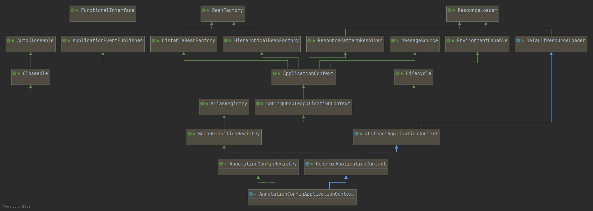
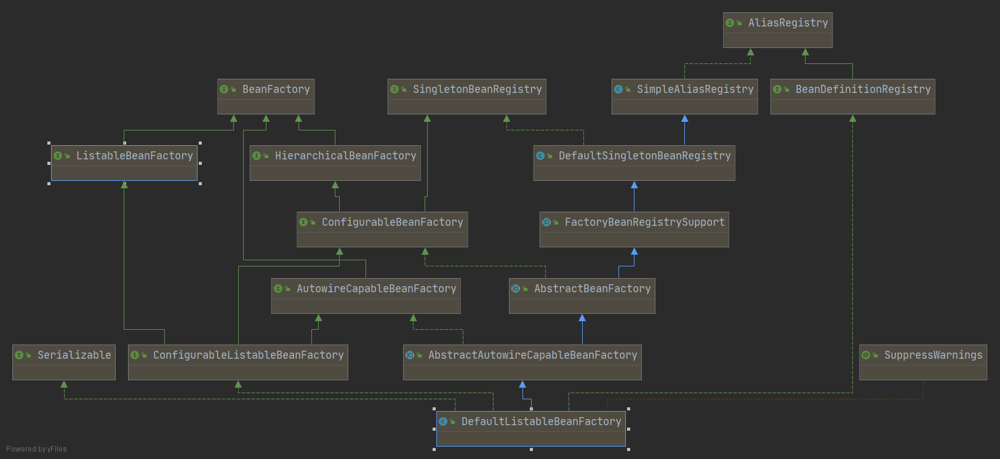
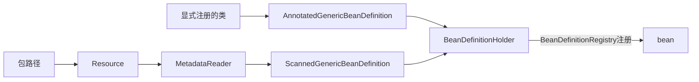
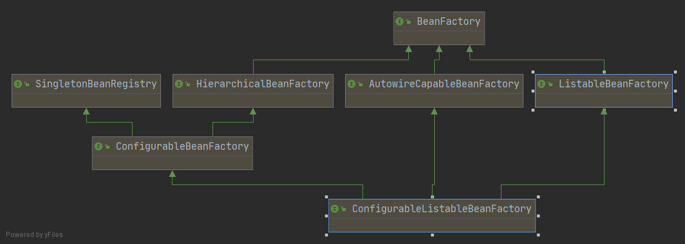
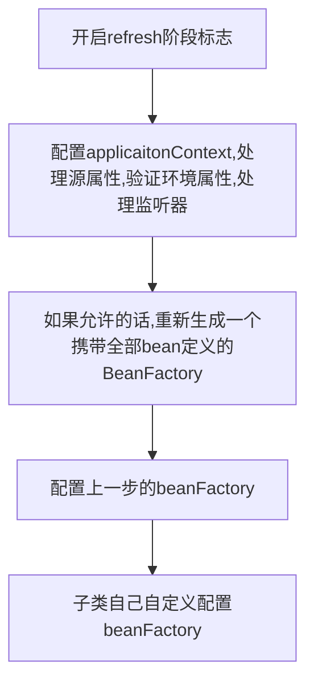

[TOC]

# spring源码

-  **spring版本：5.3.10**
-  预备要求：
   -  会使用spring、springboot
   -  了解常用的设计模式
   -  了解基本的JVM知识
   -  不只是看，自己也会动手研究源码
-  **我自己也是初次研究，中间肯定会犯很多错误，希望大家多多指正**
-  注意，我实际上是直接引入的springboot包，再由它引的spring，不过应该没啥大的区别

## DIP、IOC、DI

我们都知道spring中有个IOC，那么IOC到底是什么？

在做这个解答之前，先说说DIP

### DIP

DIP：依赖倒置原则，是说

1. 高层次的模块不应该依赖于低层次的模块，两者都应该依赖于抽象。

   - 如果一个类A需要另一个类B帮忙完成一个事情，我们称B是低层次的（底层代码）。
   - A将它的需求抽象C出来，B去实现这个抽象C，这使得A、B都依赖于C

2. 抽象不应该依赖于具体。而具体则应该依赖于抽象。

	- 依赖：如果A的功能需要B的存在，**这表明A依赖于B**。

	- 示例代码：

      ```java
      public class DIPTest{
        private final InterBase inter;
        // constructor
        public DIPTest(InterBase interImpl){
            this.inter = interImpl; // InterImpl 实现了 InterBase
        }
      }
      ```

	- 上述代码中，DIPTest依赖InterBase来完成一些操作。但注意，InterBase是一个接口，所以这个依赖关系是**依赖抽象**而不是**依赖实现**。
       - 如果一个抽象依赖了实现，一旦实现发生了变化，抽象也可能跟着有大变化。这种设计不仅违背了**开闭原则**，还违背了一般逻辑：**抽象居然由具体实现决定功能**，我这个人与别人交流用的是手机，当交流不用手机，我居然要修改一下DNA才会重新交流？
       - 颠倒指的是颠倒了传统的软件设计对依赖的认知。

**总结一下**：就是要面向抽象编程

### IOC

IOC（Inversion of Control，控制反转）指的是原来应该由自己控制的东西被第三方控制。

以模板方法模式为例：

```java
public abstract class TwoStep {
    public void doSome() {
        step1();
        step2();
    }

    protected abstract void step1();

    protected abstract void step2();

}
```

这个TwoStep的doSome()调用之后到底发生了什么，完全不由TwoStep自己决定，由此**流程**的控制被子类实现，符合了IOC的情形。

再回过头来，Spring在控制上做了以下2件事：

1. 创建bean于Spring自己的IOC容器中。
2. 从IOC容器中将beanA注入到依赖于beanA的beanB里。

即是说，Spring控制的是beanB获得依赖的过程（不再由我们自己在什么地方实例化再注入进去）

所以Spring的IOC也会被人称为DI（**依赖注入**）。

由此也可以得出一个结论：DIP和IOC并没有什么直接的联系，在IOC之前提一嘴DIP是因为网上很多人将他们扯在一起。不过一个基于IOC的框架或者代码如果设计上没有遵循DIP，能不能搞出来都是个问题。

### DI

DI（Dependency Injection，依赖注入）在Spring中被大量应用。构造器注入、setter注入、接口注入等方式这里不提及，只说DI的优势就在于可以很好的**解耦**。

下面我们就直接进入正题吧。

## Spring-IOC

上面我们说过Spring的DI做了3件事：

1. 创建IOC容器
2. 注册bean
3. 完成bean之间的依赖关系

现在我们就跳过很多细节，先对Spring的内容有个大致的了解。对于很多代码细节，我们将在Spring-Details中进行补全。这里有一些细节：

1. 前期会很仔细地分析很多过程性的内容，这是为熟悉Spring代码风格和我自己阅读源码方式打基础。
   1. 注释一半来自翻译，但有些时候也会加上我的一些理解
   2. 所有没有写在代码块的方法我基本都是忽略了参数
2. 从2.4节开始将会把注意更多的放在一些重要内容上，一些过程上的内容就大家应该能够自己分析了。
3. 所有设计到的设计模式，我只点出名字，不会在这里细讲
4. 使用的IDE是IDEA，几乎所有快捷键都是默认快捷键

### **一、创建IOC容器**

#### 1.1 IOC容器在哪个类

首先我们要搞明白作为IOC容器的类到底是那个类，为此我们得追寻Spring的启动代码

- 启动Spring的方式很多，随便选择一个就可以，这里就以`public AnnotationConfigApplicationContext(Class<?>... componentClasses)-`为例

```java
// bean对应的类，使用了Lombok的注解@Data
@Data
public class BeanWithId {
    private String id;
}

```

```java
// 注册bean
public class SpringConfig {
    @Bean
    public BeanWithId normalBean() {
        BeanWithId beanWithId = new BeanWithId();
        beanWithId.setId("first bean");
        return beanWithId;
    }
}
```

```java
// 启动Spring
public class Context {
    public static void main(String[] args) {
        // 这个构造方法会将SpringConfig注入到容器中，当然@Bean注解返回的BeanWithId也注入进入了（为什么可以以后再说）
        AnnotationConfigApplicationContext applicationContext = new AnnotationConfigApplicationContext(SpringConfig.class);
        Object normalBean = applicationContext.getBean("normalBean");
        if (normalBean instanceof BeanWithId) {
            BeanWithId realBean = (BeanWithId) normalBean;
            String id = realBean.getId();
            System.out.println("id = " + id);	// id = first bean
        }
    }
}

```

**这份代码将会狠狠地跟着源码解析，我自己都没想到**

现在整体上看一下AnnotationConfigApplicationContext这个类的UML图（IDEA快捷键：`ctrl+shift+alt+U`）



观察uml图，注意到有个叫做`ApplicationContext`的接口继承了很多其他接口。这说明该接口汇聚了很多功能于一身，应该是一个**中心接口**，说什么都要点进去看看。进去一看注释，好家伙，啥都写出来了：

An ApplicationContext provides:
<ul>
<li>Bean factory methods for accessing application components.
Inherited from {@link org.springframework.beans.factory.ListableBeanFactory}.
<li>The ability to load file resources in a generic fashion.
Inherited from the {@link org.springframework.core.io.ResourceLoader} interface.
<li>The ability to publish events to registered listeners.
Inherited from the {@link ApplicationEventPublisher} interface.
<li>The ability to resolve messages, supporting internationalization.
Inherited from the {@link MessageSource} interface.
<li>Inheritance from a parent context. Definitions in a descendant context
will always take priority. This means, for example, that a single parent
context can be used by an entire web application, while each servlet has
its own child context that is independent of that of any other servlet.
</ul>

其中，第一条提到ApplicationContext的实现要提供：

> `ListableBeanFactory`中定义的，**访问应用组件的方法**（意译的）

这里**应用组件**指的就是bean，所以ApplicationContext提供了访问bean的方法，而这些方法在`ListableBeanFactory`接口中被定义。

看一下`ListableBeanFactory`，随便找个访问方法，比如第一个的`boolean containsBeanDefinition(String beanName);`。看一下它是如何实现这个方法来访问到IOC容器的，查看UML里最近的实现在`AbstractApplicationContext`里面。

```java
	@Override
	public boolean containsBeanDefinition(String beanName) {
		return getBeanFactory().containsBeanDefinition(beanName);
	}
	// getBeanFactory()是一个抽象方法
	@Override
	public abstract ConfigurableListableBeanFactory getBeanFactory() throws IllegalStateException;
```

`ConfigurableListableBeanFactory`继承自`ListableBeanFactory`，**基本可以肯定IOC容器就是实现了`BeanFactory`接口的类**（`BeanFactory`是`ListableBeanFactory`的父接口），再看一下`ConfigurableListableBeanFactory`的实现，唯一实现是`DefaultListableBeanFactory`。在Spring中，`DefaultListableBeanFactory`就是默认的IOC容器。

**可以注意到的设计模式**：

1. BeanFactory从名字来看应该使用了**工厂方法**，事实上也确实如此：

   ```java
   	Object getBean(String name) throws BeansException;
   	<T> T getBean(String name, Class<T> requiredType) throws BeansException;
   	Object getBean(String name, Object... args) throws BeansException;
   	<T> T getBean(Class<T> requiredType) throws BeansException;
   	// ...
   ```

2. 在`AbstractApplicationContext`里面，使用获取`BeanFactory`的办法是调用了

   `public abstract ConfigurableListableBeanFactory getBeanFactory() throws IllegalStateException;`这是**模板方法**设计模式，如何获取beanFactory交由子类自由实现

3. 注意到`ApplicationContext`子类（`AbstractRefreshableApplicationContext`、`GenericApplicationContext`）实现`ListableBeanFactory`接口的方式是采用委托的方式，即在这些实现类里持有`ListableBeanFactory`的默认实现`DefaultListableBeanFactory`，所有的方法都丢给这个默认实现来完成。

   ```java
   	//---------------------------------------------------------------------
   	// Implementation of BeanFactory interface
   	//---------------------------------------------------------------------
   
   	@Override
   	public Object getBean(String name) throws BeansException {
   		assertBeanFactoryActive(); // 验证生命周期的方法
   		return getBeanFactory().getBean(name); // 获得beanFactory并且调用它的getBean()方法，这就是委托
   	}
   //.......
   ```

   这个是典型的**装饰器模式**，方便拓展
   
4. `ApplicationContext`继承了很多接口，集成了所有功能且对外提供自己，这是**外观模式**，减少复杂性且封装了内层，方便维护和基于此接口的开发。

#### 1.2 BeanFactory

既然清楚了实现`BeanFactory`接口的就是IOC容器，且Spring默认该实现类为`DefaultListableBeanFactory`。现在我们先来深入研究一下`BeanFactory`。

进入到该类，先看**注释**。

注释很长，总结一下说了这几件事：

1. 是访问bean容器（也就是IOC容器）的根接口，被持有一系列`bean definition`（bean定义）的类实现。

   - 注意，这个接口只定义了**访问的方法**，他要求实现这个接口的类**必须可以持有一系列的bean定义**。

   - 这些bean定义之间由`String name`区分
   - 根据`bean factory`的配置，每次`getBean()`返回的可能是不同的实例、也可能是同一个实例
   - 依赖注入优于自己去容器里面找相应的bean（就是平时使用的时候尽量不要自己调用`getBean()`)

2. `BeanFactory`是最基本的接口，一些特殊的功能在子接口中添加：

   - `ListableBeanFactory`提供枚举所有bean定义的功能，所有实现提前加载bean定义功能的`beanFactory`应该实现这个接口。

     - 无论是以xml配置，还是注解配置，都是在系统启动时提前加载的，所以大部分我们用到的spring应用其`beanFactory`都至少实现了这个接口
     - `ApplicationContext`接口也继承了这个接口

   - `HierarchicalBeanFactory`将`BeanFactory`变成了层级结构，`BeanFactory`可以有父`BeanFactory`

     - 设置父`BeanFactory`的方法在子类`ConfigurableBeanFactory`中被**定义**。这说明仅实现`HierarchicalBeanFactory`的类只能通过**构造函数**设置父容器，并且一旦设置就不能再变。

       - 在子接口`ConfigurableBeanFactory`的`setParentBeanFactory()`方法注释上强调了

         > 只有在构造该容器父容器不可用时，才允许在构造方法外调用这个方法，并且一点绑定就不允许再改变

     - 实现了该接口的`BeanFactory`如果找不到相应名称的bean时，应该继续委托给父类查找

     - 一个经典的应用就是Spring和SpringMVC父子容器

3. **提供了一套bean标准的初始化方法和顺序**，并且要求`BeanFactory`**尽可能**地实现这些方法。

**这里面提到了一个东西：`bean definition`。根据注释，这些bean定义一般来自于程序外部的配置源（比如我们熟悉的xml文档），而`beanFactory`的职责是在必要的时候以其为原型，返回它的bean实例（不是返回bean定义，换句话说bean定义的管理与该接口无关）。**

到此，我们大致知道了`BeanFactory`的职责，自然而然地我们会想IOC容器到底是什么数据结构？怎么创建初始化的？注意到这些问题已经涉及到具体的逻辑和算法了，接下来我们将回到最开始的代码，跟着断点一步一步走下去。

此外，与主线“IOC容器”不相关的问题我们将其暂时搁置（bean定义是如何加载的？相互之间的依赖又是如何注入的？等等等）。

**可以注意到的设计模式**：

- `BeanFactory`持有的是bean定义，是bean的原型，这很显然地用了**原型模式**。

#### 1.3 IOC容器在哪里创建

回到最开始的代码，在

```java
AnnotationConfigApplicationContext applicationContext = new AnnotationConfigApplicationContext(SpringConfig.class);
```

打上断点，debug启动F7一步一步看看它到底做了什么。虽然这么说，我们也要详略得当，一些边边角角的内容就不谈，比如一开始的是否忽略SpEL表达式。

直接快进到构造函数（按住F7不要停）

```java
public AnnotationConfigApplicationContext(Class<?>... componentClasses) {
	this();	// 无参构造方法
	register(componentClasses); // 注册参数中的bean
	refresh();    // 来了，refresh方法，之后详解
}
```

构造函数长成这样，看到第二行：`register(componentClasses)`。这个方法名和参数告诉我们这是在向IOC注册bean了。所以，**IOC容器必须在`this();`里创建完毕！**继续看下去，我们都知道，`this();`里面第一句隐式地调用了`super();`

继续F7，果然调用了`GenericApplicationContext`的构造方法：

```java
public GenericApplicationContext() {
	this.beanFactory = new DefaultListableBeanFactory();	// 创建IOC容器了，当然此时还没有调用这个方法，先走super();
}
```

然而，它还有父类，继续F7

```java
public AbstractApplicationContext() {
	this.resourcePatternResolver = getResourcePatternResolver();	// 模板方法，初始化一个解析器，它的默认实现也在这个类里面。当然此时还没有调用这个方法，先走super();
}
```

最后一个待被初始化的父类:`DefaultResourceLoader`。

从名称和注释可以看出来，这个类是一个用于加载程序外部资源的类，可以猜测这个类可以用于读取在外部的bean定义（比如xml文档）。只是现在和我们的主线无关，先把这个类放放。

继续F7发现回到了`AbstractApplicationContext`并且开始初始化，嗯终于没有父类需要初始化了。现在我们来看看初始化了哪些字段：

```java
protected final Log logger = LogFactory.getLog(getClass());		// 日志
private String id = ObjectUtils.identityToString(this);			// 一个标志
private String displayName = ObjectUtils.identityToString(this);// 一个标志
private final List<BeanFactoryPostProcessor> beanFactoryPostProcessors = new ArrayList<>();	// bean定义后处理器,之后细谈
private final AtomicBoolean active = new AtomicBoolean();	//	状态标志
private final AtomicBoolean closed = new AtomicBoolean();	//	状态标志
private final Object startupShutdownMonitor = new Object();	//	锁
private ApplicationStartup applicationStartup = ApplicationStartup.DEFAULT;	//	程序启动时的阶段标志器
private final Set<ApplicationListener<?>> applicationListeners = new LinkedHashSet<>();	//	监听器
private ResourcePatternResolver resourcePatternResolver = getResourcePatternResolver();// 在构造函数中初始化了一个解析器
```

感觉这些东西和IOC创建还是没有啥关系（毕竟没有涉及到`BeanFactory`，`beanFactoryPostProcessors`已经是后置处理beanFactory的东西了）

只好继续执行下去，回到`GenericApplicationContext`看看都初始化了些啥

```java
private boolean customClassLoader = false;		// 默认没有使用自定义ClassLoader加载资源
private final AtomicBoolean refreshed = new AtomicBoolean();	//	一个标志
this.beanFactory = new DefaultListableBeanFactory();	// 	构造方法中初始化了beanFactory
```

终于，我们在`GenericApplicationContext`找到了IOC容器创建的地方和相应的实体类`DefaultListableBeanFactory`，它持有这个IOC容器。

#### 1.4 容器的真身

为了找到容器到底在这个类的哪里，和之前一样，先看`DefaultListableBeanFactory`的UML类图：



注意到这个类确实实现了`BeanFactory`接口，而且还实现了它的所有直接子接口（感兴趣的话可以去看看这些接口都加了什么性质）。另一边它又实现了`SingletonBeanRegistry`,`AliasRegistry`两个接口。这两个接口看名字和**注册**相关，是很重要的接口，但现在和主线无关的一律全丢掉。

发现如果继续F7跟着父实现走一遍，有很多个字段需要看是不是容器，这会非常的耗时，这里不妨换一个方法：

1. `getBean()`方法一定要访问IOC容器，按照源码走一遍
2. `AnnotationConfigApplicationContext`的有参构造方法里，有一个`register()`方法，它一定会访问容器，可以跟着走一遍
3. 按照自己的理解，所谓容器应该是一个`Collection`，并且每个bean定义都有其对应的name，合理推断这个`Collection`应该是个`Map<String,X>`，字段只看`map`就行了。（这里的X指的是不清楚是什么具体泛型，不是这个Map声明的泛型为X）

不论那种方法都可以找到具体的容器是哪一个，不过到此为止我们还没分析过注册过程，所以这里就已1，3为例子带着大家分析一下。

- 第三种方法：
  1. 打开`Structure`（快捷键：`alt+7`），`show fileds`看一下从`DefaultListableBeanFactory`到其父类的所有字段

  2. 找到所有和bean相关的map属性，再阅读相关注释就可以挑选出容器：

     ```java
     private final Map<String, BeanDefinition> beanDefinitionMap = new ConcurrentHashMap<>(256);	// ?是BeanDefinition
     ```

- 第一种方法：

  1. 打开`Structure`，找到`getBean(String)`方法，发现它在`AbstractBeanFactory`里面，点开发现实际上调用了`doGetBean()`方法

  2. 进入该方法，阅读源码。**很多时候好的命名就是注释，这一点我们在自己编程的时候就要尽量做到**。该方法主要做了这几件事：

     1. 规范化beanName，这里涉及到`FactoryBean`（和`BeanFactory`不同，之后会谈）和别名问题，反正应该和容器无关

     2. 看到`getSingleton(beanName);`但是注意上面的注释：`cache for manually registered singletons`，是缓存，这应该不是我们要找的，继续往下看。

     3. 跳过明显不是容器相关的方法，定位到

        ```java
        StartupStep beanCreation = this.applicationStartup.start("spring.beans.instantiate").tag("beanName", name);
        ```

        `applicationStartup`之前提到过，是启动过程中阶段的标志器，现在它标志为bean的初始化。继续往下看

     4. 发现后面只有一个`RootBeanDefinition`和`Bean`有关系，点进去看看，它持有一个`BeanDefinitionHolder`，而`BeanDefinitionHolder`又持有`BeanDefinition`。从名字上就可以确认这个`BeanDefinition`就是容器要存的类。

     5. 跟进`getMergedLocalBeanDefinition()`

        ```java
        protected RootBeanDefinition getMergedLocalBeanDefinition(String beanName) throws BeansException {
        	RootBeanDefinition mbd = this.mergedBeanDefinitions.get(beanName);
        	if (mbd != null && !mbd.stale) {
        		return mbd;
        	}
        	return getMergedBeanDefinition(beanName, getBeanDefinition(beanName));
        }
        ```

        先尝试从`mergedBeanDefinitions`中获得`RootBeanDefinition`但是如果没有获得会调用`getBeanDefinition(beanName)`。

     6. 跟进`getBeanDefinition(beanName)`，它的实现回到了`DefaultListableBeanFactory`，从`beanDefinitionMap`中获取`BeanDefinition`，如果没有找到就直接抛异常了，所以可以确定容器就是

        ```java
        private final Map<String, BeanDefinition> beanDefinitionMap = new ConcurrentHashMap<>(256);
        ```

至此，我们终于发现容器就是`DefaultListableBeanFactory`里的`beanDefinitionMap`。

但同时我们在一路上也发现了更多的问题：

1. 什么是`ResourceLoader`，加载的`Resource`又是什么
2. `bean`是什么时候、怎么注册进入容器的
3. `BeanFactoryPostProcessor`又是啥...
4. `BeanDefinition`的内部有什么内容
5. `DefaultListableBeanFactory`其他的那么多属性又都是干什么的
6. ......

问题越来越多不要怕，这确实使得源码阅读更复杂，但只要坚持只走主线（只解决一个问题）的方针，这些问题都会变成一个个的方向来帮助我们更快的理解Spring。（我们最开始的主线就是找到IOC容器是什么）

#### 1.5 小结

1. 容器需要实现`BeanFactory`接口，但`beanFactory`接口只提供访问容器的方法。容器不仅要实现该接口，还要实现注册、管理bean定义的接口。后面这个接口在下一章出现。
2. spring默认使用的容器是`DefaultListableBeanFactory`里的`beanDefinitionMap`。
3. 容器里面装的不是bean，而是bean定义，**那么bean定义又从哪里来，怎么到bean的**，这就是下一章的主线。

### **二、bean从何而来**

#### 2.1 BeanDefinition和bean

在之前关于容器的探索中，我们发现容器存储的并不是我们认为的bean实例(`Object`)，反而是一个叫做bean定义(`BeanDefinition`)的东西。它们之间到底有什么区别和联系呢？

直接打开`BeanDefinition`的源码来看看，老规矩先看UML图……结果发现就只继承了2个顶级接口`AttributeAccessor`，`BeanMetadataElement`。前者定义了访问、附加属性于任意元数据的通用方法；后者是元数据实现的接口，并且提供它的配置源（我们最开始的代码bean实例`normalBean`的配置源就是`SpringConfig`类，可以debug去验证）

再看注释：

1. 一个bean定义描述了一个具有指定属性值、构造参数值、和其他信息（由bean定义子类添加）的bean实例
   - 描述语义上是用一套**方式**来**解释说明**某个东西，只要某人对这套方式熟悉，那么就可以更轻松地理解这个东西
     - 严格地说，描述应当是一个等价关系，如果A描述了B，那么A一定要等价于B，不然还描述了个什么？
     - 所以，一个bean定义至少拥有一个bean的全部信息
     - 所以称描述了bean实例所有属性的类为bean定义是很恰当的名称
2. 是最小的一个接口，主要目的是允许`BeanFactoryPostProcessor`访问并修改描述的属性值，以及其他bean的元数据

**所以BeanDefinition是某个bean实例的原型（元数据），只是它可以被BeanFactoryPostProcessor修改，修改后这个bean定义就描述另一个bean实例了**。

现在我们来看看这个接口都有哪些方法：

1. 定义了2种scope常量：

   ```java
   	String SCOPE_SINGLETON = ConfigurableBeanFactory.SCOPE_SINGLETON;	// 就是 "singleton"，单例
   	String SCOPE_PROTOTYPE = ConfigurableBeanFactory.SCOPE_PROTOTYPE;	// 就是 "prototype"，多例
   ```

2. 定义了3种角色常量：

   ```java
   int ROLE_APPLICATION = 0;		// 程序用的一般bean，我们最经常用的@Bean，@Component注册进来的就是这个角色
   int ROLE_SUPPORT = 1;			
   int ROLE_INFRASTRUCTURE = 2;
   ```

3. 定义了一些可被修改属性的方法：

   - parentName：父子bean中的父bean定义名字，还记得xml中的父子bean吗，在注解注册过程中也是可以配置这个属性的

   - beanClassName：类名

   - scope：单例还是多例

   - lazyInit：懒加载

   - dependsOn：依赖类，这些类必须要先于该类**初始化**，强度高于引用。可以使用`@dependsOn`注解（xml的bean标签也有相应属性）

     - 如果类A**引用了**类B，注入的时候如果B还没有被完全初始化也是可以被注入到A中的，甚至可以是`null`
     - 如果类A**依赖于**类B，创建A的时候如果B还没有被初始化，那就先进行B的**完全**初始化。此外，A依赖于B是可以不引用B的（虽然不知道有什么用）。
     - 优点在于定义了bean之间初始化的顺序和销毁bean的销毁顺序，但同时失去了解**循环引用**的能力——即是说如果A、B相互**依赖**，一定会抛出异常

   - autowireCandidate：是否在按类型注入时忽略这个bean

   - primary：是否优先注入这个bean

   - factoryBeanName：factoryBean的名字（注意不是之前提到的BeanFactory）

   - factoryMethodName：工厂创建bean的方法名。

     - `factoryBean`，是一个**工厂bean**。首先它是一个工厂类，可以用于创建类的实例（工厂模式）；其次它是一个`bean`，会被注入到容器中。但是它创建的实例却**不会**被注入到容器中。

     - 既然它是一个bean，那它对应的类就需要我们自己实现

     - 既然它是一个工厂，他就具有所有工厂都有的优点，特别的，这个工厂允许我们自由地对实例进行一些操作（代理之类的）

     - 当容器`getBean`用`factoryBean`的`beanName`或者待创建的实例类的class类来获取的时候，会获得这个`factoryBean`创建的实例

     - 如果要获取`factoryBean`本身，需要在`beanName`前面加上`&`

       ```java
       public class BeanWithIdFactory implements FactoryBean<BeanWithId> {
           // 实现FactoryBean接口
           @Override
           public BeanWithId getObject() throws Exception { // 工厂方法获取实例
               BeanWithId beanWithId = new BeanWithId();
               beanWithId.setId("from factory");
               return beanWithId;
           }
       
           @Override
           public Class<?> getObjectType() {
               return BeanWithId.class;
           }
       
           @Override
           public boolean isSingleton() { // 不是单例，如果这里是true，那么每次返回的都是同一个实例，即使getObject里面是new出来的
               return false;
           }
       }
       // 这个使用方式不是很有用，可以看看别的框架如何使用这个接口的，比如mybatis
       ```

       ```java
       public class Context {
           public static void main(String[] args) throws Exception {
               AnnotationConfigApplicationContext applicationContext = new AnnotationConfigApplicationContext(BeanWithIdFactory.class);	// 将工厂注册成为bean
               // 也可以直接用BeanWithId.class当参数传入getBean()方法
               Object beanWithIdFactory = applicationContext.getBean("beanWithIdFactory");
               Object beanWithIdFactoryAnother = applicationContext.getBean("beanWithIdFactory");
       
               if (beanWithIdFactory instanceof BeanWithId) { // getBean返回的是工厂产生的实例而不是工厂本身
                   BeanWithId beanWithId = (BeanWithId) beanWithIdFactory;
                   BeanWithId beanWithIdAnother = (BeanWithId) beanWithIdFactoryAnother;
                   System.out.println(beanWithId.getId()); // from factory
                   System.out.println(beanWithIdAnother == beanWithId); // false 不是单例
               }
               Object factory = applicationContext.getBean("&beanWithIdFactory"); // 加上&来获取这个factoryBean
               if (factory instanceof BeanWithIdFactory) {
                   System.out.println("I am factory bean");	// 确实打印出来了
               }
           }
       }
       // 中间可以打一个断点，我们已经知道容器是applicationContext-->beanFactory-->beanDefinitionMap，可以看一下长啥样
       ```

   - constructorArgumentValues：构造函数参数

   - propertyValues：属性值

   - initMethodName：初始化方法名

   - destroyMethodName：销毁方法名

   - role：角色，就是上面3种常量之一

   - description：注释

4. 定义了一些只读属性的方法：

   - resolvableType：类型信息，获取超类、接口、泛型可用它
   - singleton/prototype：是否单例/多例
   - isAbstract：是否是抽象的
   - getResourceDescription：获取该bean定义所属资源的描述
   - getOriginatingBeanDefinition：获取bean定义的原始定义（暗示可以对定义作装饰，添加内容）

方法很多，我大致简单的解释了一下，可以随意看看注释，想一想有些方法存在的意义。

至此，我们搞明白了`BeanDefinition`和`bean`之间的关系以及`BeanDefinition`所具有的属性方法。也清楚了现在的一个过程是`BeanDefintion-->Bean`：**bean从BeanDefintion而来**。

#### 2.2 BeanDefintion如何被创建

接上文，现在我们的目标就是`BeanDefintion`从哪里来的。在[1.2 beanFactory](#1.2 BeanFactory)一节里，我们提到过

> 这里面提到了一个东西：`bean definition`。根据注释，这些bean定义一般来自于程序外部的配置源（比如我们熟悉的xml文档），而`beanFactory`的职责是储存这些定义，并且在必要的时候以其为原型，返回它的bean实例。

这个说法比较抽象，我们并不清楚到底是如何进入程序并转为BeanDefintion，这一节我们就来追踪这个问题。具体实现，我们就断点跟踪代码。不过我们可以先猜测一下：

- 最早的时候我们使用`spring.xml`来定义`bean`，那么Spring肯定是把这个xml文档以流的形式加载进来，然后注册
- 之后我们开始注解开发，以springboot为例，`@ComponentScan`还是会扫描包内部的class文件加载，有`@Component`这类注解的类会注册为`beanDefinition`
- 以本文代码为例[1.1 IOC容器在哪个类](#1.1 IOC容器在哪个类)，这种构造函数直接注册类也是可以的——>他没有进行外部扫描。
  - 但是也有扫描包的构造方法`public AnnotationConfigApplicationContext(String... basePackages) `

既然`AnnotationConfigApplicationContext`哪种都能进行，我们依旧选择之前的代码进行跟踪。在之前跟踪寻找容器的过程中，我们跟着到了`GenericApplicationContext`的构造函数里面，创建了`DefaultListableBeanFactory`。这次从这里继续，而上次我们刚好走完了`AnnotationConfigApplicationContext`里无参构造函数的`super()`

```java
public AnnotationConfigApplicationContext(Class<?>... componentClasses) {
	this();
	register(componentClasses);
	refresh();
}

public AnnotationConfigApplicationContext() {
    // super();    <-- 隐式调用,上次刚好到这个地方结束
	StartupStep createAnnotatedBeanDefReader = this.getApplicationStartup().start("spring.context.annotated-bean-reader.create"); 		// 应该记住了，StartupStep是启动过程中的阶段标志，这里是标志开始创建AnnotatedBeanDefinitionReader。
	this.reader = new AnnotatedBeanDefinitionReader(this);
	createAnnotatedBeanDefReader.end();
	this.scanner = new ClassPathBeanDefinitionScanner(this);
}
```

可以看到，无参构造函数里面初始化了一个reader，一个scanner。看名字，`AnnotatedBeanDefinitionReader`是和注解注册`BeanDefinition`有关的类，`ClassPathBeanDefinitionScanner`是和扫描注册`BeanDefinition`有关的类，这不得仔细看看。

**题外话，再一次强调好的命名就是最好的注释，大家平时码代码的时候，如果写了行内注释，这就是提醒你可以抽出部分代码为private方法，用一个好的命名来解释它要干的事。**

直接跟进`AnnotatedBeanDefinitionReader`构造函数，并先看注释

```java
	// AnnotatedBeanDefinitionReader
	/**
	 * Create a new {@code AnnotatedBeanDefinitionReader} for the given registry.
	 * <p>If the registry is {@link EnvironmentCapable}, e.g. is an {@code ApplicationContext},
	 * the {@link Environment} will be inherited, otherwise a new
	 * {@link StandardEnvironment} will be created and used.
	 * @param registry the {@code BeanFactory} to load bean definitions into,
	 * in the form of a {@code BeanDefinitionRegistry}
	 * @see #AnnotatedBeanDefinitionReader(BeanDefinitionRegistry, Environment)
	 * @see #setEnvironment(Environment)
	 */
	public AnnotatedBeanDefinitionReader(BeanDefinitionRegistry registry) {
		this(registry, getOrCreateEnvironment(registry));
	}
```

注意到注释里面重量级的这句话：

> @param registry the BeanFactory to load bean definitions into, in the form of a BeanDefinitionRegistry

这是在告诉我们参数`BeanDefinitionRegistry`的作用：registry以`BeanDefinitionRegistry`的形式将`bean definitions`加载进`beanFactory`。

另一边`ClassPathBeanDefinitionScanner`的构造函数中的注释，也有相应的这句话：

```java
	// ClassPathBeanDefinitionScanner
	/**
	 * Create a new {@code ClassPathBeanDefinitionScanner} for the given bean factory.
	 * @param registry the {@code BeanFactory} to load bean definitions into, in the form
	 * of a {@code BeanDefinitionRegistry}
	 */
	public ClassPathBeanDefinitionScanner(BeanDefinitionRegistry registry) {
		this(registry, true);
	}
```

还记得在beanFactory一节中提到的`beanFactory`仅仅提供访问bean的方法，管理bean定义的方法在其他地方。现在我们知道了，`BeanDefinitionRegistry`就是来搞注册bean定义的，是将`beanDefinition-->bean`的具体实现类。

此外，这俩构造函数的参数都是`this`（`AnnotationConfigApplicationContext`）。再次拿出我们的UML图，发现实现`BeanDefinitionRegistry`接口的是`GenericApplicationContext`那么可以猜测，注册进`beanFactory`的方法是在`GenericApplicationContext`中实现的（事实上是委托给`DefaultListableBeanFactory`）。

```java
	this.reader = new AnnotatedBeanDefinitionReader(this);
	this.scanner = new ClassPathBeanDefinitionScanner(this);
```

不过我们的主线是搞明白BeanDefinition的创建，所以这部分我们留在后面详谈，现在有个印象就好。

继续看`AnnotatedBeanDefinitionReader`和`ClassPathBeanDefinitionScanner`类上面的注释：

1. `ClassPathBeanDefinitionScanner`:给`beanFactory`或`ApplicationContext`注册bean定义的类
   - 默认扫描带`@Component`注解的类（`@Repository`、`@Service`、`@Controller`都继承了`@Component`，也会被扫描到）。
   - `@ManagedBean`（Java EE6的）、`@Named`（JSR-330的）两个注解也会被注册进来。
2. `AnnotatedBeanDefinitionReader`：也是一个给容器注册`beanDefinition`的类，不过只处理显式注册且用注解开发的情形
   - 所谓显式注册，就是像之前调用构造函数注册或者用`AnnotationConfigApplicationContext#register()`注册的类，它们都是程序手动注册

我们继续跟进源码，`this();`初始化了2个注册`beanDefinition`的类。接下来根据不同的构造函数调用不同的方法：

- `public AnnotationConfigApplicationContext(Class<?>... componentClasses)`走的是`register(componentClasses);`方法，是显式注册bean定义，所以应该是调用`AnnotatedBeanDefinitionReader`做注册的事，跟进去看看

  ```java
  	@Override
  	public void register(Class<?>... componentClasses) {
  		Assert.notEmpty(componentClasses, "At least one component class must be specified");
  		StartupStep registerComponentClass = this.getApplicationStartup().start("spring.context.component-classes.register")
  				.tag("classes", () -> Arrays.toString(componentClasses));
  		this.reader.register(componentClasses);
  		registerComponentClass.end();
  	}
  ```

  四行代码，一行验证参数，两行标志阶段，所以真正有用的就是`this.reader.register(componentClasses);`，直接跟进去

  ```java
  	public void register(Class<?>... componentClasses) {
  		for (Class<?> componentClass : componentClasses) {	// 遍历注册组件
  			registerBean(componentClass);
  		}
  	}
  
  	public void registerBean(Class<?> beanClass) {
  		doRegisterBean(beanClass, null, null, null, null); 	// 真正注册的方法，注意除了beanClass其他参数全是null
  	}
  ```

  没什么说的，继续跟进，接下来的方法有些长，不过耐心一点，慢慢看其实很好懂的，我也会加上一些注释的

  ```java
  /*
  先看方法注释，每个参数写的很清楚了是干什么的
  beanClass：bean的类
  name：bean的名字
  qualifiers： 处理autowire限制符注解
  supplier：创建实例的方法，如果bean定义设置了这个将会忽略factoryBean，直接以supplier返回的实例为bean（Supplier<T> 标准函数式接口，可以了解一下）
  			这么做的好处是不需要反射调用，提高性能。可以跟踪getBean()方法看看在哪里调用这个supplier
  customizers：自定义修改该bean定义的东西
  */	
  private <T> void doRegisterBean(Class<T> beanClass,
                                  @Nullable String name,
                                  @Nullable Class<? extends Annotation>[] qualifiers,
                                  @Nullable Supplier<T> supplier,
                                  @Nullable BeanDefinitionCustomizer[] customizers) {
  
  		AnnotatedGenericBeanDefinition abd = new AnnotatedGenericBeanDefinition(beanClass); // 直接new一个bean定义
  		if (this.conditionEvaluator.shouldSkip(abd.getMetadata())) {	// 注解@Conditional的处理，不满足的就不注册了
  			return;
  		}
  
  		abd.setInstanceSupplier(supplier);	// 加入supplier
  		ScopeMetadata scopeMetadata = this.scopeMetadataResolver.resolveScopeMetadata(abd);// 处理@Scope注解
  		abd.setScope(scopeMetadata.getScopeName());
  		String beanName = (name != null ? name : this.beanNameGenerator.generateBeanName(abd, this.registry));
  
  		AnnotationConfigUtils.processCommonDefinitionAnnotations(abd);// 处理@Lazy、@DependsOn等常用注解。
  		if (qualifiers != null) {	// 一些bean在autowire的时候有特殊的行为，就在这里处理（比如@Qualifier)
  			for (Class<? extends Annotation> qualifier : qualifiers) {
  				if (Primary.class == qualifier) {
  					abd.setPrimary(true);
  				}
  				else if (Lazy.class == qualifier) {
  					abd.setLazyInit(true);
  				}
  				else {
  					abd.addQualifier(new AutowireCandidateQualifier(qualifier));
  				}
  			}
  		}
  		if (customizers != null) {	// 最后自定义地处理bean定义
  			for (BeanDefinitionCustomizer customizer : customizers) {
  				customizer.customize(abd);
  			}
  		}
  
  		BeanDefinitionHolder definitionHolder = new BeanDefinitionHolder(abd, beanName); // 创建对应的BeanDefinitionHolder
  		definitionHolder = AnnotationConfigUtils.applyScopedProxyMode(scopeMetadata, definitionHolder, this.registry);// 是否使用代理（通用的默认为不创建）
  		BeanDefinitionReaderUtils.registerBeanDefinition(definitionHolder, this.registry);// 向registry注册这个bean定义
  	}
  ```

  可以看到，注册一个bean定义之前居然做了这么多处理，主要是处理一些注解和一些回调方法。**此外，真正向beanFactory注册bean定义的类居然是BeanDefinitionHolder。**

  接下来看看扫描注册的过程：

- `public AnnotationConfigApplicationContext(String... basePackages)`调用的是`scan(basePackages);`扫描传入的`basePackages`。跟进源码看看

  ```java
  	@Override
  	public void scan(String... basePackages) {
  		Assert.notEmpty(basePackages, "At least one base package must be specified");
  		StartupStep scanPackages = this.getApplicationStartup().start("spring.context.base-packages.scan")
  				.tag("packages", () -> Arrays.toString(basePackages));
  		this.scanner.scan(basePackages);
  		scanPackages.end();
  	}
  ```
  
  老样子，只有`this.scanner.scan(basePackages);`有用
  
  ```java
  	public int scan(String... basePackages) {
  		int beanCountAtScanStart = this.registry.getBeanDefinitionCount(); // 现有bean定义数
  		doScan(basePackages);	// 扫描！
  		if (this.includeAnnotationConfig) { // 标志是否使用内置的注解处理器
  			AnnotationConfigUtils.registerAnnotationConfigProcessors(this.registry);	// 注册一些常见注解（@Configuration、@Bean等）的处理器，这样这些注解才会生效
  		}
  		return (this.registry.getBeanDefinitionCount() - beanCountAtScanStart); // 返回新注册的bean数量
  	}
  ```
  
  继续跟进
  
  ```java
  	protected Set<BeanDefinitionHolder> doScan(String... basePackages) {
  		Assert.notEmpty(basePackages, "At least one base package must be specified");	// 判空
  		Set<BeanDefinitionHolder> beanDefinitions = new LinkedHashSet<>();
  		for (String basePackage : basePackages) {
  			Set<BeanDefinition> candidates = findCandidateComponents(basePackage);	// 扫描包，返回bean定义
  			for (BeanDefinition candidate : candidates) {	// 后面都是对bean定义的一些处理，和doRegisterBean类似。
  				ScopeMetadata scopeMetadata = this.scopeMetadataResolver.resolveScopeMetadata(candidate);
  				candidate.setScope(scopeMetadata.getScopeName());
  				String beanName = this.beanNameGenerator.generateBeanName(candidate, this.registry);
  				if (candidate instanceof AbstractBeanDefinition) {
  					postProcessBeanDefinition((AbstractBeanDefinition) candidate, beanName);
  				}
  				if (candidate instanceof AnnotatedBeanDefinition) {
  					AnnotationConfigUtils.processCommonDefinitionAnnotations((AnnotatedBeanDefinition) candidate);
  				}
  				if (checkCandidate(beanName, candidate)) {
  					BeanDefinitionHolder definitionHolder = new BeanDefinitionHolder(candidate, beanName);
  					definitionHolder =
  							AnnotationConfigUtils.applyScopedProxyMode(scopeMetadata, definitionHolder, this.registry);
  					beanDefinitions.add(definitionHolder);
  					registerBeanDefinition(definitionHolder, this.registry);// 注册
  				}
  			}
  		}
  		return beanDefinitions;
  	}
  ```

好家伙，扫描的过程都在`findCandidateComponents()`方法里，而且最后注册的时候也是以`BeanDefinitionHolder`类的形式完成的。

看来为了搞明白扫描的`BeanDefinition`来自哪里，我们还得去`findCandidateComponents()`里看看。

```java
	public Set<BeanDefinition> findCandidateComponents(String basePackage) {
		if (this.componentsIndex != null && indexSupportsIncludeFilters()) { 
            // 根据注释：spring5之后的新特性，扫描META-INF/spring.components里面定义的类，并且注入进来
			return addCandidateComponentsFromIndex(this.componentsIndex, basePackage);
		}
		else {
			return scanCandidateComponents(basePackage);
		}
	}
```

这里面有两条路，但逻辑上来说，不论走哪个if，basePackage下的类都是要被扫描的。我们更关心一般意义上的使用，所以spring5新特性的内容可以暂时跳过而选择`scanCandidateComponents()`方法。

终于要到我们的终点了：

```java
private Set<BeanDefinition> scanCandidateComponents(String basePackage) {
		Set<BeanDefinition> candidates = new LinkedHashSet<>();
		try {
			String packageSearchPath = ResourcePatternResolver.CLASSPATH_ALL_URL_PREFIX +
					resolveBasePackage(basePackage) + '/' + this.resourcePattern;
			Resource[] resources = getResourcePatternResolver().getResources(packageSearchPath);
			boolean traceEnabled = logger.isTraceEnabled();
			boolean debugEnabled = logger.isDebugEnabled();
			for (Resource resource : resources) {
				if (traceEnabled) {
					logger.trace("Scanning " + resource);
				}
				if (resource.isReadable()) {
					try {
						MetadataReader metadataReader = getMetadataReaderFactory().getMetadataReader(resource);
						if (isCandidateComponent(metadataReader)) {
							ScannedGenericBeanDefinition sbd = new ScannedGenericBeanDefinition(metadataReader);
							sbd.setSource(resource);
							if (isCandidateComponent(sbd)) {
								if (debugEnabled) {
									logger.debug("Identified candidate component class: " + resource);
								}
								candidates.add(sbd);
							}
							else {
								if (debugEnabled) {
									logger.debug("Ignored because not a concrete top-level class: " + resource);
								}
							}
						}
						else {
							if (traceEnabled) {
								logger.trace("Ignored because not matching any filter: " + resource);
							}
						}
					}
					catch (Throwable ex) {
						throw new BeanDefinitionStoreException(
								"Failed to read candidate component class: " + resource, ex);
					}
				}
				else {
					if (traceEnabled) {
						logger.trace("Ignored because not readable: " + resource);
					}
				}
			}
		}
		catch (IOException ex) {
			throw new BeanDefinitionStoreException("I/O failure during classpath scanning", ex);
		}
		return candidates;
	}
```

无视下面一大段的logger，我们专注于上半段，可以注意到其中核心的部分在于：

```java
Set<BeanDefinition> candidates = new LinkedHashSet<>();	// bean定义集合
String packageSearchPath = ResourcePatternResolver.CLASSPATH_ALL_URL_PREFIX +
			resolveBasePackage(basePackage) + '/' + this.resourcePattern;	// 扫描路径
Resource[] resources = getResourcePatternResolver().getResources(packageSearchPath);// 获取路径下的Resource
for (Resource resource : resources) {	// 处理Resource，看是不是要被注册的类
    if (resource.isReadable()) {
        MetadataReader metadataReader = getMetadataReaderFactory().getMetadataReader(resource);
        if (isCandidateComponent(metadataReader)) {
            ScannedGenericBeanDefinition sbd = new ScannedGenericBeanDefinition(metadataReader); // new一个bean定义
			sbd.setSource(resource);
			if (isCandidateComponent(sbd)) {
                candidates.add(sbd);	// 添加进集合
            }
        }
    }
    return candidates;
}
```

可以看到，扫描方式注册的Bean定义是`ScannedGenericBeanDefinition`类，并且是从`Resource`类转变过来的

至此，我们分析了两种注册Bean定义的方式，并且更进一步地搞明白了`AnnotatedGenericBeanDefinition`的来源，如此我们从Bean定义到bean的图像可以进一步拓展为：



为了解决bean从何而来的问题，我们还差`Resource`、`MetadataReader`、`BeanDefinitionHolder`三个类没有说，`BeanDefinitionRegistry`也只是简单提了一下。接下来我们就继续沿着主线搞明白这几个类。

**可以注意到的地方**：

1. 在处理Bean定义的时候，在自己的流程上面提供了很多回调方法（`AnnotatedGenericBeanDefinition`的`supplier`和`customizers`，`ScannedGenericBeanDefinition`也类似），这种处理方式非常适合模板方法模式、builder模式等有一套主流程的模式。好处是方便开发人员在自己这套流程上面最大化地拓展内容。
2. 发现Spring将解耦解的非常开：`BeanFactory`和`BeanDefinitionRegistry`共同完成了容器的读与写，而且beanName也经常是从`beanNameGenerator`这个类来得到，别名注册有接口`AliasRegistry`等等
   - 好处是：拓展性极强，可以很好的维护更新迭代内容
   - 缺点是：非常复杂，我们的主线还没走多少呢，一大堆类接口就出现了；此外为了保证可读性需要非常清晰的注释

#### 2.3 Resource

在上一节结尾，我们弄清楚了两种Bean定义是如何被new出来的，但是对于`ScannedGenericBeanDefinition`创建过程中出现的`Resource`类还没有任何了解。不过就我们得到的信息：

1. `Resource`类只在扫描注册过程中有用
2. 扫描注册需要读取包路径下的类
3. resource翻译过来就是资源

我们可以简单猜测一下：**`Resource`类应该就是用于读取文件流的**

现在我们直接进入这个接口

老规矩先看UML类图，发现它是直接继承顶级接口`InputStreamSource`，就这个名字，基本可以认为`Resource`类和流相关。

来看看两个接口的注释：

1. `InputStreamSource`：是`InputStearm`源对象的简单接口，它要求每次调用`getInputStream()`方法的时候得到的都是一个新的流
2. `Resource`：底层资源抽象出来的描述性接口，可以描述不论URL、FILE还是单纯的二进制流。但它终究是个句柄——即描述的底层资源可能并不存在。

根据这俩注释，我们知道`Resource`对象就是Spring对流的一次封装，可以代表各种来源的流并且提供了重复获取流的能力。理所当然的，Spring可以通过它获取到包路径下的所有文件流。这就完成了整个扫描中将文件（主要是class文件）加载进内存的过程。

再看一下`Resource`的实现，发现大多是对不同来源的资源进行一定的特殊处理。那么扫描出来的文件到底是哪一个实现呢？我们回到之前的代码打个断点：

```java
Resource[] resources = getResourcePatternResolver().getResources(packageSearchPath); // 记得将AnnotationConfigApplicationContext构造方法参数改为包路径哦
```

可以看到获取的`Resource`其实是`FileSystemResource`，而`getResourcePatternResolver()`获取到的`ResourceLoader`是帮忙用路径获取文件`Resource`的辅助接口，有兴趣的可以看看，这里只要知道此时获取到的`Resource`都是以`.class`文件结尾的class文件就行了。

既然class字节码文件已经以流的形式被加载进内存（注意不是JVM虚拟机），那下一步自然就是分析该类上面有没有相应的注解来注册这个class为bean了。这就到`MetadataReader`出场的时机了。

#### 2.4 MetadataReader

其实我猜大部分读者应该和我一样，在要分析某个类是否有什么注解的问题上，第一反应就是jdk的反射。但spring又给我上了一课：使用asm框架直接读取class文件字节码，来获取该class文件的全部信息。事实上这也不可能走反射这条道路

- 反射太重，对性能的影响很大
- 不可能所有class文件都要先加载进jvm，生成Class对象再获取到注解，来判断是不是要注册的bean吧。

**已经阅读到这里的读者应该已经习惯了Spring的代码习惯，从本节开始我将更快的跳过一些代码细节，直捣黄龙。**

我们注意到`Resource`经过方法`MetadataReader metadataReader = getMetadataReaderFactory().getMetadataReader(resource);`最后变成了`MetadataReader`，那没的说，进去看看咯。

进去一看，他自己就是顶级接口，那就直接看注释：

> Simple facade for accessing class metadata, as read by an ASM {@link org.springframework.asm.ClassReader}.

它说它是包装了由asm框架`ClassReader`读取出的元数据e而成的外观类。所谓外观类是什么可以参考**外观设计模式**，本质是封装。换句话说，通过这个接口就可以获得对应的class信息。

再看它的实现，只有唯一实现`SimpleMetadataReader`(并且该类的访问控制符是final class，没有public，这说明该类只在该包下使用)，主要看构造函数

```java
SimpleMetadataReader(Resource resource, @Nullable ClassLoader classLoader) throws IOException {
    // 根据名字和接口方法上的注释，是用来访问classReader获取到的class字节码信息的
	SimpleAnnotationMetadataReadingVisitor visitor = new SimpleAnnotationMetadataReadingVisitor(classLoader);
    // 通过resource（class字节码）生成classReader，并且给予visitor类对象的信息
	getClassReader(resource).accept(visitor, PARSING_OPTIONS);
	this.resource = resource;
    // 将visitor的metadata赋值进来
	this.annotationMetadata = visitor.getMetadata();
}
```

可以看到`metadataReader`从asm中获取的只有`visitor.getMetadata();`我们点进去看看发现拿到的是类`SimpleAnnotationMetadata`：

```java
// SimpleAnnotationMetadata类中的属性：
	private final String className;						// 类名
	private final int access;							// 访问控制符	
	private final String enclosingClassName;			// 直接外部类名字，如果自己是顶层类返回null
	private final String superClassName;				// 父类名
	private final boolean independentInnerClass;		// 该类是否是独立的：顶层类或者嵌套静态类(public static class)
	private final String[] interfaceNames;				// 接口名
	private final String[] memberClassNames;			// 成员类
	private final MethodMetadata[] annotatedMethods;	// 下面3个都是注解
	private final MergedAnnotations annotations;		
	private Set<String> annotationTypes;				
```

全部都是一个类的信息，自然而然地包含注解的信息

既然已经拿到一个class的注解信息了，下一步就是解析有没有需要被注册进的注解。根据注释在`ClassPathScanningCandidateComponentProvider`中由

```java
private final List<TypeFilter> includeFilters = new ArrayList<>();
private final List<TypeFilter> excludeFilters = new ArrayList<>();
```

两个属性来控制不注册的注解和要注册的注解，方法就是`isCandidateComponent`

至此，我们已经搞明白了从源到`BeanDefinition`的全过程，接下来就是注册进`beanFactory`的过程了

#### 2.5 BeanDefinitionRegistry

在之前的学习中我们了解到所有的`BeanDefinition`在注册为bean之前，先要变为`BeanDefinitionHolder`。这一节就来看看这个类是干什么的。

老规矩UML，发现它直接实现顶级接口`BeanMetadataElement`，之前我们见过，这个接口也是`BeanDefinition`两个父接口之一，目的是提供配置源。

再看注释：携带`beanName`和别名（`aliases`）的`BeanDefinition`。看来是处理和别名相关的类（inner bean部分略过），在注册的时候一起将别名注册进入容器里。

直接看源码来印证我们的想法

```java
// 注册方法
BeanDefinitionReaderUtils.registerBeanDefinition(definitionHolder, registry);

// 具体方法
public static void registerBeanDefinition(BeanDefinitionHolder definitionHolder, BeanDefinitionRegistry registry)
		throws BeanDefinitionStoreException {

	// Register bean definition under primary name.
	String beanName = definitionHolder.getBeanName();
	registry.registerBeanDefinition(beanName, definitionHolder.getBeanDefinition()); // 注册bean定义

	// Register aliases for bean name, if any.
	String[] aliases = definitionHolder.getAliases();
	if (aliases != null) {
		for (String alias : aliases) {
			registry.registerAlias(beanName, alias);// 注册别名
		}
	}
}
```

注意这个方法的下半部分，可以看到就是在注册别名。

现在，我们把目光移到`registry`对应的接口`BeanDefinitionRegistry`上来。之前我们提过这个接口是用来管理bean定义的接口（不是访问bean实例，这是它与`beanFactory`最大的区别）现在就让我们进去看看。

老规矩UML：它直接继承了顶级接口`AliasRegistry`。进入该顶级接口，阅读注释

> Common interface for managing aliases——管理别名的通用接口

- `AliasRegistry`的思想很简单：对任一name，它可以有很多个别名，所以得有相应管理（增删查）的方法

这个接口给了`BeanDefinitionRegistry`处理别名的能力，在注册bean定义的时候也可以注册相应的别名（源码就在上面），而其方法实现是在`SimpleAliasRegistry`里。

现在回到`BeanDefinitionRegistry`阅读它的注释

- spring中`factory`包里唯一用于注册bean定义的接口。
- 标准的`beanFactory`接口仅提供访问bean的方法，不去做管理bean定义的事情
- 一般来说被`beanFactory`实现，与`AbstractBeanDefinition`交互。

这几点在之前[2.2 BeanDefintion如何被创建](#2.2 BeanDefintion如何被创建)里已经提到过，这里就继续看看它的实现类。它的直接实现类有3个：`SimpleBeanDefinitionRegistry`，`DefaultListableBeanFactory`，`GenericApplicationContext`。

- `SimpleBeanDefinitionRegistry`的注释：只是接口的简单实现，没有和`beanFactory`联系起来，一般用于测试获取bean定义（就是说不用它）
- 还记得`GenericApplicationContext`持有`DefaultListableBeanFactory`的引用，所以前者实现`BeanDefinitionRegistry`接口的放法应该都是委托给后者完成。

为了确认第二点，我们去`GenericApplicationContext`里面看一眼：

```java
//---------------------------------------------------------------------
        // Implementation of BeanDefinitionRegistry
	//---------------------------------------------------------------------

	@Override
	public void registerBeanDefinition(String beanName, BeanDefinition beanDefinition)
			throws BeanDefinitionStoreException {
		this.beanFactory.registerBeanDefinition(beanName, beanDefinition);
	}

	@Override
	public void removeBeanDefinition(String beanName) throws NoSuchBeanDefinitionException {
		this.beanFactory.removeBeanDefinition(beanName);
	}

	@Override
	public BeanDefinition getBeanDefinition(String beanName) throws NoSuchBeanDefinitionException {
		return this.beanFactory.getBeanDefinition(beanName);
	}
// 以下省略
```

确实是这样的。那没什么好说的进入`DefaultListableBeanFactory`看看我们日思夜想的`registerBeanDefinition`方法，`beanDefinition`到底是如何被注册进来的。

```java
public void registerBeanDefinition(String beanName, BeanDefinition beanDefinition) throws BeanDefinitionStoreException {
	// 判空
    Assert.hasText(beanName, "Bean name must not be empty");
	Assert.notNull(beanDefinition, "BeanDefinition must not be null");

    if (beanDefinition instanceof AbstractBeanDefinition) { // AbstractBeanDefinition是大多数bean定义的父类，我们常用的2种都继承了该类
        try {
            ((AbstractBeanDefinition) beanDefinition).validate();// 验证该bean定义有没有同时声明了factoryMethodName（使用fanctoryBean创建）和lookup-method、replace-method等原型方法。如果同时声明了，将会验证失败抛出异常
        }
        catch (BeanDefinitionValidationException ex) {
            throw new BeanDefinitionStoreException(beanDefinition.getResourceDescription(), beanName,
                                                   "Validation of bean definition failed", ex);
        }
    }

    BeanDefinition existingDefinition = this.beanDefinitionMap.get(beanName);  // 该beanName是否已经被使用
    if (existingDefinition != null) {
        if (!isAllowBeanDefinitionOverriding()) { // 是否允许覆盖bean定义
            throw new BeanDefinitionOverrideException(beanName, beanDefinition, existingDefinition);
        }
        // 下面都是logger
        else if (existingDefinition.getRole() < beanDefinition.getRole()) { // 用框架内部产生的bean覆盖用户自定义的bean
            // e.g. was ROLE_APPLICATION, now overriding with ROLE_SUPPORT or ROLE_INFRASTRUCTURE
            if (logger.isInfoEnabled()) {
                logger.info("Overriding user-defined bean definition for bean '" + beanName +
                            "' with a framework-generated bean definition: replacing [" +
                            existingDefinition + "] with [" + beanDefinition + "]");
            }
        }
        else if (!beanDefinition.equals(existingDefinition)) {
            if (logger.isDebugEnabled()) {
                logger.debug("Overriding bean definition for bean '" + beanName +
                             "' with a different definition: replacing [" + existingDefinition +
                             "] with [" + beanDefinition + "]");
            }
        }
        else { // 此时俩个bean定义相同
            if (logger.isTraceEnabled()) {
                logger.trace("Overriding bean definition for bean '" + beanName +
                             "' with an equivalent definition: replacing [" + existingDefinition +
                             "] with [" + beanDefinition + "]");
            }
        }
        this.beanDefinitionMap.put(beanName, beanDefinition); // 覆盖
    }
    else { // 没有相同beanName
        if (hasBeanCreationStarted()) { // 是否处于启动时，因为运行时会经常遍历这些Collection，如果进行元素增删将会抛出异常
            // Cannot modify startup-time collection elements anymore (for stable iteration)
            synchronized (this.beanDefinitionMap) {
                this.beanDefinitionMap.put(beanName, beanDefinition); // 注册该bean，map当锁可以放心添加
                List<String> updatedDefinitions = new ArrayList<>(this.beanDefinitionNames.size() + 1);// 新声明一个list
                updatedDefinitions.addAll(this.beanDefinitionNames);
                updatedDefinitions.add(beanName);
                this.beanDefinitionNames = updatedDefinitions; // 用添加了新beanName的list替换旧的
                removeManualSingletonName(beanName); // 从手动注册单例列表中移除该beanName
            }
        }
        else {
            // Still in startup registration phase
            this.beanDefinitionMap.put(beanName, beanDefinition);
            this.beanDefinitionNames.add(beanName);
            removeManualSingletonName(beanName);
        }
        this.frozenBeanDefinitionNames = null; // 新增了bean，缓存的bean当然要清除
    }

    if (existingDefinition != null || containsSingleton(beanName)) { // 如果以前有过同beanName存在，清除与该bean相关的缓存
        resetBeanDefinition(beanName);
    }
    else if (isConfigurationFrozen()) { // 如果是新增的bean，且以前缓存了所有bean定义的元数据的话，清除所有k-v为<Class<?>, String[]>的Map缓存
        clearByTypeCache();
    }
}
```

可以看得，注册的过程就是对`beanDefinitionMap`管理和清楚缓存的过程。

至此，我们**粗略**得完成了从源到bean的流程，本次的主线已经完成，中间有一些细节，但那些细节我们放在后面的details里面谈。

#### 2.6 小结

1. bean定义是bean的原型，具有bean的全部信息。
2. 显式注册方式比较简单，因为它们的类已经被加载进了JVM（构造方法就是传入Class类）。后续就是利用反射获取到各种信息，生成metaData放在bean定义里。再经过校验等过程，注册为bean定义。
3. 扫描注册方式较为繁杂，首先需要从传入的包路径下加载所有.class文件进入内存（不是JVM），再用asm框架从2进制流中直接读取该类的所有信息，生成metaData放在bean定义中。再经过校验等过程，注册为bean定义。
4. 真正完成注册功能的接口是`BeanDefinitionRegistry`，里面声明了注册、管理bean定义的方法
5. `beanDefinitionHolder`帮忙完成注册别名的工作
6. 注册的时候会相应的清除缓存

终于，我们完成了整个大流程…………了吗？

```java
public AnnotationConfigApplicationContext(String... basePackages) {
    this();  // 第一章，创建容器
    scan(basePackages);  // 第二章，注册bean定义
    refresh();	// 这是干嘛的？？？
}
```

突然想起来，spring的Ioc除了管理bean定义的创建，好像距离一个真正的bean，还差一个创建bean和初始化赋值的过程。这个`refresh()`方法难道就是干这事的？不得不说，本以为完事结果还是差了一大截，整理一下继续吧。

### **三、refresh()**方法

我想，大部分对spring有一点深究或者学习的时候应该都听过`refresh()`方法，不过用spring这么久也还是没有搞明白这个方法到底是干啥的。正好我们对源码的探究也到这里了：在之前的小结中，我们猜测创建和初始化一个bean的过程在`refresh()`方法中，到底是不是呢？

#### 3.1 初探refresh()方法

回到构造函数

```java
public AnnotationConfigApplicationContext(String... basePackages) {
    this();  // 第一章，创建容器
    scan(basePackages);  // 第二章，注册bean定义
    refresh();	
}
```

我们进入`refresh();`方法，发现处于`AbstractApplicationContext`类中。还记得这个类是`GenericApplicationContext`的父类，并且默认具有容器的`DefaultListableBeanFactory`类并没有处于`AbstractApplicationContext`中，这个抽象类只声明了模板方法

`public abstract ConfigurableListableBeanFactory getBeanFactory() throws IllegalStateException;`

来获取子类声明的`ConfigurableListableBeanFactory `。

注意到`refresh()`方法的上面也有`@Override`注解，点进去发现声明该方法的接口是`ConfigurableApplicationContext`。阅读`refresh()`的注释：

- 该方法是用来加载或者刷新持久配置的表象
  - 所谓持久配置指的就是外部源的配置——xml文档、数据库、配置文件、class文件都可以是
  - 这里的表象就是这些外部配置在spring中的表现形式——主要指的是ApplicationContext。
- 这是一个启动方法，如果方法完成所有的单例都被创建完成；反之任何一个单例都不能被创建
  - 暗示这个方法要进行bean的实例化（创建bean的实例）。
  - 这个方法应该忽略`initLazy`为true的bean定义，懒加载不是这个时实例化的。
  - 该方法不实例化多例，可以猜测多例只有bean定义，每次都创建个新的。
  - 方法中间抛出异常就让所有bean都销毁的原因是为了防止内存泄漏。

现在我们先根据注释从整体来看一下整个`refresh()`方法干了什么事情：

```java
public void refresh() throws BeansException, IllegalStateException {
    synchronized (this.startupShutdownMonitor) {
        StartupStep contextRefresh = this.applicationStartup.start("spring.context.refresh");
        // Prepare this context for refreshing.
        prepareRefresh();
        // Tell the subclass to refresh the internal bean factory.
        ConfigurableListableBeanFactory beanFactory = obtainFreshBeanFactory();
        // Prepare the bean factory for use in this context.
        prepareBeanFactory(beanFactory);
        try {
            // Allows post-processing of the bean factory in context subclasses.
            postProcessBeanFactory(beanFactory);
            StartupStep beanPostProcess = this.applicationStartup.start("spring.context.beans.post-process");
            // Invoke factory processors registered as beans in the context.
            invokeBeanFactoryPostProcessors(beanFactory);
            // Register bean processors that intercept bean creation.
            registerBeanPostProcessors(beanFactory);
            beanPostProcess.end();
            // Initialize message source for this context.
            initMessageSource();
            // Initialize event multicaster for this context.
            initApplicationEventMulticaster();
            // Initialize other special beans in specific context subclasses.
            onRefresh();
            // Check for listener beans and register them.
            registerListeners();
            // Instantiate all remaining (non-lazy-init) singletons.
            finishBeanFactoryInitialization(beanFactory);
            // Last step: publish corresponding event.
            finishRefresh();
        }
        catch (BeansException ex) {
            if (logger.isWarnEnabled()) {
                logger.warn("Exception encountered during context initialization - " +
                            "cancelling refresh attempt: " + ex);
            }
            // Destroy already created singletons to avoid dangling resources.
            destroyBeans();
            // Reset 'active' flag.
            cancelRefresh(ex);
            // Propagate exception to caller.
            throw ex;
        }
        finally {
            // Reset common introspection caches in Spring's core, since we
            // might not ever need metadata for singleton beans anymore...
            resetCommonCaches();
            contextRefresh.end();
        }
    }
}
```

通观整个方法，有几个`init`开头的方法`finishBeanFactoryInitialization(beanFactory);`。猜测，这几个方法都是完成bean实例化的。前几个具体初始化特殊类的bean，最后那个是完成一般bean的初始化。为了验证点进去看看注释：

> 初始化所有剩余的单例bean，完成beanFactory的初始化。

虽然找到了初始化方法，但是前面的内容也不得不让人在意，因此本章的主线就是跟着源码看看这个`refresh()`除了初始化bean以外还干了什么事情。

#### 3.2 第一部分——准备Context和新的BeanFactory

直接看源码，源码上面的注释大致是我自己翻译，也有一些是我自己加的

```java
synchronized (this.startupShutdownMonitor) {	
    // 启动时阶段标志器
    StartupStep contextRefresh = this.applicationStartup.start("spring.context.refresh");
    // 为refresh作准备
    prepareRefresh();
    // 要求子类（默认GenericApplicationContext）刷新它的beanFactory
    ConfigurableListableBeanFactory beanFactory = obtainFreshBeanFactory();
    // 准备在该context使用的beanFactory
    prepareBeanFactory(beanFactory);
    try {
        // 模板方法，子类自定义处理beanFactory
        postProcessBeanFactory(beanFactory);
        // ...
    }
}
```

我们一步一步来，先看`prepareRefresh();`看看这个过程到底准备了什么（注释大致还是翻译）

```java
// 准备刷新context
protected void prepareRefresh() {
		// 设置启动时间，context状态
		this.startupDate = System.currentTimeMillis();
		this.closed.set(false);
		this.active.set(true);
		// logger记录日志
		if (logger.isDebugEnabled()) {
			if (logger.isTraceEnabled()) {
				logger.trace("Refreshing " + this);
			}
			else {
				logger.debug("Refreshing " + getDisplayName());
			}
		}

		// 替换Context中所有占位PropertySource。
    	// 在创建Context的时候，部分PropertySource可能无法被初始化，此时需要用占位PropertySource先把位置占住，到这里进行替换
    	// 默认空实现，因为对单纯的Spring来说没啥要替换的
		initPropertySources();
		
    	// getEnvironment()返回的ConfigurableEnvironment代表着运行环境信息
    	// validateRequiredProperties()验证必要的环境信息是否可以被解析且不为null
		getEnvironment().validateRequiredProperties();

		// 这个用于存refresh之前的早期监听器，逻辑如下：
    	// 在refresh之前注册的监听器都在this.applicationListeners里，刚启动的时候this.earlyApplicationListeners为null
    	// refresh之前的监听器都是早期监听器，之后可能再次refresh，所以需要this.earlyApplicationListeners记录哪些是refresh之前就该有的监听器
    	// 也就是说this.earlyApplicationListeners只做记录，此后再也不改变
		if (this.earlyApplicationListeners == null) {
			this.earlyApplicationListeners = new LinkedHashSet<>(this.applicationListeners);
		}
		else {
			// 再次refresh的话，将此时的监听器列表替换为早期监听器列表，保证refresh之前状态一致
			this.applicationListeners.clear();
			this.applicationListeners.addAll(this.earlyApplicationListeners);
		}

		// 允许在Multicast可用后发布的ApplicationEvents的集合
		this.earlyApplicationEvents = new LinkedHashSet<>();
	}
```

把注释简单翻译一下瞬间懵了，突然出现了好多根本不认识的东西，不过静下心简单分析一下发现这个方法主要处理了2个主要内容：

- 环境配置内容的更替和校验
- refresh之前的监听器和监听事件

这就是`prepareRefresh();`干的事情，至于环境、配置、监听和监听器的内容，我们在后几节详谈。

下一个方法是

```java
ConfigurableListableBeanFactory beanFactory = obtainFreshBeanFactory(); // 获取新的BeanFactory
```

我们进入源码看一下：

```java
// 通知子类refresh其内部的beanFactory
protected ConfigurableListableBeanFactory obtainFreshBeanFactory() {
    refreshBeanFactory();
    return getBeanFactory();
}
```

发现就2行代码，进入第一行的`refreshBeanFactory();`阅读注释：

- 子类必须实现这个方法来执行实际的加载配置过程
- 在其他初始化工作之前，`refresh()`方法将会调用这个方法
- 子类有2种方式来实现这个方法：
  - 直接创建一个新的`beanFactory`并且持有它的引用
  - 就只允许一个beanFactory实例存在，也就是说，第二次调用这个方法的时候将会抛出`IllegalStateException`异常，根本不允许创建新的`beanFactory`

也就是说`refreshBeanFactory();`要么让持有的`beanFactory`恢复至第一次`refresh()`之前的状态（通过创建一个新的beanFactory的方式）

- 因为`prepareRefresh()`方法没有与`beanFactory`进行任何交互，也可以理解为恢复至第一次`prepareRefresh()`之后的状态

要么直接不允许再一次`refresh()`。**看来，每一次`refresh()`执行到这之后`beanFactory`都可以保证都是处于相同状态的**。

#### 3.3 再看BeanFactory

本来该继续下一个方法`prepareBeanFactory(beanFactory);`的。根据注释，这个方法全部都是对新的beanFactory进行标准配置…………但一眼下去，这又是一大堆没见过的方法，逼得我们不得不重新审视一下`ConfigurableListableBeanFactory`。

本节会很长，因为`BeanFactory`子接口定义的方法又多又繁杂，在全面了解之前还不好理清逻辑，所以这一节需要下点功夫。

在之前对于`BeanFactory`接口的介绍中，我们只对其两个子接口：`ListableBeanFactory`和`HierarchicalBeanFactory`两个接口进行过简单的介绍，但事实上还有一个也比较重要的接口：`AutowireCapableBeanFactory`没有提及。这是因为这跟我们寻找容器在哪没有直接联系（上面2个在接口中提到了，我就简单的的说了一下），为了逻辑清晰，我选择性地跳过了这一部分。而现在已经到全面建设`BeanFactory`的时候了，那这再不看一下确实不合适了。

此外再看`ConfigurableListableBeanFactory`的UML类图：



可以发现`ConfigurableListableBeanFactory`和`ApplicationContext`接口类似，也是集大成者，所以重回我们的`BeanFactory`和它的子接口，看看在到底定义了哪些方法和相应的类吧。当然，与主线无关的内容我还是会跳哦~

**BeanFactory**

正如我们之前说过的那样，这个接口只提供访问bean定义的方法，打开`structure(alt+7)`看看方法，基本上是这些：

```java
Object getBean(String name) throws BeansException;
boolean containsBean(String name);
boolean isSingleton/isPrototype(String name) throws NoSuchBeanDefinitionException;
Class<?> getType(String name) throws NoSuchBeanDefinitionException;
String[] getAliases(String name);
```

应该没有什么好说的，这些都是看名字就知道干啥的方法了。至于`<T> ObjectProvider<T> getBeanProvider(Class<T> requiredType);`这种方法在之后会谈。

**ListableBeanFactory**

该接口提供了遍历beanName的一些方法，之后就可以靠`getBean();`来获取bean，基本上的方法是这些：

```java
int getBeanDefinitionCount();
String[] getBeanDefinitionNames();
boolean containsBeanDefinition(String beanName);
String[] getBeanNamesForType(ResolvableType type);
<T> Map<String, T> getBeansOfType(Class<T> type) throws BeansException;
String[] getBeanNamesForAnnotation(Class<? extends Annotation> annotationType);
Map<String, Object> getBeansWithAnnotation(Class<? extends Annotation> annotationType) throws BeansException;
<A extends Annotation> A findAnnotationOnBean(String beanName, Class<A> annotationType) throws NoSuchBeanDefinitionException;
```

可以看出来提供了通过类型、注解获取bean、beanName，或者直接获取全部bean定义名字的方法。此外除了`getBeanDefinitionCount`和`containsBeanDefinition`外，**其他方法不应该频繁调用**，也因此这些方法的实现可能会比较慢。

**AutowireCapableBeanFactory**

第一个见这个接口，先看名字，嗯？autowire这可太熟悉了。简单翻译一下似乎是说“可以自动装配的`BeanFactory`”。那这个接口就是定义如何装配bean的？

带着疑问，再看注释：

1. 虽然是`BeanFactory`的子接口，但并不建议在一般Spring应用程序中直接使用它，也因此`ApplicationContext`没有实现这个接口

2. 该接口拓展`BeanFactory`接口的**自动装配方法**，如果想让自己的bean获得自动装配能力的`beanFactory`需要实现该接口。

3. 可以用于整合其他框架：将不受Spring管理的实例注入Spring中的bean，以完成自动装配，这样可以整合其他框架（但装配完成后，其他框架的实例依旧不受Spring管理，也不会在Spring中创建相应的bean）。

4. 该接口主要处理xml文件中定义的\<beans\>标签下“default-autowire”属性，默认是"no"，**任何与注解@Autowire或者@Resource相关的依赖注入都与该接口无关！**

5. 虽然`ApplicationContext`没有继承`AutowireCapableBeanFactory`接口，但也可以从`getAutowireCapableBeanFactory()`方法中获取到实现这个接口的`BeanFactory`

   - 或者去实现`BeanFactoryAware`，将BeanFactory强转为`AutowireCapableBeanFactory`。

     - `XXXAware`接口提供setXXX方法，可以将XXX存储在自己的属性中，比如：

       ```java
       public class ExampleOfAware implements BeanFactoryAware {
           private BeanFactory beanFactory;
           @Override
           public void setBeanFactory(BeanFactory beanFactory) throws BeansException {
               this.beanFactory = beanFactory;
           }
       }
       // 这下ExampleOfAware就持有了beanFactory的引用，至于Spring什么时候调用setBeanFactory()方法在后面会谈。
       ```

可见，该接口确实提供了自动装配的方法，并且是对**任意实例**都可以装配而不仅限制于spring管理的bean。现在来看看它的具体源码，主要分为4部分：

- 常量：

  ```java
  // 这四个常量和xml文件中<beans>标签下default-autowire相关。
  // 没有自动装配，但是xxxAware和注解依然有效
  int AUTOWIRE_NO = 0;
  // 根据名称自动装配
  int AUTOWIRE_BY_NAME = 1;
  // 根据类型自动装配
  int AUTOWIRE_BY_TYPE = 2;
  // 根据构造函数装配
  int AUTOWIRE_CONSTRUCTOR = 3;
  // 根据待装填的类自动装配，已被废弃，被@Autowire等注解取代
  @Deprecated
  int AUTOWIRE_AUTODETECT = 4;
  // spring5.1之后的约定后缀。加载全限定类名之后来强制返回没有被代理的bean
  String ORIGINAL_INSTANCE_SUFFIX = ".ORIGINAL";
  ```

- 粗粒度的创建和注入外部实例方法：

  ```java
  <T> T createBean(Class<T> beanClass) throws BeansException;
  void autowireBean(Object existingBean) throws BeansException;
  Object configureBean(Object existingBean, String beanName) throws BeansException;
  ```

- 细粒度控制bean生命周期的方法：

  在生命周期、自动装配方式上等进行更细节的控制。

  ```java
  Object createBean(Class<?> beanClass, int autowireMode, boolean dependencyCheck) throws BeansException;
  Object autowire(Class<?> beanClass, int autowireMode, boolean dependencyCheck) throws BeansException;
  void autowireBeanProperties(Object existingBean, int autowireMode, boolean dependencyCheck) throws BeansException;
  void applyBeanPropertyValues(Object existingBean, String beanName) throws BeansException;
  Object initializeBean(Object existingBean, String beanName) throws BeansException;
  Object applyBeanPostProcessorsBeforeInitialization(Object existingBean, String beanName) throws BeansException;
  Object applyBeanPostProcessorsAfterInitialization(Object existingBean, String beanName) throws BeansException;
  void destroyBean(Object existingBean);
  ```

- 解析注入点

  ```java
  // 根据class获得bean实例和它的beanName，与getBean()方法类似
  <T> NamedBeanHolder<T> resolveNamedBean(Class<T> requiredType) throws BeansException;
  // 下面3个方法参数都有DependencyDescriptor类，根据注释他就是某个特定依赖进行注入的描述类
  // 这三个都是解析注入点的方法
  Object resolveBeanByName(String name, DependencyDescriptor descriptor) throws BeansException;
  Object resolveDependency(DependencyDescriptor descriptor, String requestingBeanName) throws BeansException;
  Object resolveDependency(DependencyDescriptor descriptor, String requestingBeanName,
  	Set<String> autowiredBeanNames, TypeConverter typeConverter) throws BeansException;
  ```

至此，简单对它的方法有个印象：

1. bean生命周期里，装配过程占了很大一部分
2. 可以对非Spring管理的bean装配组件
3. **虽然感觉这个接口比较有料，但感觉和refresh()方法没有什么大的联系，所以我们依旧将其跳过。**

**HierarchicalBeanFactory**

该接口之前也看过，是提供了父子层级的接口。

**ConfigurableBeanFactory**

这个接口继承自`HierarchicalBeanFactory`,`SingletonBeanRegistry`。分别带来了

- 父子层级的beanFactory
- 注册bean定义

这两种功能，再看注释：大多数`beanFactory`将会实现本接口，**本接口提供了大量（真的很多）方法来配置`beanFactory`。**

换句话说，这个接口定义的方法要么直接或者间接和`beanFactory`的配置相关。

感觉会和我们之前停下来的方法`prepareBeanFactory(beanFactory);`有关，毕竟都是对beanFactory进行一些配置嘛。为了证实，点进方法进去的第一句：

```java
beanFactory.setBeanClassLoader(getClassLoader());
```

就是定义在`ConfigurableBeanFactory`接口的方法。看来这次是要**仔细研读**一下这个接口了。

1. scope相关方法

   首先看见的就是两个常量：

   ```java
   String SCOPE_SINGLETON = "singleton";
   String SCOPE_PROTOTYPE = "prototype";
   ```

   根据注释，这俩分别对应单例、多例的两个scope（翻译过来是作用域），并且可以通过`registerScope()`方法注册新的Scope。

   ```java
   void registerScope(String scopeName, Scope scope); // Scope是一个接口
   // 下面两个都只会返回显式注册的scopes，singleton和prototype不会被返回
   String[] getRegisteredScopeNames();
   Scope getRegisteredScope(String scopeName);
   // 	销毁具有显式scope的bean（singleton和prototype不算，会抛异常）
   void destroyScopedBean(String beanName);
   // 根据bean定义销毁指定的bean（一般用于销毁多例，SCOPE_PROTOTYPE）
   void destroyBean(String beanName, Object beanInstance);
   // 销毁所有单例，SCOPE_SINGLETON
   void destroySingletons();
   ```
   
   关于scope我们也不是第一次遇见了：bean定义里面有个属性就是scope，且在处理bean定义注解内容的时候有对@Scope注解的处理（也是此时设置的bean定义里面的scope属性的时候）。点开`Scope`接口，根据注释：**它缓存有一系列bean实例**，并且在获取、删除、销毁这个bean的时候提供了拓展的机会：
   
   - `Object get(String name, ObjectFactory<?> objectFactory);`中`ObjectFactory<T>`是一个函数式接口，他和`FactoryBean`的功能一样，都是我们自己创建（此时可以随意拓展）且返回一个bean，但**最大的区别**在于FactoryBean是一个bean，由Spring管理它，对这个bean创建出来的实例，我们只需要注入就好（类似SPI）；而`ObjectFactory<T>`并不由Spring管理，我们需要主动地调用这个接口的`getObject()`方法来创建实例（是一个API）。它的功能和Spring没有什么关系，更一般地说`ObjectFactory<T>`与`Supplier<T>`几乎等价，前者是Spring1.0.2的接口，而后者是jdk1.8的内容，怀疑是以前Spring没有函数式接口，自己写了一个通用的创建对象的接口。
   - `void registerDestructionCallback(String name, Runnable callback);`提供了一个Runnable来完成销毁要干的事情。
   
   至此，我们可以理解Scope像是一种策略接口，**根据bean定义上scope的不同提供不同的获取、删除、销毁实现方式**。更具体的例子可以先用singleton和prototype理解一下，后面再谈其他的一些scope。
   
2. setParentBeanFactory，如果有印象的话这个方法我们遇到过。

   ```java
   void setParentBeanFactory(BeanFactory parentBeanFactory) throws IllegalStateException;
   ```

   因为是`ConfigurableBeanFactory`**可配置**的beanFactory，所以提供了创建之后设置父beanFactory的方法（不然只能通过构造方法设置）。此外一旦设置之后就不能再改动了。

3. classLoader相关方法

   ```java
   void setBeanClassLoader(@Nullable ClassLoader beanClassLoader);
   ClassLoader getBeanClassLoader();
   void setTempClassLoader(@Nullable ClassLoader tempClassLoader);
   ClassLoader getTempClassLoader();
   ```

   这里出现了两个classLoader，根据注释：

   - beanClassLoader：用于加载bean class的类加载器
     - 默认为当前线程上下文的类加载器
     - 这个classLoader只用于没有加载bean class的bean定义，比如spring2.0默认在`beanFactory`处理bean定义之前只包含类名。
   - tempClassLoader：用于类型匹配
     - 涉及加载时编织（load-time weaving）将会只用临时类加载器，以保证实际实例的懒加载
     - 当beanFactory启动完成之后，将会删去临时类加载器
     - 可以猜测，这里应该和AOP相关

4. bean元数据相关：

   ```java
   void setCacheBeanMetadata(boolean cacheBeanMetadata);
   boolean isCacheBeanMetadata();
   BeanDefinition getMergedBeanDefinition(String beanName) throws NoSuchBeanDefinitionException;
   ```

   这几个方法和bean元数据相关，根据注释这里的元数据主要是合并bean定义（`mergedBeanDefinition`但并没有这个类，它一般是由`RootBeanDefinition`直接表示）

   - 主要针对父子bean，子bean定义（`ChildBeanDefiition`）加上父bean定义（`RootBeanDefinition`）的缺省信息组合而成。
   - 此外合并bean定义是原始bean定义的处理副本：Spring在创建bean实例的时候使用的bean定义副本。
   - 如果方法`isCacheBeanMetadata();`返回的是false，那么这意味着该`beanFactory`不缓存`mergedBeanDefinition`，每次创建bean实例的时候都会重新查询bean class来确定这个bean的类型。
   - `getMergedBeanDefinition()`就是从上述的合并bean定义缓存里拿取bean定义，如果关闭了缓存就从`beanDefinitionMap`里面拿，并且不进行缓存。

5. 表达式解析相关：

   ```java
   void setBeanExpressionResolver(@Nullable BeanExpressionResolver resolver);
   BeanExpressionResolver getBeanExpressionResolver();
   void addEmbeddedValueResolver(StringValueResolver valueResolver);
   boolean hasEmbeddedValueResolver();
   String resolveEmbeddedValue(String value);
   ```

   `BeanExpressionResolver`用于解析spel，而`EmbeddedValueResolver`用于解析注解里的String，有兴趣可以研究。

6. 类型转换相关：

   ```java
   void setConversionService(@Nullable ConversionService conversionService);
   ConversionService getConversionService();
   void addPropertyEditorRegistrar(PropertyEditorRegistrar registrar);
   void registerCustomEditor(Class<?> requiredType, Class<? extends PropertyEditor> propertyEditorClass);
   void copyRegisteredEditorsTo(PropertyEditorRegistry registry);
   void setTypeConverter(TypeConverter typeConverter);
   TypeConverter getTypeConverter();
   ```

   都是用于做类型转换的方法，涉及到String来转的基本都用到了`PropertyEditor`

7. bean后处理器相关

   ```java
   void addBeanPostProcessor(BeanPostProcessor beanPostProcessor);
   int getBeanPostProcessorCount();
   ```

   既然正式接触到了`BeanPostProcessor`，这里就进去探一探……注释：

   - 该接口允许自定义修改新的bean实例

   - 该接口只有2个默认方法：

     ```java
     // 当一个bean实例被创建并且赋值之后立刻调用的回调方法，在所有其他初始化方法之前
     default Object postProcessBeforeInitialization(Object bean, String beanName) throws BeansException {
         return bean;
     }
     // 当所有其他初始化方法调用之后，调用该方法.此外InstantiationAwareBeanPostProcessor#postProcessBeforeInstantiation()方法可以用于在实例化bean之前创建一个我们自己定义的实例用于该bean（一般是代理类），如果创建了之后也会调用这个方法
     // 对于FactoryBean，该bean和它创建的实例都会经过该方法
     default Object postProcessAfterInitialization(Object bean, String beanName) throws BeansException {
         return bean;
     }
     ```

   - 一般来说，通过一些**标记**来填充bean的行为走`postProcessBeforeInitialization()`方法；

     - 猜测@Autowire注解可能就是在这里进行解析的

   - 一般来说，生成**代理**走`postProcessAfterInitialization()`方法。

     - 猜测AOP的过程就是在这里完成的

8. 阶段标志器相关：

   ```java
   void setApplicationStartup(ApplicationStartup applicationStartup);
   ApplicationStartup getApplicationStartup();
   ```

   将`ApplicationContext`的标志器放进来，继续记录

9. 安全访问相关：

   ```java
   AccessControlContext getAccessControlContext();
   ```

   根据注释：用于做出对系统资源访问决策，但我以前确实没有接触过，看之后在details里面能不能补上吧，先放着

10. beanFactory相关：

    ```java
    void copyConfigurationFrom(ConfigurableBeanFactory otherFactory);
    ```

    复制另一个beanFactory的配置，**只有配置，不复制bean定义**。

11. 其他简单的方法：这些方法比较简单，多是一些辅助方法（除了别名和正在创建，但我不想分类了），看一下就明白的

    ```java
    // 注册别名
    void registerAlias(String beanName, String alias) throws BeanDefinitionStoreException;
    // 解析别名，修改别名map
    void resolveAliases(StringValueResolver valueResolver);
    // 判断是不是factoryBean
    boolean isFactoryBean(String name) throws NoSuchBeanDefinitionException;
    // 下面两个只在容器内部使用，用于设置某个bean是否正在被创建
    void setCurrentlyInCreation(String beanName, boolean inCreation);
    boolean isCurrentlyInCreation(String beanName);
    // 下面3个方法用于注册bean之间的依赖关系，便于递归销毁
    void registerDependentBean(String beanName, String dependentBeanName);
    String[] getDependentBeans(String beanName);
    String[] getDependenciesForBean(String beanName);
    ```

至此看完了`ConfigurableBeanFactory`所有的定义方法，可以看得出来这个接口其实提供了很多功能点，现在我们全面了解了一个`BeanFactory`的配置了，终于可以…………见最后一个`BeanFactory`了……

**ConfigurableListableBeanFactory**

我们终于回到了`ConfigurableListableBeanFactory`接口，作为所有`BeanFactory`接口的集大成者，我们也来研读一下它的源码

注释：

大多数可遍历的`beanFactory`都要实现该接口，除了`ConfigurableBeanFactory`接口中的配置功能，还提供了**分析、修改bean定义**的方法以及**提前实例化所有单例**的方法。

现在我们来看看定义的方法：

1. 依赖注入相关：这里再强调一下，**@Autowire和@Resource注解与这些方法无关！**这里讨论的是xml文档里\<beans\>标签下`default-autowire`属性不为no的时候（会有自动装配）

   ```java
   void ignoreDependencyType(Class<?> type);
   void ignoreDependencyInterface(Class<?> ifc);
   void registerResolvableDependency(Class<?> dependencyType, @Nullable Object autowiredValue);
   boolean isAutowireCandidate(String beanName, DependencyDescriptor descriptor) throws NoSuchBeanDefinitionException;
   ```

   - 第一个方法：注册自动装配时待忽略的类型（包括接口），这样自动装配的时候就会忽略掉这些类了。

   - 第二个方法：取名的反面教材，这个名字很容易和第一个方法进行比较而认为是忽略接口，**但是**，它和第一个方法没有一点关系！这个方法的意思是：
     1. 接口ifc里面声明了setter方法（考虑XXXAware接口）
     
     2. 实现类里面持有和ifc接口中setter入参相同类型的引用（`setXXX(XXX xxx)`）
     
     3. spring会忽略XXX的自动装配
     
        ```java
        public class IgnoreClass implements BeanFactoryAware {
        
            private BeanFactory beanFactory;
            
            @Override
            public void setBeanFactory(BeanFactory beanFactory) throws BeansException {
                // do nothing
            }
        }
        // ignoreDependencyInterface(BeanFactoryAware.class)，注册之后，即使default-autowire不为"no"，IgnoreClass中的beanFactory字段也不会自动装填，
        ```
     
   - 第三个方法：将一个实例注册为该实例类型的装配值。主要用于注入那些不是bean却需要被注入的类型。比如：beanFactory，ApplicationContext等。

   - 第四个方法：检测该bean是不是要被注入某个依赖的bean

2. 缓存相关：这三个方法都是和缓存相关的方法，其中最后一个我们在之前的`registerBeanDefinition()`中见过，这次我们就来详细看看这几个方法到底是干什么的：

   ```java
   void clearMetadataCache();
   void freezeConfiguration();
   boolean isConfigurationFrozen();
   ```

   - 第一个方法：删除尚未被视为完整元数据的合并bean定义（被视为完整元数据的bean定义就是那些已经被创建bean的bean定义）
     - 一般来说，如果修改了原始bean定义，要调用该方法清除缓存。
   - 第二个方法：冻结所有已经注册的bean定义，表明这些bean定义将不会再被改动。这允许`beanFactory`可以主动缓存bean定义
   - 第三个方法：这些bean定义是否已经被冻结

3. bean定义相关：这三个方法都和bean定义相关

   ```java
   BeanDefinition getBeanDefinition(String beanName) throws NoSuchBeanDefinitionException;
   Iterator<String> getBeanNamesIterator();
   void preInstantiateSingletons() throws BeansException;
   ```

   - 第一个方法：获取bean定义的方法，可以访问该bean定义里属性值和构造参数值，并且可以修改。
     - 返回的bean定义不能是副本，而就是最原始的bean定义
     - 不会去父`beanFactory`寻找bean定义
   - 第二个方法：返回beanName的视图
   - 第三个方法：初始化所有非懒加载的bean
     - 一般来说，在`beanFactory`启动的最后调用该方法。

在对`beanFactory`多个重要接口中定义的方法有了大致了解之后，我相信继续后面的源码阅读将会大大减少我们的困难。

#### 3.4 第二部分——完成BeanFactory的准备工作

继续我们的`refresh()`之旅，在重新配置`ApplicationContext`和保证`beanFactory`回到配置之前的状态之后，现在我们到了`prepareBeanFactory()`方法。

```java
protected void prepareBeanFactory(ConfigurableListableBeanFactory beanFactory) {
    // 让beanFactory使用applicationContext的类加载器加载class
    beanFactory.setBeanClassLoader(getClassLoader());
    if (!shouldIgnoreSpel) {
        // 如果不忽略spel表达式，向beanFactory注册spel表达式的解析器
        beanFactory.setBeanExpressionResolver(new StandardBeanExpressionResolver(beanFactory.getBeanClassLoader()));
    }
    // 向beanFactory注册Resource相关的类型转换器
    beanFactory.addPropertyEditorRegistrar(new ResourceEditorRegistrar(this, getEnvironment()));

    // 注册bean后置处理器——用于处理Aware接口中setter方法：调用相应的set方法
    beanFactory.addBeanPostProcessor(new ApplicationContextAwareProcessor(this));
    // 忽略setter参数相同的自动装配，注意到基本都是XXXAware接口，这些实例的装配已经在上一行的bean后置处理器中完成了
    beanFactory.ignoreDependencyInterface(EnvironmentAware.class);
    beanFactory.ignoreDependencyInterface(EmbeddedValueResolverAware.class);
    beanFactory.ignoreDependencyInterface(ResourceLoaderAware.class);
    beanFactory.ignoreDependencyInterface(ApplicationEventPublisherAware.class);
    beanFactory.ignoreDependencyInterface(MessageSourceAware.class);
    beanFactory.ignoreDependencyInterface(ApplicationContextAware.class);
    beanFactory.ignoreDependencyInterface(ApplicationStartupAware.class);
	// 这四个类的装填使用这俩实例
    beanFactory.registerResolvableDependency(BeanFactory.class, beanFactory);
    beanFactory.registerResolvableDependency(ResourceLoader.class, this);
    beanFactory.registerResolvableDependency(ApplicationEventPublisher.class, this);
    beanFactory.registerResolvableDependency(ApplicationContext.class, this);
	// 注册bean后置处理器——将实现了ApplicationListener接口的bean注册为监听器
    beanFactory.addBeanPostProcessor(new ApplicationListenerDetector(this));

    // 看是不是GraalVM，如果是的话直接跳过代码编织能力
    // 查看有没有AspectJ的代码编织能力，具体后续详谈
    if (!NativeDetector.inNativeImage() && beanFactory.containsBean(LOAD_TIME_WEAVER_BEAN_NAME)) {
        beanFactory.addBeanPostProcessor(new LoadTimeWeaverAwareProcessor(beanFactory));
        // 果然TempClassLoader和AOP相关
        beanFactory.setTempClassLoader(new ContextTypeMatchClassLoader(beanFactory.getBeanClassLoader()));
    }

    // 注册一些默认的环境bean
    if (!beanFactory.containsLocalBean(ENVIRONMENT_BEAN_NAME)) {
        beanFactory.registerSingleton(ENVIRONMENT_BEAN_NAME, getEnvironment());
    }
    if (!beanFactory.containsLocalBean(SYSTEM_PROPERTIES_BEAN_NAME)) {
        beanFactory.registerSingleton(SYSTEM_PROPERTIES_BEAN_NAME, getEnvironment().getSystemProperties());
    }
    if (!beanFactory.containsLocalBean(SYSTEM_ENVIRONMENT_BEAN_NAME)) {
        beanFactory.registerSingleton(SYSTEM_ENVIRONMENT_BEAN_NAME, getEnvironment().getSystemEnvironment());
    }
    if (!beanFactory.containsLocalBean(APPLICATION_STARTUP_BEAN_NAME)) {
        beanFactory.registerSingleton(APPLICATION_STARTUP_BEAN_NAME, getApplicationStartup());
    }
}
```

有了[3.3 再看BeanFactory](#3.3 再看BeanFactory)的基础，再看这部分源码应该很轻松了。这部分源码中涉及到了AOP，这不是我们现在的主线，所以那部分我们就先跳过了。这一部分的配置代码的结束，**标志着beanFactory结束了标准初始化过程**。

最后，我们来到了准备BeanFactory的最后一个方法：

```java
postProcessBeanFactory(beanFactory);
```

这个方法默认是一个**空实现**，是模板方法模式：子类通过重写这个方法对beanFactory再进行进一步的**自定义配置**，比如注册一些特殊的bean之类的。

根据注释，调用该方法的时候：

1. beanFactory已经完成了标准初始化过程
2. 所有bean定义已经全部被加载
3. 没有任何一个bean被创建

普通Spring没有对其有过实现，在之后Springboot启动时，我们再看看官方的一些动作是什么。

至此`ApplicationContext`和`BeanFactory`的准备已经全部完成，我们简单地回顾一下：



**注意到的地方**：

- refresh()方法是一个被规定好的流程，Spring在流程中加入了模板方法，以便后续拓展。这一点我觉得在流程性很强的代码中可以借鉴借鉴，加入一些模板方法来提高拓展性。	
  - 这种拓展方式解耦不够彻底，所以他的拓展性有限：每一次修改都要写一个子类、只能根据定好的参数和返回值进行拓展
  - 但反过来说，因为是流程

#### 3.5 第三部分——beanFactory后置处理器

在完成初始化准备之后，接下来我们要干的事情是什么呢？继续往下看

```java
// ...
// 开启后置处理器阶段
StartupStep beanPostProcess = this.applicationStartup.start("spring.context.beans.post-process");
// 调用已经被注册为bean的beanFactory的后置处理器
invokeBeanFactoryPostProcessors(beanFactory);
// 注册拦截创建bean时的bean后置处理器
registerBeanPostProcessors(beanFactory);
// 后置处理器阶段结束
beanPostProcess.end();
// ...
```

根据注释可以发现这部分内容就是在处理后置处理器(`PostProcessor`)，不过这两种后置处理器好像有些区别，似乎是前者处理`beanFactory`，后者处理`bean`。

跟进第一个方法：

```java
protected void invokeBeanFactoryPostProcessors(ConfigurableListableBeanFactory beanFactory) {
    PostProcessorRegistrationDelegate.invokeBeanFactoryPostProcessors(beanFactory, getBeanFactoryPostProcessors());

    // Detect a LoadTimeWeaver and prepare for weaving, if found in the meantime
    // (e.g. through an @Bean method registered by ConfigurationClassPostProcessor)
    if (!NativeDetector.inNativeImage() && beanFactory.getTempClassLoader() == null && beanFactory.containsBean(LOAD_TIME_WEAVER_BEAN_NAME)) {
        beanFactory.addBeanPostProcessor(new LoadTimeWeaverAwareProcessor(beanFactory));
        beanFactory.setTempClassLoader(new ContextTypeMatchClassLoader(beanFactory.getBeanClassLoader()));
    }
}
```

先看注释：

- 实例化并调用所有已经注册的实现了`BeanFactoryPostProcessor`接口的bean
- 如果该bean明确了顺序，就按照该顺序来
- 在单例实例化之前，调用该方法

根据注释，我们发现了一个接口`BeanFactoryPostProcessor`，这个接口和之前遇到过的`BeanPostProcessor`接口名称有些相似，猜测是`BeanFactory`的后置处理器。

进入`BeanFactoryPostProcessor`看看注释：

- 该接口是修改`beanFactory`的钩子(hook)接口。
  - 注意，在这个接口中尽量只与**bean定义**交互，绝对不能**随意地**与**bean实例**交互，这样可能会提早bean的实例化，如果一定要和bean实例交互，使用`BeanPostProcessor`。
  - 但这也不是说不能实例化一些bean，比如`EventListenerMethodProcessor`中就直接实例化了`DefaultEventListenerFactory`
- `BeanFactoryPostProcessor`可以通过一下两种方式进行注册：
  1. 实现该接口的类，只要作为bean被扫描到就算注册完成，具体如何完成一会看源码
  2. 使用`ConfigurableApplicationContext`的`addBeanFactoryPostProcessor`方法也可以人为地注册。

- 可以通过`Ordered`和`PriorityOrdered`接口排序，但是以手动注册方法的后处理器将无视这两接口的排序。

然后该接口只有一个方法：

```java
void postProcessBeanFactory(ConfigurableListableBeanFactory beanFactory) throws BeansException;
```

可以注意到，我们是直接拿到`beanFactory`进行修改操作的，因此除了配置`beanFactory`的一些内容，我们还可以直接修改bean定义。（毕竟bean定义也算beanFactory的配置内容嘛）

- 注意到它的子接口`BeanDefinitionRegistryPostProcessor`提供了

  ```java
  void postProcessBeanDefinitionRegistry(BeanDefinitionRegistry registry) throws BeansException;
  ```

  还记得`BeanDefinitionRegistry`接口可以提供bean定义的注册吗，马上我们就会大量接触到它。

总之，我们现在了解到：**如果要在bean实例化之前修改beanFactory的配置，那么可以写一个类实现该接口，通过该接口的方法进行相应的修改，但要注意bean实例化的问题。**


回到之前的`postProcessBeanFactory`方法源码之前还有一个问题：之前我们提到在进行beanFactory后置处理之前没有一个bean是被实例化的，而要完成实现`BeanFactoryPostProcessor`类中修改bean的目的，就不得不**实例化该类**并且调用它的`postProcessBeanFactory`方法。

可以猜测，在`postProcessBeanFactory`方法中，一定特殊地将实现了`BeanFactoryPostProcessor`接口的类变成了一个个的bean。

- 注意区分`refresh`方法里特殊实例化的bean和`BeanFactoryPostProcessor`接口方法中处理`beanFactory`时实例化bean的区别：前者是启动过程进行的必要过程；后者是要注意某些bean一旦被实例化可能导致的问题，但如果确定不会导致什么问题，那就可以做。

继续源码，先看源码中带注释的那一段:

这一段很眼熟，在`prepareBeanFactory`中也出现过，是跟AOP相关的内容。为什么这里又出现了呢？根据注释，这是因为经过`beanFactory`后置处理器处理，可能会带来相应的AOP的bean（比如`@Bean`注解就是用`ConfigurationClassPostProcessor`后置处理器处理的）。

这么看来最重要的就是第一行代码了，我们跟进去看看:

先看`PostProcessorRegistrationDelegate`注释：是`AbstractApplicationContext`**后置处理器**的委托类，注意到该描述没有限定是beanFactory还是bean的后置处理器，所以应该会处理这两种后置处理器。果然，仅有的两个public方法`invokeBeanFactoryPostProcessors`和`registerBeanPostProcessors`分别**处理beanFactory后置处理器**和**注册bean后置处理器**。

这里我们继续跟进`invokeBeanFactoryPostProcessors`方法的源码，很长我们将其分为2个部分：

```java
public static void invokeBeanFactoryPostProcessors(
    ConfigurableListableBeanFactory beanFactory, List<BeanFactoryPostProcessor> beanFactoryPostProcessors) {
    // 两个参数分别是beanFactory和getBeanFactoryPostProcessors()返回的手动注册的BeanFactoryPostProcessor

    // 用于存储实例化beanFactory后置处理器的beanName
    Set<String> processedBeans = new HashSet<>();

    // 如果该beanFactory具有注册bean定义功能的话，可以完成BeanDefinitionRegistryPostProcessor接口的事情。
    if (beanFactory instanceof BeanDefinitionRegistry) {
        BeanDefinitionRegistry registry = (BeanDefinitionRegistry) beanFactory;
        // 用于存储一般的factory后置处理器
        List<BeanFactoryPostProcessor> regularPostProcessors = new ArrayList<>();

        // BeanDefinitionRegistryPostProcessor继承自BeanFactoryPostProcessor。具有一个新的方法postProcessBeanDefinitionRegistry
        // 根据注释，这些factory后置处理器（更准确的说叫bean定义注册后置处理器）在BeanFactoryPostProcessor之前调用，主要用途在于可以注册一些特殊的bean定义，比如定义新的BeanFactoryPostProcessor的bean定义或者处理@Bean这种注册方式（ConfigurationClassPostProcessor就是这么做的）
        List<BeanDefinitionRegistryPostProcessor> registryProcessors = new ArrayList<>();

        // 对手动注册的beanFactory后置处理器分类为BeanFactoryPostProcessor和BeanDefinitionRegistryPostProcessor。且直接执行BeanDefinitionRegistryPostProcessor的postProcessBeanDefinitionRegistry方法来注册新的bean定义
        for (BeanFactoryPostProcessor postProcessor : beanFactoryPostProcessors) {
            if (postProcessor instanceof BeanDefinitionRegistryPostProcessor) {
                BeanDefinitionRegistryPostProcessor registryProcessor =
                    (BeanDefinitionRegistryPostProcessor) postProcessor;
                // 直接注册新的bean定义
                registryProcessor.postProcessBeanDefinitionRegistry(registry);
                registryProcessors.add(registryProcessor);
            }
            else {
                regularPostProcessors.add(postProcessor);
            }
        }

        // 用于存储已经在beanDefinitionMap中注册的BeanDefinitionRegistryPostProcessor
        List<BeanDefinitionRegistryPostProcessor> currentRegistryProcessors = new ArrayList<>();

        // 先找到根据PriorityOrdered排序的BeanDefinitionRegistryPostProcessor，将其实例化（getBean方法）
        String[] postProcessorNames =
            beanFactory.getBeanNamesForType(BeanDefinitionRegistryPostProcessor.class, true, false);
        for (String ppName : postProcessorNames) {
            if (beanFactory.isTypeMatch(ppName, PriorityOrdered.class)) {
                currentRegistryProcessors.add(beanFactory.getBean(ppName, BeanDefinitionRegistryPostProcessor.class));
                processedBeans.add(ppName);
            }
        }
        // 排序
        sortPostProcessors(currentRegistryProcessors, beanFactory);
        registryProcessors.addAll(currentRegistryProcessors);
        // 执行注册新的bean定义
        invokeBeanDefinitionRegistryPostProcessors(currentRegistryProcessors, registry, beanFactory.getApplicationStartup());
        currentRegistryProcessors.clear();

        // 再找到根据Ordered排序的BeanDefinitionRegistryPostProcessor，将其实例化，后续一样
        // 重新调用getBeanNamesForType是因为刚才注册的bean定义可能也是BeanDefinitionRegistryPostProcessor
        postProcessorNames = beanFactory.getBeanNamesForType(BeanDefinitionRegistryPostProcessor.class, true, false);
        for (String ppName : postProcessorNames) {
            // 已经被处理过的就不处理了
            if (!processedBeans.contains(ppName) && beanFactory.isTypeMatch(ppName, Ordered.class)) {
                currentRegistryProcessors.add(beanFactory.getBean(ppName, BeanDefinitionRegistryPostProcessor.class));
                processedBeans.add(ppName);
            }
        }
        sortPostProcessors(currentRegistryProcessors, beanFactory);
        registryProcessors.addAll(currentRegistryProcessors);
        invokeBeanDefinitionRegistryPostProcessors(currentRegistryProcessors, registry, beanFactory.getApplicationStartup());
        currentRegistryProcessors.clear();

        // 最后找到其他BeanDefinitionRegistryPostProcessor，将其实例化并执行注册bean定义的方法
        // 注意到每次有新的BeanDefinitionRegistryPostProcessor被实例化reiterate就变成true，这是因为被实例化的BeanDefinitionRegistryPostProcessor注册的新bean定义可能还是BeanDefinitionRegistryPostProcessor，要反复进行确认，防止遗漏。
        boolean reiterate = true;
        while (reiterate) {
            reiterate = false;
            postProcessorNames = beanFactory.getBeanNamesForType(BeanDefinitionRegistryPostProcessor.class, true, false);
            for (String ppName : postProcessorNames) {
                if (!processedBeans.contains(ppName)) {
                    currentRegistryProcessors.add(beanFactory.getBean(ppName, BeanDefinitionRegistryPostProcessor.class));
                    processedBeans.add(ppName);
                    reiterate = true;
                }
            }
            sortPostProcessors(currentRegistryProcessors, beanFactory);
            registryProcessors.addAll(currentRegistryProcessors);
            invokeBeanDefinitionRegistryPostProcessors(currentRegistryProcessors, registry, beanFactory.getApplicationStartup());
            currentRegistryProcessors.clear();
        }

        // 处理完BeanDefinitionRegistryPostProcessor注册新bean定义功能，现在处理它进行修改beanFactory的功能。
        invokeBeanFactoryPostProcessors(registryProcessors, beanFactory);
        invokeBeanFactoryPostProcessors(regularPostProcessors, beanFactory);
    }

    else {
        // 如果beanFactory不支持注册功能，只用处理手动注册的后置处理器
        invokeBeanFactoryPostProcessors(beanFactoryPostProcessors, beanFactory);
    }
    // ......
}
```

上面是第一部分，已经用注释将大致做的事情标注出来了，应该不难看懂。现在来简单总结一下第一部分干了什么事情：

1. 将手动注册的`BeanFactoryPostProcessor`的子类`BeanDefinitionRegistryPostProcessor`分离出来。
2. 直接执行`BeanDefinitionRegistryPostProcessor`的注册新bean定义功能——> 此时可以将方法上`@Bean`之类的bean定义加入进来
3. 按照`PriorityOrdered`、`Ordered`、无排序的顺序分别获取`BeanDefinitionRegistryPostProcessor`，并执行它们的注册新bean定义的功能
4. 如此处理完`BeanDefinitionRegistryPostProcessor`之后再处理其父类中修改`beanFactory`的功能。

可以发现这一部分主要处理的是

- 手动注册的后置处理器
- 实现了接口为`BeanDefinitionRegistryPostProcessor`的后置处理器

还有很多仅实现接口为`BeanFactoryPostProcessor`的后置处理器没有处理，那么不难猜测第二部分就是干这件事了：

```java
// ...
// 获取BeanFactoryPostProcessor，开始处理剩下的BeanFactoryPostProcessor
// BeanFactoryPostProcessor接口不存在注册新bean的能力，所以只需要取一次处理即可
String[] postProcessorNames =
    beanFactory.getBeanNamesForType(BeanFactoryPostProcessor.class, true, false);

// 为什么这里实现了PriorityOrdered的处理过程被跳步了，咱也不知道
List<BeanFactoryPostProcessor> priorityOrderedPostProcessors = new ArrayList<>();
List<String> orderedPostProcessorNames = new ArrayList<>();
List<String> nonOrderedPostProcessorNames = new ArrayList<>();
for (String ppName : postProcessorNames) {
    if (processedBeans.contains(ppName)) {
        // 已经被当成BeanDefinitionRegistryPostProcessor实例化过的就忽略掉
    }
    // PriorityOrdered继承自Ordered，所以这些选择语句是else if并且PriorityOrdered在先处理
    else if (beanFactory.isTypeMatch(ppName, PriorityOrdered.class)) {
        priorityOrderedPostProcessors.add(beanFactory.getBean(ppName, BeanFactoryPostProcessor.class));
    }
    else if (beanFactory.isTypeMatch(ppName, Ordered.class)) {
        orderedPostProcessorNames.add(ppName);
    }
    else {
        nonOrderedPostProcessorNames.add(ppName);
    }
}

// 按顺序处理BeanFactoryPostProcessor
sortPostProcessors(priorityOrderedPostProcessors, beanFactory);
invokeBeanFactoryPostProcessors(priorityOrderedPostProcessors, beanFactory);
List<BeanFactoryPostProcessor> orderedPostProcessors = new ArrayList<>(orderedPostProcessorNames.size());
for (String postProcessorName : orderedPostProcessorNames) {
    orderedPostProcessors.add(beanFactory.getBean(postProcessorName, BeanFactoryPostProcessor.class));
}
sortPostProcessors(orderedPostProcessors, beanFactory);
invokeBeanFactoryPostProcessors(orderedPostProcessors, beanFactory);
List<BeanFactoryPostProcessor> nonOrderedPostProcessors = new ArrayList<>(nonOrderedPostProcessorNames.size());
for (String postProcessorName : nonOrderedPostProcessorNames) {
    nonOrderedPostProcessors.add(beanFactory.getBean(postProcessorName, BeanFactoryPostProcessor.class));
}
invokeBeanFactoryPostProcessors(nonOrderedPostProcessors, beanFactory);

// 该方法之前见过，每次bean定义修改之后都要执行的清除Type相关缓存方法 
beanFactory.clearMetadataCache();
```

在第一部分的基础上，第二部分就很好读了。

最后，在这个方法的开头就给出了为什么这个方法特别长，有大量list和循环，感觉起来很容易重构————这是为了保证此时不序列化和按顺序执行各个后置处理器。

至此，所有的beanFactory后置处理器也就处理完了。

#### 3.6 第四部分——Bean后置处理器

完成了`beanFactory`后置处理器的处理之后，接下来就是`refresh`的下一行

```java
registerBeanPostProcessors(beanFactory);
// 点进去是这个：
protected void registerBeanPostProcessors(ConfigurableListableBeanFactory beanFactory) {
    PostProcessorRegistrationDelegate.registerBeanPostProcessors(beanFactory, this);
}
```

果然还是给了`PostProcessorRegistrationDelegate`这个委托类。进入`registerBeanPostProcessors`方法

```java
public static void registerBeanPostProcessors(
    ConfigurableListableBeanFactory beanFactory, AbstractApplicationContext applicationContext) {
    // 获取bean定义中所有实现了BeanPostProcessor接口的beanName
    String[] postProcessorNames = beanFactory.getBeanNamesForType(BeanPostProcessor.class, true, false);

    // BeanPostProcessor全部实例化应该有个bean数量，式子里面的+1是因为下一行直接注册的logger
    int beanProcessorTargetCount = beanFactory.getBeanPostProcessorCount() + 1 + postProcessorNames.length;
    // 直接注册BeanPostProcessorChecker这个bean后置处理器，它的作用是如果在执行注册bean后置处理器方法（就是本方法）时，正好有bean在被创建的话，这个bean将无法回调所有的bean后置处理器（因为还有部分bean后置处理器还没有被注册），就需要这个checker用日志的方式记录下来
    beanFactory.addBeanPostProcessor(new BeanPostProcessorChecker(beanFactory, beanProcessorTargetCount));

    // 和beanFactory后置处理器一样，按照PriorityOrdered，Ordered，无顺序分类
    List<BeanPostProcessor> priorityOrderedPostProcessors = new ArrayList<>();
    List<BeanPostProcessor> internalPostProcessors = new ArrayList<>();
    List<String> orderedPostProcessorNames = new ArrayList<>();
    List<String> nonOrderedPostProcessorNames = new ArrayList<>();
    for (String ppName : postProcessorNames) {
        if (beanFactory.isTypeMatch(ppName, PriorityOrdered.class)) {
            BeanPostProcessor pp = beanFactory.getBean(ppName, BeanPostProcessor.class);
            priorityOrderedPostProcessors.add(pp);
            // 如果该bean后置处理器是MergedBeanDefinitionPostProcessor的话，特别地将其放到一个特别的list中。
            if (pp instanceof MergedBeanDefinitionPostProcessor) {
                internalPostProcessors.add(pp);
            }
        }
        else if (beanFactory.isTypeMatch(ppName, Ordered.class)) {
            orderedPostProcessorNames.add(ppName);
        }
        else {
            nonOrderedPostProcessorNames.add(ppName);
        }
    }

    // 先排序，再注册
    sortPostProcessors(priorityOrderedPostProcessors, beanFactory);
    registerBeanPostProcessors(beanFactory, priorityOrderedPostProcessors);
    List<BeanPostProcessor> orderedPostProcessors = new ArrayList<>(orderedPostProcessorNames.size());
    for (String ppName : orderedPostProcessorNames) {
        BeanPostProcessor pp = beanFactory.getBean(ppName, BeanPostProcessor.class);
        orderedPostProcessors.add(pp);
        if (pp instanceof MergedBeanDefinitionPostProcessor) {
            internalPostProcessors.add(pp);
        }
    }
    sortPostProcessors(orderedPostProcessors, beanFactory);
    registerBeanPostProcessors(beanFactory, orderedPostProcessors);
    List<BeanPostProcessor> nonOrderedPostProcessors = new ArrayList<>(nonOrderedPostProcessorNames.size());
    for (String ppName : nonOrderedPostProcessorNames) {
        BeanPostProcessor pp = beanFactory.getBean(ppName, BeanPostProcessor.class);
        nonOrderedPostProcessors.add(pp);
        if (pp instanceof MergedBeanDefinitionPostProcessor) {
            internalPostProcessors.add(pp);
        }
    }
    registerBeanPostProcessors(beanFactory, nonOrderedPostProcessors);

    // 在之前注册MergedBeanDefinitionPostProcessor时，每一类都是加入internalPostProcessors之后再排序的，现在要重新排序以保证
    // 小值在先且PriorityOrdered > Ordered > 无顺序的顺序。
    // registerBeanPostProcessors方法对于重复的bean后置处理器会将其移至最后面（先remove再add）
    sortPostProcessors(internalPostProcessors, beanFactory);
    registerBeanPostProcessors(beanFactory, internalPostProcessors);
	// 将ApplicationListenerDetector放到最后面——这是我们第二次见到它了，第一次是在prepareBeanFactory方法中
    beanFactory.addBeanPostProcessor(new ApplicationListenerDetector(applicationContext));
}
```

可以发现`BeanPostProcessor`的注册方式和`BeanFactoryPostProcessor`的应用方式都很像，这是因为它们都要保证显式声明的顺序。

该方法中出现了一个新的接口`MergedBeanDefinitionPostProcessor`被特殊处理，现在来看看该接口干了什么事情。

进入该接口看UML图发现它时顶级接口`BeanPostProcessor`的直接子接口，那么看看注释:

- 在创建bean实例时专门用于处理合并bean定义的接口（还记得我们说过合并bean定义是Spring创建bean时用的bean定义副本吗）
- **定义在该接口的方法`postProcessMergedBeanDefinition`会在初始化bean之前（注意，bean已经被实例化但是还没有被赋值，即初始化）进行调用**（比bean后置处理器的`postProcessBeforeInitialization`还要之前，毕竟是对合并bean定义做操作）
- 这个方法可以做缓存bean定义中的一些元数据，也可以对该合并bean定义进行修改（也只能修改合并bean定义，如果要对原始bean定义修改的话，考虑`BeanFactoryPostProcessor`）

说完了`MergedBeanDefinitionPostProcessor`，我们再谈谈最后出现的`ApplicationListenerDetector`，作为少有的`BeanPostProcessor`直接例子（之前的研究很多程度上都是给予抽象类、接口的），我们应该研究一下，进入该类看看。

查看UML图，发现它实现的`DestructionAwareBeanPostProcessor`,` MergedBeanDefinitionPostProcessor`都是`BeanPostProcessor`的子接口。刚才我们才认识了`MergedBeanDefinitionPostProcessor`。那就直接进入`DestructionAwareBeanPostProcessor`里面看一下。

根据注释`DestructionAwareBeanPostProcessor`添加了销毁bean实例前的回调方法`postProcessBeforeDestruction`。

那么不论是`DestructionAwareBeanPostProcessor`还是`MergedBeanDefinitionPostProcessor`其实都是**拓展了原有`BeanPostProcessor`的声明周期方法**

可以猜测，除开这俩以外还有更多的生命周期方法被拓展。

不过现在还是回到`ApplicationListenerDetector`来，根据实现的接口我们现在知道的是：

- 在合并bean定义处进行了拓展——如果合并bean定义创建出来的bean是`ApplicationListener`，将该beanName记录在singletonNames中
- 实例化前进行了拓展——不做处理
- 实例化后进行了拓展——如果进来的bean确实是`ApplicationListener`且在singletonNames中，还是单例，那么注册进监听器中
- 销毁前进行了拓展——从`ApplicationEventMulticaster(发布事件的)`中删除该监听器

再看注释：

> ApplicationListenerDetector是用来检测实现了ApplicationListener接口的bean（监听器），它可以检测到getBeanNamesForType()获取不到的bean

简单来说就是用来补充监听器bean的检测，`getBeanNamesForType`方法上面明确指出了：该方法只查询顶层的bean，此时inner bean就不会被找到。所以`ApplicationListenerDetector`才在所有`BeanPostProcessor`的最后以保证所有实现了`ApplicationListener`接口的监听器都被探测到。

- 如果记忆力比较好的话，这个时候应该会返回`prepareBeanFactory()`方法，因为在那个方法里面我们就已经**提前注册了整个beanFactory中的前两个bean后置处理器：**

  - `ApplicationContextAwareProcessor`
  - `ApplicationListenerDetector`

  这其实就是为了保证在beanFactory后置处理器特殊初始化的bean如果是实现了`Aware`接口或`ApplicationListener`接口的，能够有相应的处理器进行处理。

- 事实上还有`@EventListener`注册的监听器，这个类无法处理该注解…………这意味着这部分监听器还有其他的注册渠道。


总之，`BeanPostProcessor`是对bean实例化生命周期的一个拓展接口，**其子接口也有很多值得一提的内容**，但这里还是先跳过吧。

#### 3.7 第五部分——注册一些特殊bean

之前我们的进度到了注册bean后置处理器，现在我们来继续看看后续的步骤：

```java
// ......
// 为该Context初始化MessageSource
initMessageSource();

// 为该Context初始化evnet广播
initApplicationEventMulticaster();

// 子类实现来初始化一些特殊的bean——>用于拓展.
onRefresh();

// 注册监听器.
registerListeners();
// ......
```

我们一个个来看：

1. `initMessageSource();`方法，顾名思义初始化`MessageSource`的方法。这个`MessageSource`是个什么东西？进去看看

   根据注释，这个接口是为了动态国际化消息而出现的，其中**动态**指的是消息内容由动态决定，国际化就不用说了吧。

   ```java
   String getMessage(String code, @Nullable Object[] args, @Nullable String defaultMessage, Locale locale);
   ```

   以第一个方法为例，code来取某个字符串模板，比如`"hello {0}"`，而args就是填充前面那个{0}的。这就完成了动态。而locale表明了地区/区域，来完成国际化。

   整个方法设计和Jdk的`ResourceBoundle`类类似这个类是jdk提供的用于国际化的类，在它的基础上又引入了`MessageFormat`的思想，用于动态填充消息模板。

   事实上`ResourceBundleMessageSource`作为Spring自己的一个`MessageSource`实现，就是基于上述2个类完成的。

   在了解了`MessageSource`接口有什么用后，我们再来看这个方法干了什么事情

   ```java
   protected void initMessageSource() {
       ConfigurableListableBeanFactory beanFactory = getBeanFactory();
       // 有没有注册了叫messageSource的bean
       if (beanFactory.containsLocalBean(MESSAGE_SOURCE_BEAN_NAME)) {
           // 如果注册了，现在直接初始化
           this.messageSource = beanFactory.getBean(MESSAGE_SOURCE_BEAN_NAME, MessageSource.class);
           // 存在父context且该messageSource具有父子层级结构（来着接口HierarchicalMessageSource）
           if (this.parent != null && this.messageSource instanceof HierarchicalMessageSource) {
               HierarchicalMessageSource hms = (HierarchicalMessageSource) this.messageSource;
               if (hms.getParentMessageSource() == null) {
                   hms.setParentMessageSource(getInternalParentMessageSource());
               }
           }
           if (logger.isTraceEnabled()) {
               logger.trace("Using MessageSource [" + this.messageSource + "]");
           }
       }
       else {
           // 如果没有注册bean，那么spring自己帮你创建一个默认的把所有工作都丢给父MessageScorce做（当然如果没有父MessageSource就什么都不做）
           DelegatingMessageSource dms = new DelegatingMessageSource();
           dms.setParentMessageSource(getInternalParentMessageSource());
           this.messageSource = dms;
           // 以registerSingleton()的方式注册该bean，这种注册方式不会走任何bean生命周期函数
           beanFactory.registerSingleton(MESSAGE_SOURCE_BEAN_NAME, this.messageSource);
           if (logger.isTraceEnabled()) {
               logger.trace("No '" + MESSAGE_SOURCE_BEAN_NAME + "' bean, using [" + this.messageSource + "]");
           }
       }
   }
   ```

   简单过了这个方法，我们看下一个

2. `initApplicationEventMulticaster()`方法：顾名思义，这是初始化事件多路广播器的方法，很明显这与观察者模式有关（应该知道Spring自己用**ApplicationListener**、**ApplicationEvent**、**ApplicationEventPublisher**完成观察者模式）。不管如何看源码：

   ```java
   protected void initApplicationEventMulticaster() {
       ConfigurableListableBeanFactory beanFactory = getBeanFactory();
       if (beanFactory.containsLocalBean(APPLICATION_EVENT_MULTICASTER_BEAN_NAME)) {
           this.applicationEventMulticaster =
               beanFactory.getBean(APPLICATION_EVENT_MULTICASTER_BEAN_NAME, ApplicationEventMulticaster.class);
           if (logger.isTraceEnabled()) {
               logger.trace("Using ApplicationEventMulticaster [" + this.applicationEventMulticaster + "]");
           }
       }
       else {
           this.applicationEventMulticaster = new SimpleApplicationEventMulticaster(beanFactory);
           beanFactory.registerSingleton(APPLICATION_EVENT_MULTICASTER_BEAN_NAME, this.applicationEventMulticaster);
           if (logger.isTraceEnabled()) {
               logger.trace("No '" + APPLICATION_EVENT_MULTICASTER_BEAN_NAME + "' bean, using " +
                            "[" + this.applicationEventMulticaster.getClass().getSimpleName() + "]");
           }
       }
   }
   ```

   这个方法也很简单，与上面对messageSource做的事情类似：

   - 如果bean定义中有名为`applicationEventMulticaster`的bean，直接初始化它并且设置其为`Context`内部字段`applicationEventMulticaster`的值。
   - 如果bean定义中没有这个bean，就用spring自己实现的`SimpleApplicationEventMulticaster`来注册这个bean

   在之前的探究中，我们不止一次地遇到了对`ApplicationListener`的处理，监听器（观察者）很明显也是和观察者模式有关的，所以这里我们看一下`ApplicationEventMulticaster`。

   **如果之前对观察者模式没有什么了解的话，可以先去看看这个很重要的设计模式**

   进入接口`ApplicationEventPublisher`，老规矩发现没有继承自谁就直接看注释：

   > 实现该接口的类应该可以管理`ApplicationListener`（监听器），并且将一个个的`ApplicationEvent`（事件）发布给这些`ApplicationListener`

   可以发现这就是一个**事件的分发器**，看看这个接口的方法就发现前7个方法都是**增删（也就是管理）监听器**的；后两个方法是**分发事件**的。

   此外，注释里面还提到：

   > `ApplicationEventPublisher`（事件广播器，一般来说`ApplicationContext`继承了它）的推送方法可以委托给该接口来完成。

   都这么写了，那么spring官方publishEvent()的方式应该就是委托给该分发器了。

   此时已经初始化了部分**监听器**和**分发器**了，那么估计后面就有发布事件的内容了。

3. `onRefresh()`方法，注释说该方法是一个子类实现的模板方法，用于初始化一些特殊的bean，默认是空实现——又是一个便于拓展的模板方法

4. `registerListeners()`方法，直接看注释：

   > 添加实现了`ApplicationListener`接口的bean
   
   可以看出，这个方法就是用于注册监听器的。
   
   ```java
   protected void registerListeners() {
       // 先注册静态（就是早期和beanFactory后置处理器中初始化）的监听器
       for (ApplicationListener<?> listener : getApplicationListeners()) {
           getApplicationEventMulticaster().addApplicationListener(listener);
       }
   
       // 对实现了ApplicationListener接口的bean注册进分发器中
       String[] listenerBeanNames = getBeanNamesForType(ApplicationListener.class, true, false);
       for (String listenerBeanName : listenerBeanNames) {
           getApplicationEventMulticaster().addApplicationListenerBean(listenerBeanName);
       }
   
       // 发布早期事件
       Set<ApplicationEvent> earlyEventsToProcess = this.earlyApplicationEvents;
       this.earlyApplicationEvents = null;
       if (!CollectionUtils.isEmpty(earlyEventsToProcess)) {
           for (ApplicationEvent earlyEvent : earlyEventsToProcess) {
               getApplicationEventMulticaster().multicastEvent(earlyEvent);
           }
       }
   }
   ```
   
   **然而没想到它最后还发布了早期事件——如果有需要的话，可以在refresh之前注册相应的早期事件和早期监听器，此时（初始化所有其他bean之前）会发布这些早期事件，可以处理一些内容。**
   
   **此外，注意到此时`this.earlyApplicationEvents`被置为null**

到此为止，`refresh`中所有特殊debean都被实例完了——国际化、分发器、监听器主要就是这三种。接下来就是初始化其他所有的bean了。

#### 3.8 第六部分——初始化其他所有bean

看到这个标题我想很多人应该会比较开心，因为这意味着我们终于到了核心的初始化过程了，这也是我们探索`refresh`方法的初衷（主线）……就是不知道大家还记得到吗？

和上次再看BeanFactory那一节一样，本节的内容比较多，全是源码，大家慢慢看

```java
// ...
// 实例化所有剩下的（非懒加载）的单例
finishBeanFactoryInitialization(beanFactory);
// ...
```

直接进入（看注释这种事情我就不强调了）

```java
protected void finishBeanFactoryInitialization(ConfigurableListableBeanFactory beanFactory) {
    // 如果注册了用于类型转换的ConversionService（之前见过）bean，那么首先初始化它并且配置到beanFactory中
    if (beanFactory.containsBean(CONVERSION_SERVICE_BEAN_NAME) &&
        beanFactory.isTypeMatch(CONVERSION_SERVICE_BEAN_NAME, ConversionService.class)) {
        beanFactory.setConversionService(
            beanFactory.getBean(CONVERSION_SERVICE_BEAN_NAME, ConversionService.class));
    }

	// 如果在beanFactory后置处理器中没有配置beanFactory的用于解析注解字符串的bean的话，此时给一个默认的解析器
    if (!beanFactory.hasEmbeddedValueResolver()) {
        beanFactory.addEmbeddedValueResolver(strVal -> getEnvironment().resolvePlaceholders(strVal));
    }

    // 首先初始化AOP相关内容的bean（实现了LoadTimeWeaverAware，可以持有LoadTimeWeaverAware实例），如果没有就不管了
    String[] weaverAwareNames = beanFactory.getBeanNamesForType(LoadTimeWeaverAware.class, false, false);
    for (String weaverAwareName : weaverAwareNames) {
        getBean(weaverAwareName);
    }

    beanFactory.setTempClassLoader(null);

    // 认为不再有bean定义会被改变了，冻结beanFactory
    beanFactory.freezeConfiguration();

    // 真正实例化bean的方法
    beanFactory.preInstantiateSingletons();
}
```

这部分内容比较简单，都是在`ConfigurableListableBeanFactory`中见过的方法，我们直接将目光移到最后的方法上，它的默认实现方法在`DefaultListableBeanFactory`里面，这里面大量涉及到以前的内容，现在来看看源码

```java
public void preInstantiateSingletons() throws BeansException {
    if (logger.isTraceEnabled()) {
        logger.trace("Pre-instantiating singletons in " + this);
    }
	// 使用bean定义names的副本，不知道为什么要这么做
    List<String> beanNames = new ArrayList<>(this.beanDefinitionNames);

    for (String beanName : beanNames) {
        // 获取合并bean定义——内部逻辑是如果没有合并bean定义，就从bean定义里面获取，再缓存进合并bean定义内。如果bean定义里都没有直接抛出异常
        RootBeanDefinition bd = getMergedLocalBeanDefinition(beanName);
        // 只初始化具体、单例、非懒加载的bean
        if (!bd.isAbstract() && bd.isSingleton() && !bd.isLazyInit()) {
            // 该bean是不是FactoryBean（在2.1 BeanDefinition和bean中提过，应该有印象吧）
            if (isFactoryBean(beanName)) {
                // factoryBean的beanName与它要创建的实例就差一个&，即FACTORY_BEAN_PREFIX
                // 现在先初始化该factoryBean
                Object bean = getBean(FACTORY_BEAN_PREFIX + beanName);
                if (bean instanceof FactoryBean) {
                    FactoryBean<?> factory = (FactoryBean<?>) bean;
                    boolean isEagerInit;
                    // 通过jvm获取该FactoryBean创建的实例是不是立刻被初始化
                    if (System.getSecurityManager() != null && factory instanceof SmartFactoryBean) {
                        isEagerInit = AccessController.doPrivileged(
                            (PrivilegedAction<Boolean>) ((SmartFactoryBean<?>) factory)::isEagerInit,
                            getAccessControlContext());
                    }
                    // 不通过jvm来获取
                    else {
                        isEagerInit = (factory instanceof SmartFactoryBean &&
                                       ((SmartFactoryBean<?>) factory).isEagerInit());
                    }
                    // 如果确实要被立刻初始化，这就初始化
                    if (isEagerInit) {
                        getBean(beanName);
                    }
                }
            }
            else {
                // 初始化这个bean
                getBean(beanName);
            }
        }
    }
	// 对实现了SmartInitializingSingleton接口的bean，此时调用它的回调方法
    for (String beanName : beanNames) {
        Object singletonInstance = getSingleton(beanName);
        if (singletonInstance instanceof SmartInitializingSingleton) {
            StartupStep smartInitialize = this.getApplicationStartup().start("spring.beans.smart-initialize")
                .tag("beanName", beanName);
            SmartInitializingSingleton smartSingleton = (SmartInitializingSingleton) singletonInstance;
            if (System.getSecurityManager() != null) {
                AccessController.doPrivileged((PrivilegedAction<Object>) () -> {
                    smartSingleton.afterSingletonsInstantiated();
                    return null;
                }, getAccessControlContext());
            }
            else {
                smartSingleton.afterSingletonsInstantiated();
            }
            smartInitialize.end();
        }
    }
}
```

可以看到这个方法的核心就是` getBean(beanName)`，这里我们还没有介绍到，不过也有很多可以谈的地方：

1. 果然，初始化bean是从bean定义入手的
2. `FactoryBean`是特殊的bean实锤了，可以看到创建的bean是该工厂（`FactoryBean`），而不是这个工厂`getObject`返回的实例
3. 在所有bean被创建完成（bean后置处理器已经被调用）之后还有一个回调的地方——就是实现了`SmartInitializingSingleton`接口的bean。
   - 注意到只有在`refresh()`方法才有这一段，所以在之前特殊初始化的bean，不会走这个回调。

那么，我们就看看核心方法吧：

**这里需要注意，循环引用和循环依赖是不同的事情，详见[ 2.1 BeanDefinition和bean](# 2.1 BeanDefinition和bean)中关于DependsOn的描述**

```java
public Object getBean(String name) throws BeansException {
    return doGetBean(name, null, null, false);
}
// 上面那个我们就简单略过		
// spring中有很多喜欢用do+xxx命名来表示真正做某事的命名方式————好不好仁者见仁吧
// 后面三个参数记得是 null、null、false
protected <T> T doGetBean(
    String name, @Nullable Class<T> requiredType, @Nullable Object[] args, boolean typeCheckOnly)
    throws BeansException {
	// 返回规范bean名：去掉FactoryBean的&前缀，将别名换成规范名
    String beanName = transformedBeanName(name);
    Object beanInstance;
	
    // 缓存中查找bean
    // 这里有三个map：singletonObjects、earlySingletonObjects、singletonFactories
    // 暂时还不清楚怎么会有这么多map，但应该都是缓存，具体的我们之后遇到再看（和解循环引用有关）
    Object sharedInstance = getSingleton(beanName);
    if (sharedInstance != null && args == null) {
        if (logger.isTraceEnabled()) {
            if (isSingletonCurrentlyInCreation(beanName)) {
                logger.trace("Returning eagerly cached instance of singleton bean '" + beanName +
                             "' that is not fully initialized yet - a consequence of a circular reference");
            }
            else {
                logger.trace("Returning cached instance of singleton bean '" + beanName + "'");
            }
        }
        // 主要是对factoryBean做了处理，如果bean是一般bean或者beanName明确指定要FactoryBean（带有前缀&）——>直接返回该bean
        // 如果beanName是一般bean而sharedInstance是BeanFacotry，返回这个工厂创建的实例
        beanInstance = getObjectForBeanInstance(sharedInstance, name, beanName, null);
    }

    else {
        // 对多例，如果正在创建该实例，我们认为是在循环引用中，抛出异常
        if (isPrototypeCurrentlyInCreation(beanName)) {
            throw new BeanCurrentlyInCreationException(beanName);
        }
        BeanFactory parentBeanFactory = getParentBeanFactory();
        // 如果本beanFactory没有该bean，又有父beanFactory的话，交由父beanFactory寻找
        if (parentBeanFactory != null && !containsBeanDefinition(beanName)) {
            String nameToLookup = originalBeanName(name);
            if (parentBeanFactory instanceof AbstractBeanFactory) {
                return ((AbstractBeanFactory) parentBeanFactory).doGetBean(
                    nameToLookup, requiredType, args, typeCheckOnly);
            }
            else if (args != null) {
                return (T) parentBeanFactory.getBean(nameToLookup, args);
            }
            else if (requiredType != null) {
                return parentBeanFactory.getBean(nameToLookup, requiredType);
            }
            else {
                return (T) parentBeanFactory.getBean(nameToLookup);
            }
        }
		// 第四个参数：是不是只用于类型检查，而不是真的创建来用
        if (!typeCheckOnly) {
            markBeanAsCreated(beanName);
        }

        StartupStep beanCreation = this.applicationStartup.start("spring.beans.instantiate")
            .tag("beanName", name);
        try {
            if (requiredType != null) {
                beanCreation.tag("beanType", requiredType::toString);
            }
            // 获取合并bean定义，并且校验该定义，此处默认只校验这个要被创建的实例对应的类是不是抽象的，如果是抛出异常
            RootBeanDefinition mbd = getMergedLocalBeanDefinition(beanName);
            checkMergedBeanDefinition(mbd, beanName, args);

            // 保证该bean所依赖的bean都被初始化了
            String[] dependsOn = mbd.getDependsOn();
            if (dependsOn != null) {
                for (String dep : dependsOn) {
                    // 看dep是否依赖于beanName对应的bean，如果是抛出循环依赖异常
                    // isDependent方法是检测第一个参数是否是第二个参数的依赖，即第二个参数对应实例的创建需不需要第一个参数对应实例先创建
                    if (isDependent(beanName, dep)) {
                        throw new BeanCreationException(mbd.getResourceDescription(), beanName,
						"Circular depends-on relationship between '" + beanName + "' and '" + dep + "'");
                    }
                    // 将依赖关系存下来=>存两个：1. dep被beanName依赖 2. beanName的所有依赖项里面添加dep
                    registerDependentBean(dep, beanName);
                    try {
                        // 初始化依赖项dep
                        getBean(dep);
                    }
                    catch (NoSuchBeanDefinitionException ex) {
                        throw new BeanCreationException(mbd.getResourceDescription(), beanName,
                                                        "'" + beanName + "' depends on missing bean '" + dep + "'", ex);
                    }
                }
            }

            // 创建单例实例
            if (mbd.isSingleton()) {
                // getSingleton第二个参数是ObjectFactory，也就是我们之前提过的像Supplier的接口，它的实现就是这个λ表达式
                // 这个getSingleton和之前的getSingleton方法区别在于（重载）这个方法除了创建新实例，还会将该实例添加到缓存中的singletonObjects中，并且移除singletonFactories，earlySingletonObjects的缓存
                // 这是解循环引用的一个重要步骤
                sharedInstance = getSingleton(beanName, () -> {
                    try {
                        // 创建bean实例，下面着重分析这个方法
                        return createBean(beanName, mbd, args);
                    }
                    catch (BeansException ex) {
                        // 如果创建过程抛出异常，立刻删除缓存和其他依赖了该bean的所有bean。
                        // 这里提到了创建过程中会将实例放在缓存中，以解循环引用
                        destroySingleton(beanName);
                        throw ex;
                    }
                });
                beanInstance = getObjectForBeanInstance(sharedInstance, name, beanName, mbd);
            }
			// 多例的话，直接创建实例返回
            else if (mbd.isPrototype()) {
                Object prototypeInstance = null;
                try {
                    beforePrototypeCreation(beanName);
                    prototypeInstance = createBean(beanName, mbd, args);
                }
                finally {
                    afterPrototypeCreation(beanName);
                }
                beanInstance = getObjectForBeanInstance(prototypeInstance, name, beanName, mbd);
            }
				// 处理单例和多例以外的scope
            else {
                String scopeName = mbd.getScope();
                if (!StringUtils.hasLength(scopeName)) {
                    throw new IllegalStateException("No scope name defined for bean ´" + beanName + "'");
                }
                // 获取对应的scope（scope在之前提过）
                Scope scope = this.scopes.get(scopeName);
                if (scope == null) {
                    throw new IllegalStateException("No Scope registered for scope name '" + scopeName + "'");
                }
                try {
                    // scope的get方法第二个参数也是ObjectFactory
                    Object scopedInstance = scope.get(beanName, () -> {
                        beforePrototypeCreation(beanName);
                        try {
                            return createBean(beanName, mbd, args);
                        }
                        finally {
                            afterPrototypeCreation(beanName);
                        }
                    });
                    beanInstance = getObjectForBeanInstance(scopedInstance, name, beanName, mbd);
                }
                catch (IllegalStateException ex) {
                    throw new ScopeNotActiveException(beanName, scopeName, ex);
                }
            }
        }
        catch (BeansException ex) {
            beanCreation.tag("exception", ex.getClass().toString());
            beanCreation.tag("message", String.valueOf(ex.getMessage()));
            // 把该bean从alreadyCreated集合里面移除
            cleanupAfterBeanCreationFailure(beanName);
            throw ex;
        }
        finally {
            beanCreation.end();
        }
    }
	// 如果创建的实例和requiredType不同（我们这里传的requiredType是null，所以直接返回了），尝试转换bean的type
    return adaptBeanInstance(name, beanInstance, requiredType);
}
```

简单整理一下（抛掉所有log、异常处理和一些细节处理）

- `preInstantiateSingletons`：循环创建一个个的bean

  ```mermaid
  graph LR
  a[根据beanName<br/>获取合并bean定义] --> b[确认该bean不是抽象,<br/>不是多例,不是懒加载] --> sw{是否是FactoryBean}
  sw --不是--> 直接获取该bean
  sw --是--> c[在beanName之前拼上&<br/>直接获取该factoryBean] --> sw2{查看是否此时直接实例化<br/>该factoryBean对应的实例}
  sw2 --是--> d[用不拼上&的<br/>beanName获取<br/>工厂的创建的实例] -->e
  sw2 --不是--> e
  e[调用回调]
  ```
  
- `doGetBean`：获取bean实例

  ```mermaid
  graph LR
  a{"检查缓存<br/>getSingleton<br/>(beanName)"}--有-->b[直接返回实例] 
  a--没有--> c{当前beanFactory中<br/>是否包含beanName<br/>的bean定义}
  c--没有--> d[向父beanFactory<br/>中寻找对应的bean]
  c--有--> 获取合并bean定义-->e{检查依赖} --有依赖--> f[获取依赖以保证<br/>依赖项被初始化] -->g
  e--没有依赖--> g[根据scope创建实例] -->h[如果有明确requiredType<br/>将实例转换为该类]
  
  ```

  - 此处有个经常调用的方法`getObjectForBeanInstance`，关于该方法的作用在第一次出现的地方用注释做了解释，这里就不复制粘贴了

至此，获得bean的过程我们清楚了，但是如何创建bean还不太清楚，所以我们得进入`createBean`方法里面一探究竟

```java
protected Object createBean(String beanName, RootBeanDefinition mbd, @Nullable Object[] args)
    throws BeanCreationException {

    if (logger.isTraceEnabled()) {
        logger.trace("Creating instance of bean '" + beanName + "'");
    }
    // 制造一个bean定义的副本
    RootBeanDefinition mbdToUse = mbd;

    // 获取加载bean的class引用（bean的class文件此时才被加载进jvm）
    // 此外的bean定义里写的classNam可能是一个表达式，需要被解析成一个引用————为了不改变原来bean定义里的内容，才需要一个bean定义副本
    Class<?> resolvedClass = resolveBeanClass(mbd, beanName);
    if (resolvedClass != null && !mbd.hasBeanClass() && mbd.getBeanClassName() != null) {
        mbdToUse = new RootBeanDefinition(mbd);
        mbdToUse.setBeanClass(resolvedClass);
    }

    // lookup-method和replace-method都在bean定义的overrideMethods里面，根据override方法名验证
    // 如果class没有相应声明的方法——>抛异常
    // 如果class只有1个相应的方法——>说明该方法名没有重载，标记为没有重载方法，减少开销
    try {
        mbdToUse.prepareMethodOverrides();
    }
    catch (BeanDefinitionValidationException ex) {
        throw new BeanDefinitionStoreException(mbdToUse.getResourceDescription(),
                                               beanName, "Validation of method overrides failed", ex);
    }

    try {
        // 处理InstantiationAwareBeanPostProcessor后置处理器
        // InstantiationAwareBeanPostProcessor接口继承了BeanPostProcessor，是一个bean后置处理器，但它比较特殊
        // 他在bean实例创建之前调用（就是此处），主要是用来对beanName创建一个我们自定义创建的bean，一般用于代理类的创建
        // 注意到如果创建了这个bean不为null直接结束createBean方法
        // 此外，resolveBeforeInstantiation方法里面的第一个if判断，mbd.beforeInstantiationResolved一开始是null，所以一定会进入
        Object bean = resolveBeforeInstantiation(beanName, mbdToUse);
        if (bean != null) {
            return bean;
        }
    }
    catch (Throwable ex) {
        throw new BeanCreationException(mbdToUse.getResourceDescription(), beanName,
                                        "BeanPostProcessor before instantiation of bean failed", ex);
    }

    try {
        // 真正创建bean的方法
        Object beanInstance = doCreateBean(beanName, mbdToUse, args);
        if (logger.isTraceEnabled()) {
            logger.trace("Finished creating instance of bean '" + beanName + "'");
        }
        return beanInstance;
    }
    catch (BeanCreationException | ImplicitlyAppearedSingletonException ex) {
        // A previously detected exception with proper bean creation context already,
        // or illegal singleton state to be communicated up to DefaultSingletonBeanRegistry.
        throw ex;
    }
    catch (Throwable ex) {
        throw new BeanCreationException(
            mbdToUse.getResourceDescription(), beanName, "Unexpected exception during bean creation", ex);
    }
}
```

这个过程主要干了2件事：

1. 获得beanName对应的**class对象引用**放在bean定义中——如果有必要的话（className是表达式），重新创建一个bean定义副本
2. 调用`InstantiationAwareBeanPostProcessor`接口的回调——其实主要是为了实现AOP

既然已经取得了class对象引用，那之后还不是我们为所欲为？那么直接开始创建并且初始化对象——`doCreateBean`走起！

```java
protected Object doCreateBean(String beanName, RootBeanDefinition mbd, @Nullable Object[] args)
    throws BeanCreationException {

    // 开始实例化bean（创造bean实例，但并不赋值）
    // BeanWrapper接口顾名思义是bean的一个封装，这个接口通用地修改任意bean的属性，读取属性相关描述——应该是外观模式才对，不知道为什么网上都说是装饰器模式，装饰器模式的一个重要特点是装饰器同样拥有被装饰对象的功能，Wrapper很明显没有任意bean的功能
    // BeanWrapper内部持有被包装的bean实例，也就是说创建wrapper的时候bean已经被创建了
    BeanWrapper instanceWrapper = null;
    if (mbd.isSingleton()) {
        // 单例下，之前可能在做类型检测的时候缓存了一个factoryBean的wrapper，直接拿来用
        // getTypeForFactoryBean方法的getSingletonFactoryBeanForTypeCheck里
        instanceWrapper = this.factoryBeanInstanceCache.remove(beanName);
    }
    if (instanceWrapper == null) {
        // 创建wrapper——的同时也会创建bean实例
        instanceWrapper = createBeanInstance(beanName, mbd, args);
    }
    // 获取wrapper持有的bean
    Object bean = instanceWrapper.getWrappedInstance();
    Class<?> beanType = instanceWrapper.getWrappedClass();
    if (beanType != NullBean.class) {
        mbd.resolvedTargetType = beanType;
    }

    // 开始处理MergedBeanDefinitionPostProcessor后置处理器————对合并bean定义的处理——很多注解都是靠他完成的
    synchronized (mbd.postProcessingLock) {
        if (!mbd.postProcessed) {
            try {
                applyMergedBeanDefinitionPostProcessors(mbd, beanType, beanName);
            }
            catch (Throwable ex) {
                throw new BeanCreationException(mbd.getResourceDescription(), beanName,
                                                "Post-processing of merged bean definition failed", ex);
            }
            mbd.postProcessed = true;
        }
    }

    // 注释提到，这是解循环引用的一步：如果bean是单例的，也是正在被创建的，beanFactory允许循环引用的话earlySingletonExposure就是true
    boolean earlySingletonExposure = (mbd.isSingleton() && this.allowCircularReferences &&
                                      isSingletonCurrentlyInCreation(beanName));
    if (earlySingletonExposure) {
        if (logger.isTraceEnabled()) {
            logger.trace("Eagerly caching bean '" + beanName +
                         "' to allow for resolving potential circular references");
        }
        // addSingletonFactory方法的第二个参数是ObjectFactory
        // addSingletonFactory将这个beanName和对应的ObjectFactory（即这里的getEarlyBeanReference方法）缓存起来。
        // 缓存的地方就是之前说的解循环引用的三个map里的singletonFactories，相应的如果singletonObjects有这个beanName就不缓存，earlySingletonObjects移除beanName的缓存，registeredSingletons这个set注册beanName代表该bean被注册了（不是用于解循环引用）
        // getEarlyBeanReference将返回bean的一个引用————一般来说就是现在传入参数的bean自己，除非需要代理
        // getEarlyBeanReference方法里面调用了SmartInstantiationAwareBeanPostProcessor的getEarlyBeanReference回调，可以对传入的bean进行一定的修改——————比如AOP
        addSingletonFactory(beanName, () -> getEarlyBeanReference(beanName, mbd, bean));
    }

    // 初始化bean（为创建的实例赋值）
    Object exposedObject = bean;
    try {
        // 为该bean赋值（instanceWrapper持有bean实例不要忘了）大致有2种：
        // 1.InstantiationAwareBeanPostProcessor后置处理器处理注解
        // 2.按照name或者type注入相应的bean（自动装配才走这个）
        // 不论哪种最终目的都是获得PropertyValues，进行属性填充，执行applyPropertyValues方法
        // 调用applyPropertyValues方法的过程中会创建不存在的引用实例resolveValueIfNecessary方法中resolveReference里出现了
        // bean = this.beanFactory.getBean(resolvedName);方法，这是在创建当前对象的引用对象
        // 同时注册当前对象依赖了创建对象this.beanFactory.registerDependentBean(resolvedName, this.beanName);
        populateBean(beanName, mbd, instanceWrapper);
        // 该方法进行回调————Aware，init-method、bean后置处理器
        exposedObject = initializeBean(beanName, exposedObject, mbd);
    }
    catch (Throwable ex) {
        if (ex instanceof BeanCreationException && beanName.equals(((BeanCreationException) ex).getBeanName())) {
            throw (BeanCreationException) ex;
        }
        else {
            throw new BeanCreationException(
                mbd.getResourceDescription(), beanName, "Initialization of bean failed", ex);
        }
    }
	// 处理解循环引用，具体的放在下面说，这里简单写写干了些啥
    if (earlySingletonExposure) {
        //从缓存的三个map里的singletonObjects、earlySingletonObjects拿（第二个参数为false表明不从singletonFactories拿）
        Object earlySingletonReference = getSingleton(beanName, false);
        if (earlySingletonReference != null) {
            // 如果exposedObject（经过各种回调处理过的bean）和原始bean一样直接用earlySingletonReference
            if (exposedObject == bean) {
                exposedObject = earlySingletonReference;
            }
            // 如果不一样，且有其他bean已经持有早期引用的对象————这个行为是错误的，直接抛出异常，结束创建
            else if (!this.allowRawInjectionDespiteWrapping && hasDependentBean(beanName)) {
                String[] dependentBeans = getDependentBeans(beanName);
                Set<String> actualDependentBeans = new LinkedHashSet<>(dependentBeans.length);
                for (String dependentBean : dependentBeans) {
                    if (!removeSingletonIfCreatedForTypeCheckOnly(dependentBean)) {
                        actualDependentBeans.add(dependentBean);
                    }
                }
                if (!actualDependentBeans.isEmpty()) {
                    throw new BeanCurrentlyInCreationException(beanName,"Bean with name '" + beanName + "' has been injected into other beans [" +StringUtils.collectionToCommaDelimitedString(actualDependentBeans) +"] in its raw version as part of a circular reference, but has eventually been " +"wrapped. This means that said other beans do not use the final version of the " +"bean. This is often the result of over-eager type matching - consider using " +"'getBeanNamesForType' with 'allowEagerInit' flag turned off, for example.");
                }
            }
        }
    }

    // 注册销毁方法
    try {
        registerDisposableBeanIfNecessary(beanName, bean, mbd);
    }
    catch (BeanDefinitionValidationException ex) {
        throw new BeanCreationException(
            mbd.getResourceDescription(), beanName, "Invalid destruction signature", ex);
    }

    return exposedObject;
}
```

方法很长，本来现在应该进行`populateBean`方法的具体说明，但如果真这么做的话就太长了，**所以我决定将这一部分完全丢进details里面。**

因为这一节地源码很多，且分散在各种地方，现在这里我们整理性地回答一些问题，以帮助我们理解创建过程到底做了什么事情：

**1. spring中是如何解循环引用的**

我们在整个初始化过程中已经不止一次看到这部分的代码注释了，现在我们来整理并分析一下：

- 首先什么是循环引用：如果bean A引用了bean B，而且bean B引用了bean A，则我们称bean A和bean B是循环引用

  - 上面的定义是2个bean之间的循环引用，多个bean之间的循环引用应该很好推广，这里只考虑2个bean

- 循环引用会引发什么问题：在bean A创建的过程中，`populateBean`的时候发现需要bean B，于是去创建bean B，而在对bean B调用`populateBean`的时候，发现需要bean A，又回去创建bean A…………这不直接栈溢出或者堆溢出了

- 循环引用的解决思路：我们都知道某个对象（以A为例）的创建其实分为两个部分：1.分配内存且初始化变量为默认值、2.执行`<init>()`方法（代码块、实例变量直接赋值、构造函数等）。因此，在创建的第一个部分就已经拥有了对象的引用（分配了内存）。而在上述循环引用中，只需要bean B发现需要bean A的时候**将之前创建出的bean A的引用**交予bean B即可，从而中断循环创建。

- spring中的解决方式：采用三级缓存即：

  ```java
  	/** Cache of singleton objects: bean name to bean instance. */
  	private final Map<String, Object> singletonObjects = new ConcurrentHashMap<>(256);	// 一级
  
  	/** Cache of early singleton objects: bean name to bean instance. */
  	private final Map<String, Object> earlySingletonObjects = new ConcurrentHashMap<>(16); // 二级
  
  	/** Cache of singleton factories: bean name to ObjectFactory. */
  	private final Map<String, ObjectFactory<?>> singletonFactories = new HashMap<>(16);// 三级
  
  ```

  这三个map来解决

  - 一级缓存专门用来缓存**完全创建好的bean**
  - 二级缓存用来缓存**正在创建中，只有引用的bean**
  - 三级缓存用来缓存**创建bean的`ObjectFactory`**

- spring具体创建流程和缓存的关系：

  - `getSingleton`方法：通篇看下来，创建bean的时候只有这个方法和缓存打了交道。他有3个重载方法，这里简单说一下

     - `getSingleton(String beanName)`：调用`getSingleton(beanName, true)`

     - `getSingleton(String beanName, boolean allowEarlyReference)`：根据beanName按顺序从一级缓存、二级缓存获取引用。如果`allowEarlyReference=true`且前2级没有获取到引用，那么串行的从一级、二级（并发可能现在就有了）、三级缓存中获取引用。如果在三级缓存中获得了`ObjectFactory`，调用它的`getObject`方法，**并将创建的实例放入二级缓存中**。
       - `refresh()`中只有在`doCreateBean`方法中的`addSingletonFactory`方法里将`() -> getEarlyBeanReference(beanName, mbd, bean)`作为`ObjectFactory`的实现放入了三级缓存中。
       
     - `getSingleton(String beanName, ObjectFactory<?> singletonFactory)`：这个方法只从一级缓存中获取引用，**如果没有该引用将通过第二个参数`singletonFactory`创建一个新的实例，注册到一级缓存中（并且清除其他缓存）**。

       - `refresh()`中只有在`doGetBean`方法中创建单例的时候调用了这个方法，`ObjectFactory`参数的实现是

         ```java
         () -> {
             try {
                 return createBean(beanName, mbd, args);
             }
             catch (BeansException ex) {
                 destroySingleton(beanName);
                 throw ex;
             }
         }
         ```

         可见主要是调用了`createBean()`方法。
       
       - 注册进一级缓存的方法是`addSingleton`方法，只有在第一次创建实例的时候才会调用。

- 现在可以来谈一下流程上如何实现的，这里以A,B相互引用为例，现在先进入创建bean A的方法

  1. `doGetBean()`方法中先调用`getSingleton(String beanName)`方法在缓存中查询A，发现没有继续进行

     ```java
     // Eagerly check singleton cache for manually registered singletons.
     Object sharedInstance = getSingleton(beanName);
     ```

  2. 创建A实例，调用`getSingleton(String beanName, ObjectFactory<?> singletonFactory)`方法，`singletonFactory`的实现是`createBean()`。

  3. 第一次创建，调用`singletonObject = singletonFactory.getObject();`即`createBean()`，进入到`doCreateBean()`中

     - 如果在`resolveBeforeInstantiation()`中生成了代理就不进`doCreateBean()`直接进入第10点的注释里

  4. `doCreateBean`中调用`addSingletonFactory()`，**注册进入三级缓存**

     ```java
     addSingletonFactory(beanName, () -> getEarlyBeanReference(beanName, mbd, bean));
     ```

  5. `populateBean(beanName, mbd, instanceWrapper)`里发现需要B的引用，开始bean B的创建，调用`getBean(B)`

  6. 从第1点开始，发现没有B的缓存，同样进入到第5点，发先需要A的引用，调用`getBean(A)`

  7. 此时第1点的`getSingleton(beanName);`发现在三级缓存中存在A，并且此时调用`() -> getEarlyBeanReference(beanName, mbd, bean)`

     ```java
     protected Object getSingleton(String beanName, boolean allowEarlyReference) {
         Object singletonObject = this.singletonObjects.get(beanName);
         if (singletonObject == null && isSingletonCurrentlyInCreation(beanName)) {
             singletonObject = this.earlySingletonObjects.get(beanName);
             if (singletonObject == null && allowEarlyReference) {
                 synchronized (this.singletonObjects) {
                     singletonObject = this.singletonObjects.get(beanName);
                     if (singletonObject == null) {
                         singletonObject = this.earlySingletonObjects.get(beanName);
                         if (singletonObject == null) {
                             ObjectFactory<?> singletonFactory = this.singletonFactories.get(beanName);
                             // 找到了A
                             if (singletonFactory != null) {
                                 // 该singletonFactory.getObject()就是getEarlyBeanReference(beanName, mbd, bean)
                                 singletonObject = singletonFactory.getObject();
                                 // 获取到了早期引用，注册进入二级缓存
                                 this.earlySingletonObjects.put(beanName, singletonObject);
                                 // 从三级缓存中删除
                                 this.singletonFactories.remove(beanName);
                             }
                         }
                     }
                 }
             }
         }
         return singletonObject;
     }
     ```

  8. 获取到了A的引用，中断`getBean(A)`，完成`populateBean`方法，继续直到创建完毕B的实例

  9. 回到B的`getSingleton(String beanName, ObjectFactory<?> singletonFactory)`中，继续调用`addSingleton(beanName, singletonObject)`方法，**将B从三级缓存注册进入一级缓存并删除三级缓存B的数据**。

  10. 回到A的`populateBean`方法中，继续创建完毕A，同样执行第9点，将A**从二级缓存z注册进入一级缓存并删除二级缓存A的数据**。

      - 如果是从`resolveBeforeInstantiation()`创建代理过来的话，就**直接注册进一级缓存**完事。

- 为什么需要使用三级缓存

  其实这个问题不难回答，首先一级缓存能不能解引用？我们注意到其实真正获取到引用的缓存**只有二级缓存**。所以毫不犹豫，完全可以只用一级缓存来解引用。所以，用三级缓存的原因自然就不只是解引用了，事实上：

  - 一级缓存只存放创建好的实例，它就是一个缓存，避免二次创建相同的实例（单例）
  - 二级缓存用于解引用
  - 三级缓存重点在于`getEarlyBeanReference`方法中进行了`SmartInstantiationAwareBeanPostProcessor`中`getEarlyBeanReference`回调，可以向二级缓存里面放入代理——为了支持AOP

**2.Spring中到底都有些啥特殊的bean后置处理器啊，怎么看起来这么多**

其实如果注意到在`Refresh()`方法里面获取这些bean后置处理器的方法`getBeanPostProcessorCache()`，进去看看就清楚有**四种**很重要的bean后置处理器

```java
static class BeanPostProcessorCache {
    // 创建bean之前和创建bean之后，还没填充属性的时候的两个回调，前者用于返回一个实例当作该bean（一般是代理），后者用于自己填充属性并考虑是否中断autowrie
    final List<InstantiationAwareBeanPostProcessor> instantiationAware = new ArrayList<>();
   
    // 继承InstantiationAwareBeanPostProcessor，比较特殊的bean后置处理器，新声明了3个方法，都是在bean实例创建之前调用。从上往下：
    // predictBeanType:告诉该父接口InstantiationAwareBeanPostProcessor中，返回的bean的class类型
    // determineCandidateConstructors：创建bean时，告诉别人具体使用哪个构造器
    // getEarlyBeanReference: 从三级缓存注册进二级缓存的时候提供机会可以获取一个代理
    final List<SmartInstantiationAwareBeanPostProcessor> smartInstantiationAware = new ArrayList<>();
    
    // 销毁bean的时候调用
    final List<DestructionAwareBeanPostProcessor> destructionAware = new ArrayList<>();
    
    // 初始化bean实例之前（已经有bean实例但还没填充属性）调用，在InstantiationAwareBeanPostProcessor的postProcessAfterInstantiation之前调用，主要处理bean定义
    final List<MergedBeanDefinitionPostProcessor> mergedDefinition = new ArrayList<>();
}
```

至此，我们就即将结束掉整个`refresh()`方法了

#### 3.9 第七部分——结束refresh

在初始化所有单例bean之后，我们再看看spring还干了什么事情：

```java
public void refresh() throws BeansException, IllegalStateException {
    synchronized (this.startupShutdownMonitor) {
        StartupStep contextRefresh = this.applicationStartup.start("spring.context.refresh");
        // ....

        // 最后一步：广播对应的event.
        finishRefresh();
        catch (BeansException ex) {
            // ...
        }
        finally {
            // 清除单例bean的元数据信息，之后应该不需要了
            resetCommonCaches();
            // refresh阶段结束
            contextRefresh.end();
        }
    }
}
```

这几个方法里面，最重要的就是`finishReFresh()`，我们点进去看看

```java
protected void finishRefresh() {
    // 清除Context级别的缓存——如ASM读取的类元数据
    clearResourceCaches();

    // 初始化Context的生命周期进程bean————该bean用于向其他实现了Lifecycle接口的bean通知调用相应的生命周期方法
    // 本质是特殊的观察者模式
    initLifecycleProcessor();

    // 要求所有生命周期bean调用start()方法
    getLifecycleProcessor().onRefresh();

    // 发布广播——在registerListener方法的最后，发布了早期事件，那时this.earlyApplicationEvents就被置为null了
    // 除了发布本Context的事件，同时也会发布父Context的事件
    publishEvent(new ContextRefreshedEvent(this));

    // 没有了解过GraalVM，暂时不管
    if (!NativeDetector.inNativeImage()) {
        LiveBeansView.registerApplicationContext(this);
    }
}
```

可以看出来最后该方法其实就是做了**一个发布的动作**（`LifecycleProcessor`本质也是观察者模式），进行最后（完成所有bean初始化）的回调。

至此，refresh()方法就介绍完了。虽然跳过了大部分内容导致还有很多问题没有解决，但从大局上来说，我们已经清楚spring一整个创建bean的流程了。

在一次艰难的探寻中看完整个`refresh()`方法，犹记得最开始看的时候特别地困难，总觉得和之前bean定义->bean的过程有些出入，多了好多以前都没见过的内容。现在，经过了完整地探索之后终于可以简单总结回答一些问题了：

1. `refresh()`到底刷新的是什么？
   - 是`ApplicationContext`，具体来说是将`Context`刷新到刚好创建好所有bean，发布了所有事件的状态（注意，只是创建好了所有bean，bean的数量、是否创建与该状态无关）。
2. 前面几个准备方法（try块之前）将context恢复至**相同的待刷新状态**到底是为什么？
   - refresh()代码是写死的，也就是说刷新过程是定下来的，**只需要初始状态相同，经历相同的过程最后就能得到相同的状态**。
3. 这个过程中出现了一些比较特殊的类，总结一下：
   - `Aware`接口
   - `Listener`、`Event`和`ApplicationEventMulticaster`
   - `FactoryBean`和普通bean
   - `BeanFactoryPostProcessor`和`BeanPostProcessor`
   - `BeanPostProcessor`和其中四种特殊后置处理器
   - `MessageSource`
4. 创建bean的过程中都做了哪些事情：大致就是第六部分写的那些，但细节上比第六部分做了更多的事情（比如AOP，@Bean注解）这些问题在Detail里面

接下来，就是我们去解决之前的**细节问题**的时候了。

## Spring-Detail

在之前的内容中，我们遇到了很多直接跳过的问题，这一章就是为了解决这些问题而存在的。虽然如此Spring的技术细节实在是太多，如果将其全部细细拆开来看

将会陷入空虚地看代码中，所以依旧详略得当地来看这些代码——如果有没有提到的内容，希望大家自己会去细究。

这一次我们从Spring中获取资源开始

### 一、Resource

记得在IOC章的时候，我们说过：

> `Resource`：底层资源抽象出来的描述性接口，可以描述不论URL、FILE还是单纯的二进制流。但它终究是个句柄——即描述的底层资源可能并不存在。

此外，我们还提到了`ResourceLoader`、`FileSystemResource`等

现在我们就来详细了解一下吧（根据UML、注释这些话我依旧不会再写，各位看到一些定义性质的句子基本都是来自注释的）

#### 1.1 InputStreamSource

首先是`Resource`接口的父接口`InputStreamSource`。这是一个顶级接口，且它只有一个接口方法：

```java
InputStream getInputStream() throws IOException;
```

该接口是用于描述任一来自`InputStream`流的`Object`，而`getInputStream()`原则上希望每次调用返回的`InputStream`都是一个**新的实例**，这样就可以实现**重读**了。

- 唯一例外的实现类是用于单次读取的`InputStreamResource`类

而这么做的原因是因为Jdk的`InputStream`设计是不可重读的，而有些时候我们会面临就是要重新读一个流的情况，此时

- 要么将读取的内容缓存下来，复用这些内容。
- 要么根据原`InputStream`创建一个新的`InputStream`。

spring选择了第二个方式（第一个方式有内存耗尽的风险）.

此外，作为文件上传的常见接口`MultipartFile`也是该接口的子接口。

#### 1.2 Resource

`Resource`接口是计算机资源（file，url等）**描述**的一个抽象接口，继承自`InputStreamSource`表明，**可以将这些底层资源以`InputStream`流的形式加载进入内存**（且可以重复获取新的流）。

这种统一资源的接口让我们可以很方便地对外部资源进行一个统一的访问。

它所定义的方法有：

```java
// 用于表示该资源是否存在
boolean exists(); 
// 用于表示该资源是否可读，从spring5.1开始它和exists()具有相同的语义；但要注意返回true不一定真的可读；返回false一定不可读
default boolean isReadable() { 
    return exists();
}
// 表示该资源对应的Input流是否已经被打开，如果被打开了说明这个流不再能重读并且一定要读完并关闭以防止内存泄漏
// 除了InputStreamResource,都应该是false
default boolean isOpen() {
    return false;
}
// 该资源是不是一个file
default boolean isFile() {
    return false;
}
// 获取该资源的url句柄，如果无法获得将抛出IOException
URL getURL() throws IOException;
// 获取该资源的uri句柄，如果无法获得将抛出IOException
URI getURI() throws IOException;
// 获取该资源对应的file句柄，如果无法获得将抛出IOException；此外如果无法解析为file的绝对路径将抛出FileNotFoundException
File getFile() throws IOException;
// 根据InputStream返回一个ReadableByteChannel
default ReadableByteChannel readableChannel() throws IOException {
    return Channels.newChannel(getInputStream());
}
// 返回该资源的大小
long contentLength() throws IOException;
// 返回该资源的最后修改时间
long lastModified() throws IOException;
// 根据当前resource的路径，传入相对路径得到另一个resource
Resource createRelative(String relativePath) throws IOException;
// 返回文件名，如果不是文件就返回null
String getFilename();
// 返回该资源的描述性字符串，一般用于异常和toString用。
String getDescription();
```

可以看出来，一个`Resource`接口主要关注的是**读取**的内容，与写入没有任何关系。

#### 1.3 Resource的几个子类

在`Resource`接口下的实现类有一部分子类/接口，现在我们就来看看

##### 1.3.1 ContextResource

一个简单的子接口，用于表明这个资源隶属于某个上下文（Context,比如web下的资源就是ServletContext里的）。它只添加了一个方法：

```java
String getPathWithinContext();
```

该方法用于返回描述**包含了上下文**的资源路径。

##### 1.3.2 AbstractResource

作为`Resource`接口的直接子抽象类，它没有认定该类表示的到底是File,Url还是什么（**事实上该资源假定什么都不是**），所以涉及到File或者Url这几个方法基本都是直接抛异常或者返回`null`。

```java
@Override
public URL getURL() throws IOException {
    throw new FileNotFoundException(getDescription() + " cannot be resolved to URL");
}
@Override
public File getFile() throws IOException {
    throw new FileNotFoundException(getDescription() + " cannot be resolved to absolute file path");
}
@Override
public Resource createRelative(String relativePath) throws IOException {
    throw new FileNotFoundException("Cannot create a relative resource for " + getDescription());
}
@Override
@Nullable
public String getFilename() {
    return null;
}
```

这里**不简单地**提一下**URL**和**URI**（这都是写在JavaDoc里的内容）

- URI：`Uniform Resource Identifier`统一资源标识符，就是资源的唯一id，用于区分不同的资源。

  - URI仅仅是用于区分资源，这意味着只通过URI通常无法知道这个资源到底在哪里。
  - 一个URI的形式应为：

  ` [scheme:]scheme-specific-part[#fragment]`

  其中`[]`内的内容是可选的，如果一个uri是有`scheme`的，称其为**绝对的**；相反，称其为**相对的**。

  - 对于一个URI，它也可以细分为两类：

    - 如果是一个**绝对URI**且其`scheme-specific-part`部分**没有以**`/`开头，这些URI无法被进一步解析，称为不透明的URI
      - 比如:`news:comp.lang.java`，`urn:isbn:096139210x`
    - 如果是一个绝对URI且其`scheme-specific-part`部分**以**`/`开头，或者是一个**相对URI**，那么这些URI可以被进一步解析，称为有层次的URI
      - 比如:`http://java.sun.com/j2se/1.3/}`，`file:///~/calendar`,`../../../demo/jfc/SwingSet2/src/SwingSet2.java`

  - 对于一个**有层次的URI**，它可以被解析为（不知道为啥path也是可选的，这不可以直接为空）

    ` [scheme:][//authority][path][?query][#fragment]`

    其中

    - `authority`具体为`[userinfo@]host[:port]`，userinfo不常见，但遇到了也要知道，它的一般形式为username:password,但也不固定
      - 这个形式只对基于服务的uri有效，对基于注册的uri无法这么解析，但现在基本已经不用基于注册的形式了
    - `path`就是由`/`片段组成的路径，如果path以`/`开头称路径为**绝对路径**；反之，称其为**相对路径**。
      - 绝对URI和带有`authority`的URI都一定是绝对的。
    - query和fragment都不太重要，可以忽略

- URL：`Uniform Resource Location`统一资源定位符，是URI的子集——它不仅可以标识资源，还可以定位资源从而获取到资源


其他实现方法大家可以自己看一下，我们直接进入下一个子类。

##### 1.3.3 AbstractFileResolvingResource

该类继承了`AbstractResource`，代表了那些解析出来指向的是file的url资源。

支持开头为`file:`和Jboss的`vfs`协议

重写了与File相关的方法：基本都是根据`getURL()`拿到Url，再根据url去new一个`File`。

- `File`是**jdk**中描述**资源的句柄**，所以这只是把`Resource`具体到`File`了而已

但是注意，对于`getUrl()`并没有重写，这意味着url的获取交由子类来实现。

##### 1.3.4 UrlResource

作为`AbstractFileResolvingResource`的实现类，也是我们至今看到的第一个普通类

毫无疑问，`UrlResource`要做的事情就是重写`getURL()`方法。事实上该类就直接持有一个`URL`的引用——`private final URL url`，也是各种构造函数里面都要赋值的属性，那`getURL()`直接返回这个属性就行了，`UrlResource`也是这么做的：

```java
@Override
public URL getURL() {
    return this.url;
}
```

一个用URL获取资源的没啥用的例子：

```java
void test() throws IOException {
    // file
    URL url = new URL("file:/C:/Users/Administrator/Desktop/20210928-000010.png");
    UrlResource urlResource = new UrlResource(url);
    File file = urlResource.getFile();
    InputStream inputStream = urlResource.getInputStream();
    inputStream.close();
    // web
    UrlResource anotherResource = new UrlResource("http://www.baidu.com");
    // File notExistFile = anotherResource.getFile();  ------> FileNotFoundException 毕竟url指向的file根本不在我们的系统里
    InputStream webIS = anotherResource.getInputStream();
    webIS.close();
}
```

##### 1.3.5 ClassPathResource

作为`AbstractFileResolvingResource`的另一个实现类，`ClassPathResource`通过`ClassLoader`或者给定的`class`来加载资源的。

- 通过给定的class最后也是用class的`ClassLoader`来加载资源的

它的构造方法支持传入`classLoader`来使用该`classLoader`来加载资源，但一般的我们不会去传这么一个参数，而直接使用最简单的单参数构造方法

```java
public ClassPathResource(String path) {
    this(path, (ClassLoader) null);
}
// 单参调用的构造方法
public ClassPathResource(String path, @Nullable ClassLoader classLoader) {
    Assert.notNull(path, "Path must not be null");
    String pathToUse = StringUtils.cleanPath(path);
    if (pathToUse.startsWith("/")) {
        pathToUse = pathToUse.substring(1);
    }
    this.path = pathToUse;
    this.classLoader = (classLoader != null ? classLoader : ClassUtils.getDefaultClassLoader());
}
```

注意到使用path当参数，最后classLoader是当前线程上下文的类加载器——一般来说就是**系统类加载器**(`Application Class Loader`)，**用于加载classPath下**的文件，这部分不清楚的朋友可以去了解一下三层类加载器和双亲委派。（当然java9之后的模块化也可以去了解一下）

所以**传入的参数path一定是相对于classPath的相对路径**（即使再最前面加上"/"也会被剔除），不然会抛出找不到文件异常（FileNotFoundException）。

```java
// 偷个小懒
public class ClassPathResourceTest {
    public static void main(String[] args) throws IOException {
        ClassPathResource classPathResource = new 				ClassPathResource("com/nona9961/springsourcecode/withSpringboot/entity/BeanWithId.class");
        InputStream inputStream = classPathResource.getInputStream();
        int available = inputStream.available();
        byte[] bytes = new byte[available];
        inputStream.read(bytes);
        System.out.println(new String(bytes));
        inputStream.close();
    }
}
```

- 当然如果使用自己的`ClassLoader`或者`class`情况另说

##### 1.3.6 FileSystemResource

`FileSystemResource`是`AbstractResource`的子类，同时实现了`WritableResource`接口。（该类不是`AbstractFileResolvingResource`的子类）

说这个类之前先简单提一下接口`WritableResource`

`WritableResource`是`Resource`的直接子接口，我们之前提过：

> 可以看出来，一个`Resource`接口主要关注的是**读取**的内容，与写入没有任何关系。

现在，这个接口就是将**写入**功能给加上的：`OutputStream getOutputStream() throws IOException;`

看回`FileSystemResource`，该类仅描述**存在于系统上的文件**（FileSystem）。

比起`ClassPathResource`不需要限定在classPath上，比起`UrlResource`仅允许是在本系统中的文件，而且前二者都没有写入功能。

- 构造函数中的path是用来创建`File`的，所以path的绝对、相对性都和`File`一样

#### 1.4 ResourceLoader

介绍完几个`Resource`的子类后，现在我们来谈一下以前出现过的`ResourceLoader`。

第一次出现是在介绍中心接口`ApplicationContext`上，所有的Context都实现了该接口（一般是以委托形式进行的）。

该接口是一个用于加载资源的策略接口，根据不同的参数执行不同的算法以获得不同的`Resource`。核心方法是：

```java
Resource getResource(String location);
```

这个方法支持的`location`**必须**有：

- 完整的`URL`格式：`"file:C:/test.dat"`————> 转为`UrlResource`
- classPath协议的伪`URL`：`"classpath:test.dat"`————>转为`ClassPathResource`

**可选**的支持：

- 相对路径：`"WEB-INF/test.dat"`————>由子类自由实现（一般是`ApplicationContext`的子类来实现）

#### 1.5 ResourceLoader的实现

##### 1.5.1 DefaultResourceLoader

类`DefaultResourceLoader`是`ResourceLoader`的**默认实现类**，可以在`ApplicationContext`中使用（比如`AbstractApplicationContext`），也可以拿出来单独使用。

这里就简单分析一下：

1. 构造方法提供了传入`ClassLoader`的功能，如果要创建`ClassPathResource`就用传进来的`ClassLoader`不然就是之前提到过的线程上下文的类加载器

2. `ProtocolResolver`是作为`DefaultResourceLoader`一个**SPI的函数式接口**。用户可以自己定义一种协议，并根据该协议实现`ProtocolResolver`接口

   重写`Resource resolve(String location, ResourceLoader resourceLoader);`方法，并将该接口的实现类实例通过`DefaultResourceLoader#addProtocolResolver(ProtocolResolver)`加入到`DefaultResourceLoader`中。通过`DefaultResourceLoader`获取资源时，当location是符合自定义的协议时，就将其按照用户写的算法解析为对应的resource。这个方法要搭配`DefaultResourceLoader#getResource(String)`一起看。

3. 定义了一个嵌套类`ClassPathContextResource`，它继承了`ClassPathResource`，在此之上实现了`ContextResource`。**但并没有多做什么**，只是**强调**了是相对于classPath的`ClassPathResource`（其实和`ClassPathResource`没啥大不同，只是只在Spring内部使用而已）。

4. 添加了`protected Resource getResourceByPath(String path)`方法，默认根据path返回对应的`ClassPathContextResource`。**可以被重写**。

   - 因为`ClassPathContextResource`本质和`ClassPathResource`没有不同，都是classPath下的资源。但如果我想要`ServletContext`下的资源呢？那就只有继承`DefaultResourceLoader`重写该方法来返回`ServletContext`下的资源，正如`ServletContextResourceLoader`所作的一样。
   - **所以该方法是用来返回在某个Context下资源的方法**

5. 核心方法`getResource`的实现：

   ```java
   public Resource getResource(String location) {
       Assert.notNull(location, "Location must not be null");
   	// 先用用户自定义的ProtocolResolver尝试解析该location
       for (ProtocolResolver protocolResolver : getProtocolResolvers()) {
           Resource resource = protocolResolver.resolve(location, this);
           if (resource != null) {
               return resource;
           }
       }
   	// 绝对路径——去掉"/"应该就是相对context的路径，所以调用getResourceByPath方法
       if (location.startsWith("/")) {
           return getResourceByPath(location);
       }
       // 以classpath:开头的伪url，其实是类路径上的资源，都是类路径上的资源了肯定不在任何其他context之下，直接返回ClassPathResource
       else if (location.startsWith(CLASSPATH_URL_PREFIX)) {
           return new ClassPathResource(location.substring(CLASSPATH_URL_PREFIX.length()), getClassLoader());
       }
       else {
           try {
               // 假设可以将location转为URL，返回UrlResource
               URL url = new URL(location);
               return (ResourceUtils.isFileURL(url) ? new FileUrlResource(url) : new UrlResource(url));
           }
           catch (MalformedURLException ex) {
               // 不是URL，最后尝试直接把location当作path，调用getResourceByPath
               return getResourceByPath(location);
           }
       }
   }
   ```

可以发现，其实默认实现还是蛮简单的。

既然有这么一个好用的的策略类，**以后就少直接new对应的`Resource`了**，用这个类就好了（也是`ResourceLoader`接口的初衷）

- 对于其他的`Resource`实现类，可以通过添加`ProtocolResolver`自定义解析，而对于常见的其他`Resource`，`DefaultResourceLoader`也有几个子类可以去看看。

虽然现在获取一个资源已经变得很简单了，但对于Spring一次性读取classpath下多个`.class`文件，还不太够用，所以接下来我们要介绍另一个`ResourceLoader`接口的子接口`ResourcePatternResolver`

##### 1.5.2 ResourcePatternResolver

接口`ResourcePatternResolver`是`ResourceLoader`的直接子接口，它提供了一个新的方法：

```java
Resource[] getResources(String locationPattern) throws IOException;
```

用于解析匹配`location pattern(位置模式)`的path(`URL`)为一系列`Resource`。该接口只提供这个转换方法，而不指定**某种匹配规则**，具体的留给子类去实现——这也是一个策略接口。至于这个匹配规则，官方默认给出了

- `classpath*:`指定classPath路径下所有文件，比如位置模式`classpath*:/beans.xml`，将会匹配classpath下所有的`beans.xml`文件**的路径**。
- `ant style regular expressions`：ant风格的匹配模式

下面我们就来看它的默认实现类。

##### 1.5.3 PathMatchingResourcePatternResolver

`PathMatchingResourcePatternResolver`看构造方法要求持有一个`ResourceLoader`的引用：不传就默认new一个`DefaultResourceLoader`；传了就使用传进来的那个。

注意到这是**装饰器模式**的应用，那么`DefaultResourceLoader`可以完成的事情就都委托给`DefaultResourceLoader`完成，**我们只需要关注新的内容**。

1. 添加了一个属性：`private PathMatcher pathMatcher = new AntPathMatcher();`默认使用`AntPathMatcher`，也可以用相应的`setter`注入自定义的`PathMatcher`

   这里我们简单说一下`PathMatcher`这个接口，顾名思义这应该就是来匹配规则的接口。事实上它的方法：

   ```java
   // 传进来的path能不能被该实现类完成匹配操作————一般是看这个path里面有没有像*?{这样的特殊字符
   boolean isPattern(String path);
   // 判断pattern和path是否匹配
   boolean match(String pattern, String path);
   // 判断path是否和pattern部分匹配
   boolean matchStart(String pattern, String path);
   // 将path里匹配pattern的部分提取出来，至于这部分有多大取决于子类实现
   String extractPathWithinPattern(String pattern, String path);
   // 在匹配的URI里提取pattern里用{}包裹起来的模板变量——"/a/{lala}"模式匹配"/a/haha"将会获得一个map的entry: lala->haha。
   Map<String, String> extractUriTemplateVariables(String pattern, String path);
   // 根据path返回一个根据精准程度排序的比较器
   Comparator<String> getPatternComparator(String path);
   // 组合两个pattern，具体如何组合由子类自由实现
   String combine(String pattern1, String pattern2);
   ```

   其中，最重要的方法就是`match()`，现在我们就来看看这个接口的默认实现（也是唯一实现）`AntPathMatcher`。

   该实现类使用ant风格的匹配模式：

   | 通配符       | 匹配范围               | 示例                       | 匹配                                 |
   | ------------ | ---------------------- | -------------------------- | ------------------------------------ |
   | *            | 匹配任意数量的字符     | /*.jpg                     | /one.jpg                             |
   | **           | 匹配任意层级的路径     | http://host:port/public/** | http://host:port/public/getIndex     |
   | ?            | 匹配单个字符           | video/2021-12-2?/\**.\*    | video/2021-12-25/nona/short/play.mp4 |
   | {var:[a-z]+} | 以正则表达式的方式匹配 | com/{filename:\\w+}.jsp    | com/test.jsp且将test赋值于filename   |

   上面正则表达式一行，将表达式去掉就是我们熟悉的`PathVariable`

   **注意：**pattern和path一定同时为**绝对**或者**相对**的，这样才能够正确匹配。如此强烈建议都使用**绝对路径**！

   - [ ] todo看一下这个算法

   关于该类的match方法，这里就不去细究了，有兴趣的朋友们可以去看看大佬是如何实现的。

   此外，Spring5之后Spring推出了`PathPattern`（在`org.springframework.web.util.pattern`包中，`PathMatcher`在`core`包下）来代替网络URL匹配。

2. 实现了方法`Resource[] getResources(String locationPattern) throws IOException;`

   这个方法较长。

   - [ ] todo看一下这个方法

至此，`ResourceLoader`我们就介绍完了。

#### 1.6 总结

1. Spring为了统一对资源的读取而诞生了`Resource`接口，主要是通过URL来定位资源。
2. Spring为了祛除各种`Resource`带来的复杂性，定义了策略接口`ResourceLoader`，并且有两个默认的实现类`DefaultResourceLoader`、`PathMatchingResourcePatternResolver`。帮助封装了创建`Resource`的过程（从这个角度也可以说他们是工厂）
3. Spring默认的URL匹配模式是ant风格的，且该匹配策略就在`core`包下，可以在Spring中随意使用

### 二、BeanFactoryPostProcessor、BeanPostProcessor

我们在讨论`refresh()`的时候曾经多次见到了各种各样的`BeanFactoryPostProcessor`、`BeanPostProcessor`。并且对这两个接口的分析已经在IOC章节做过了，这一节我们主要是看看都有哪些值得注意的`BeanFactoryPostProcessor`、`BeanPostProcessor`。

这里先帮大家回忆一下四类重要的`BeanPostProcessor`：

- `InstantiationAwareBeanPostProcessor`，在`docreateBean`之前回调before方法是否给一个默认bean、在`populateBean`最开始调用after方法是否自定义注入一些属性值，并决定要不要继续让spring继续注入下去。
- `SmartInstantiationAwareBeanPostProcessor`，`InstantiationAwareBeanPostProcessor`的子接口，三个方法各有各的地方（不推荐用户使用）
- `DestructionAwareBeanPostProcessor`，销毁的回调
- `MergedBeanDefinitionPostProcessor`，`doCreateBean()`开始执行的对bean定义的回调

以及一类特殊的可以注册新bean定义的`BeanDefinitionRegistryPostProcessor`。

此外一些不太重要的后置处理器我就略过去了。

#### 2.1 BeanFactoryPostProcessor

`BeanFactoryPostProcessor`主要是修改beanFactory配置，包括其中的bean定义，在默认的`BeanFactoryPostProcessor`中比较重要的就是`ConfigurationClassPostProcessor`

##### 2.1.1 ConfigurationClassPostProcessor

只看注释就能明白这个类为什么会放在第一个来介绍了。

> 引导`@Configuration`类（配置类）的处理

Java项目中我们经常使用`@Configuration`类来作为配置类，并经常在这里面使用`@Bean`注解修饰的方法来声明一个bean，这些事情究竟是如何完成的，让我们来看看这个类。

- **注意一个问题，我们经常在`@Configuration`修饰的类里面使用@Value注解或者@ConfigurationProperties来为字段赋值配置文件的内容，但这部分的解析不在这个后置处理器中进行。ConfigurationClassPostProcessor只处理@Bean方法**

首先我们注意到该类`ConfigurationClassPostProcessor`实现的是`BeanDefinitionRegistryPostProcessor`接口，那我们就要关注

- `postProcessBeanDefinitionRegistry`
- `postProcessBeanFactory`

两个方法了。

其次，我们注意到该类还实现了`PriorityOrdered`接口，并且在方法实现中这么写的：

```java
@Override
public int getOrder() {
    return Ordered.LOWEST_PRECEDENCE;  // Ordered.LOWEST_PRECEDENCE = Integer.MAX_VALUE
}
```

即是说，`ConfigurationClassPostProcessor`比其他所有仅实现了`Ordered`接口的处理器要先处理，但比其他实现了`PriorityOrdered`接口的要后处理。

- 这是因为`@Bean`对应一个bean定义，这些定义可能会被其它`BeanFactoryPostProcessor`处理。但也留了一些后路，万一以后需要有在`ConfigurationClassPostProcessor`之前干其他事情的`BeanFactoryPostProcessor`呢。

下面我们跟着回调顺序来看看到底做了什么事：

1. 在bean定义中找到所有被`@Configuration`修饰的类

   注意，该方法是在`refresh()`方法被调用的，**此时扫描到的bean定义都已经都有了**

   ```java
   @Override
   public void postProcessBeanDefinitionRegistry(BeanDefinitionRegistry registry) {
       // 计算registry（就是beanFactory）的hashcode
       int registryId = System.identityHashCode(registry);
       // 保证以前没有调用过对该beanFactory的postProcessBeanDefinitionRegistry方法
       if (this.registriesPostProcessed.contains(registryId)) {
           throw new IllegalStateException(
               "postProcessBeanDefinitionRegistry already called on this post-processor against " + registry);
       }
       // 保证postProcessBeanFactory方法没有先调用
       if (this.factoriesPostProcessed.contains(registryId)) {
           throw new IllegalStateException(
               "postProcessBeanFactory already called on this post-processor against " + registry);
       }
       // 注册该beanfactory的hashcode进入registriesPostProcessed以表示这个beanFactory被该类的postProcessBeanDefinitionRegistry方法处理过
       this.registriesPostProcessed.add(registryId);
   	// 真正处理的方法
       processConfigBeanDefinitions(registry);
   }
   ```

   ```java
   public void processConfigBeanDefinitions(BeanDefinitionRegistry registry) {
       // 被@Configuration修饰的候选BeanDefinitionHolder
       List<BeanDefinitionHolder> configCandidates = new ArrayList<>();
       // 获取所有beanName
       String[] candidateNames = registry.getBeanDefinitionNames();
   
       for (String beanName : candidateNames) {
           BeanDefinition beanDef = registry.getBeanDefinition(beanName);
           // 被处理过的@Configuration类对应的bean定义里面
           // "org.springframework.context.annotation.ConfigurationClassPostProcessor.configurationClass"的属性不为空。
           // ConfigurationClassUtils.CONFIGURATION_CLASS_ATTRIBUTE就是ConfigurationClassPostProcessor的全限定类名加上
           // .configurationClass。被处理过的直接跳过。
           if (beanDef.getAttribute(ConfigurationClassUtils.CONFIGURATION_CLASS_ATTRIBUTE) != null) {
               if (logger.isDebugEnabled()) {
                   logger.debug("Bean definition has already been processed as a configuration class: " + beanDef);
               }
           }
           // 查看该类是否被@Configuration修饰
           else if (ConfigurationClassUtils.checkConfigurationClassCandidate(beanDef, this.metadataReaderFactory)) {
               // 添加该BeanDefinitionHolder进入候选
               configCandidates.add(new BeanDefinitionHolder(beanDef, beanName));
           }
       }
   
       if (configCandidates.isEmpty()) {
           return;
       }
       // 第一部分——找到所有@Configuration·结束
       // .......
   }
   ```

   在继续解析`@Configuration`之前我们先仔细看看`ConfigurationClassUtils.checkConfigurationClassCandidate`到底干了啥

   - 当然我们可以猜测，Spring通过bean定义获取到了该bean的注解，直接查看是不是`@Configuration`即可。

   ```java
   public static boolean checkConfigurationClassCandidate(
       BeanDefinition beanDef, MetadataReaderFactory metadataReaderFactory) {
   
       String className = beanDef.getBeanClassName();
       if (className == null || beanDef.getFactoryMethodName() != null) {
           return false;
       }
   	// 注解元数据
       AnnotationMetadata metadata;
       if (beanDef instanceof AnnotatedBeanDefinition &&
           className.equals(((AnnotatedBeanDefinition) beanDef).getMetadata().getClassName())) {
           // 可以直接复用之前获取到了MetaData
           metadata = ((AnnotatedBeanDefinition) beanDef).getMetadata();
       }
       else if (beanDef instanceof AbstractBeanDefinition && ((AbstractBeanDefinition) beanDef).hasBeanClass()) {
           // hasBeanClass()判断是依据是this.beanClass instanceof Class，这意味着这个class已经被加载进JVM里了。
           Class<?> beanClass = ((AbstractBeanDefinition) beanDef).getBeanClass();
           // 如果这个bean的类是如下四种，直接返回false，表示不是@Configuration
           if (BeanFactoryPostProcessor.class.isAssignableFrom(beanClass) ||
               BeanPostProcessor.class.isAssignableFrom(beanClass) ||
               AopInfrastructureBean.class.isAssignableFrom(beanClass) ||
               EventListenerFactory.class.isAssignableFrom(beanClass)) {
               return false;
           }
           // 通过class对象反射获取注解元数据
           metadata = AnnotationMetadata.introspect(beanClass);
       }
       else {
           try {
               // 先通过全限定类名获取resource，如果没找到对应文件，假设是内部类将最后的'.'->'&'重新尝试获取
               // 通过asm获取注解元数据
               MetadataReader metadataReader = metadataReaderFactory.getMetadataReader(className);
               metadata = metadataReader.getAnnotationMetadata();
           }
           catch (IOException ex) {
               if (logger.isDebugEnabled()) {
                   logger.debug("Could not find class file for introspecting configuration annotations: " +
                                className, ex);
               }
               return false;
           }
       }
   	// 如果注解中包含@Configuration，获取它的属性值，如果没有就是null
       Map<String, Object> config = metadata.getAnnotationAttributes(Configuration.class.getName());
       // 如果是@Configuration且"proxyBeanMethods"属性是true的话，为其bean定义设置属性org.springframework.context.annotation.ConfigurationClassPostProcessor.configurationClass为full
       if (config != null && !Boolean.FALSE.equals(config.get("proxyBeanMethods"))) {
           beanDef.setAttribute(CONFIGURATION_CLASS_ATTRIBUTE, CONFIGURATION_CLASS_FULL);
       }
       // 如果是@Configuration且"proxyBeanMethods"属性是false或者isConfigurationCandidate(metadata)为true
       // isConfigurationCandidate(metadata)看了以下3点：
       // 1. 如果metadata对应的是接口，那么他不是@Configuration候选
       // 2. 如果该类被@Component、@ComponentScan、@Import、@ImportResource四种注解之一修饰的话，那么它是@Configuration候选
       // 3. 如果方法有被@Bean修饰的话，那么它是@Configuration候选
       // 为其bean定义设置属性org.springframework.context.annotation.ConfigurationClassPostProcessor.configurationClass为lite
       else if (config != null || isConfigurationCandidate(metadata)) {
           beanDef.setAttribute(CONFIGURATION_CLASS_ATTRIBUTE, CONFIGURATION_CLASS_LITE);
       }
       else {
           return false;
       }
   
       Integer order = getOrder(metadata);
       if (order != null) {
           beanDef.setAttribute(ORDER_ATTRIBUTE, order);
       }
   
       return true;
   }
   ```

   前半部分和我们猜的相似，确实是通过看注解有没有`@Configuration`，但后半部分对`@Configuration`也进行了分类：

   - `full configuration class`指的是被`@Configuration`修饰，且`@Configuration`的属性`proxyBeanMethods`为`true`
     - `proxyBeanMethods`默认就是true
     - 他代表对`@Bean`修饰方法返回的对象用`CG-LIB`代理——**每次调用该方法返回的都是用一个bean**
   - `lite configuration class`指的是以下三种：
     - 被`@Configuration`修饰，且`@Configuration`的属性`proxyBeanMethods`为`false`
     - 没有被`@Configuration`修饰，但是被`@Component、@ComponentScan、@Import、@ImportResource`之一修饰
     - 没有被上面任何一个注解修饰，但是方法里面有被`@Bean`修饰的一般类
       - 但是考虑到会进入到这段代码的前提是，**这个一般类被视作bean**，具有bean定义，所以第三种应该很少。
   - `lite`的配置类，它的`@Bean`修饰方法返回的结果不会被CG-LIB代理。

2. 准备工作

   ```java
   public static boolean checkConfigurationClassCandidate(
       BeanDefinition beanDef, MetadataReaderFactory metadataReaderFactory) {
   	
       // .......
       // 第二部分——准备工作·开始
   
       // 对@Order进行排序
       configCandidates.sort((bd1, bd2) -> {
           int i1 = ConfigurationClassUtils.getOrder(bd1.getBeanDefinition());
           int i2 = ConfigurationClassUtils.getOrder(bd2.getBeanDefinition());
           return Integer.compare(i1, i2);
       });
   
       // 获取BeanName生成器，如果有相应的bean的话直接使用该bean，如果没有使用默认的FullyQualifiedAnnotationBeanNameGenerator.INSTANCE
       SingletonBeanRegistry sbr = null;
       if (registry instanceof SingletonBeanRegistry) {
           sbr = (SingletonBeanRegistry) registry;
           if (!this.localBeanNameGeneratorSet) {
               BeanNameGenerator generator = (BeanNameGenerator) sbr.getSingleton(
                   AnnotationConfigUtils.CONFIGURATION_BEAN_NAME_GENERATOR);
               if (generator != null) {
                   this.componentScanBeanNameGenerator = generator;
                   this.importBeanNameGenerator = generator;
               }
           }
       }
   	// 如果没有设置环境，设置环境
       if (this.environment == null) {
           this.environment = new StandardEnvironment();
       }
   
       // 第二部分——准备工作·结束
       // ......
   }
   ```

   很简单，没有什么多说的

3. 解析`@Configuration`类

   ```java
   public static boolean checkConfigurationClassCandidate(
       BeanDefinition beanDef, MetadataReaderFactory metadataReaderFactory) {
   
       // .......
       // 第三部分——解析Configuration候选·开始
   
       // 创建解析器，作用是将这些BeanDefinitionHolder解析为ConfigurationClass配置类（主要包含@Bean方法和@Import注解）
       ConfigurationClassParser parser = new ConfigurationClassParser(
           this.metadataReaderFactory, this.problemReporter, this.environment,
           this.resourceLoader, this.componentScanBeanNameGenerator, registry);
   	// 待解析候选
       Set<BeanDefinitionHolder> candidates = new LinkedHashSet<>(configCandidates);
       // 已经解析过了的
       Set<ConfigurationClass> alreadyParsed = new HashSet<>(configCandidates.size());
       do {
           StartupStep processConfig = this.applicationStartup.start("spring.context.config-classes.parse");
           // 解析这些BeanDefinitionHolder，具体的分析在下面
           parser.parse(candidates);
           // 验证ConfigurationClass
           parser.validate();
   		// 解析出来的ConfigurationClass
           Set<ConfigurationClass> configClasses = new LinkedHashSet<>(parser.getConfigurationClasses());
           // 去除已经被解析过的
           configClasses.removeAll(alreadyParsed);
   
           // 如果没有的话，new一个reader；该reader用于注册@Bean方法返回的bean的bean定义
           if (this.reader == null) {
               this.reader = new ConfigurationClassBeanDefinitionReader(
                   registry, this.sourceExtractor, this.resourceLoader, this.environment,
                   this.importBeanNameGenerator, parser.getImportRegistry());
           }
           // 注册bean定义
           this.reader.loadBeanDefinitions(configClasses);
           // 标记这些configClasses为一解析
           alreadyParsed.addAll(configClasses);
           processConfig.tag("classCount", () -> String.valueOf(configClasses.size())).end();
   		// 清空候选
           candidates.clear();
           // 考虑到注册进来的bean定义可能也是一个Configuration候选（注意候选不只是@Configuration修饰的类），所以要重新解析
           // 如果新注册了bean定义进来
           if (registry.getBeanDefinitionCount() > candidateNames.length) {
               String[] newCandidateNames = registry.getBeanDefinitionNames();
               // 执行注册@Bean之前beanfactory有的bean定义
               Set<String> oldCandidateNames = new HashSet<>(Arrays.asList(candidateNames));
               Set<String> alreadyParsedClasses = new HashSet<>();
               for (ConfigurationClass configurationClass : alreadyParsed) {
                   // 已经被解析过ConfigurationClass的类名
                   alreadyParsedClasses.add(configurationClass.getMetadata().getClassName());
               }
               for (String candidateName : newCandidateNames) {
                   // 如果是新注册的bean名
                   if (!oldCandidateNames.contains(candidateName)) {
                       BeanDefinition bd = registry.getBeanDefinition(candidateName);
                       // 且这个bean是候选也没有被解析过
                       if (ConfigurationClassUtils.checkConfigurationClassCandidate(bd, this.metadataReaderFactory) &&
                           !alreadyParsedClasses.contains(bd.getBeanClassName())) {
                           // 加入候选集合
                           candidates.add(new BeanDefinitionHolder(bd, candidateName));
                       }
                   }
               }
               // 更新候选名
               candidateNames = newCandidateNames;
           }
       }
       // 开始循环重新解析注册直到没有候选为止
       while (!candidates.isEmpty());
   
       if (sbr != null && !sbr.containsSingleton(IMPORT_REGISTRY_BEAN_NAME)) {
           sbr.registerSingleton(IMPORT_REGISTRY_BEAN_NAME, parser.getImportRegistry());
       }
   
       if (this.metadataReaderFactory instanceof CachingMetadataReaderFactory) {
           ((CachingMetadataReaderFactory) this.metadataReaderFactory).clearCache();
       }
       // 第三部分——解析Configuration候选·结束
   }
   ```

   可见和处理`postProcessBeanDefinitionRegistry`一样，这种代码过程中出现新的待处理的类，**就用一个循环来完成**。并且为了不多次处理同一个实例，加入了很多缓存。

   在整个流程中，我们暂时略去了`ConfigurationClassParser`解析类和`ConfigurationClassBeanDefinitionReader`读取类的研究，现在我们就来看看这两个类都做了些什么。

4. `ConfigurationClassParser`解析类

   该类的作用就是将一个`Configuration`候选解析成为一系列`ConfigurationClass`（配置类）。

   那看来不得不先看一下`ConfigurationClass`是做什么的。

   一个`ConfigurationClass`代表着一个含有`@Bean`方法的类，它不仅持有自己的`@Bean`方法，还可以获取到祖先类中的`@Bean`

   ```hava
   ```

   

5. 

